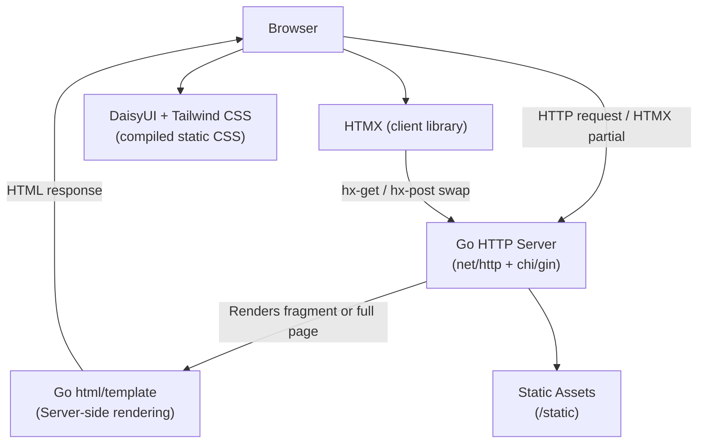

# ADR-0001: Technology Stack — Go, HTMX, DaisyUI, Tailwind

## Context and Problem Statement

We are starting a new web application and need to choose a full-stack technology combination that balances developer productivity, performance, maintainability, and operational simplicity. How should we architect the frontend/backend technology stack for this project?

## Decision Drivers

* Strong type safety and performance at the server layer
* Minimal JavaScript complexity while retaining dynamic UI interactions
* A rich component library to accelerate UI development
* Low operational overhead (single binary deployment preferred)
* Developer familiarity and long-term maintainability

## Considered Options

* **Go + HTMX + DaisyUI/Tailwind** — server-rendered HTML with hypermedia-driven interactions
* **Go + React/Next.js** — Go API backend with a separate SPA frontend
* **Node.js (TypeScript) + React + Tailwind** — full JS/TS stack with SPA frontend

## Decision Outcome

Chosen option: **Go + HTMX + DaisyUI/Tailwind**, because it delivers dynamic UIs without the complexity of a SPA while keeping the entire application in a single deployable binary. Server-side rendering via Go templates with HTMX attributes for partial page updates provides excellent performance and simplicity. DaisyUI on top of Tailwind gives a component system that eliminates the need for a JS component framework.

### Consequences

* Good, because deployment is a single Go binary plus static assets — no Node.js runtime required in production
* Good, because HTML-over-the-wire (HTMX) dramatically reduces JavaScript surface area and complexity
* Good, because Go's `net/http` and template ecosystem are mature and well-tested
* Good, because Tailwind + DaisyUI provides rapid UI composition with consistent theming
* Bad, because HTMX has a learning curve for developers accustomed to React/Vue patterns
* Bad, because complex client-side state (e.g., real-time collaborative features) is more awkward than in a SPA

### Confirmation

Confirmed by: presence of `go.mod`, Go template files (`.html`), Tailwind config (`tailwind.config.js`), and `htmx` script inclusion in base layout. No `package.json` with React or Vue dependencies should exist.

## Pros and Cons of the Options

### Go + HTMX + DaisyUI/Tailwind

Server renders full or partial HTML fragments; HTMX swaps them into the DOM. Styles provided by Tailwind with DaisyUI semantic component classes.

* Good, because single-binary deployment minimizes operational complexity
* Good, because Go's concurrency model handles high request throughput efficiently
* Good, because HTMX eliminates the need for JSON APIs and a separate frontend build step
* Good, because DaisyUI provides accessible, themed components (buttons, modals, forms) without writing CSS
* Neutral, because server-side templating requires Go's `html/template` package (less expressive than JSX)
* Bad, because rich client-side interactivity (drag-and-drop, complex forms) requires Alpine.js or small JS patches

### Go + React/Next.js

Go handles the API; React/Next.js handles the frontend as a separate SPA or SSR app.

* Good, because React ecosystem is large and developers are widely available
* Good, because full SPA capability for complex interactions
* Bad, because two runtimes (Go + Node.js) increases operational and deployment complexity
* Bad, because requires designing and maintaining a REST/GraphQL API contract between layers
* Bad, because state synchronization and hydration add significant complexity

### Node.js (TypeScript) + React + Tailwind

Everything in JavaScript/TypeScript — API and frontend in the same language.

* Good, because single language across the stack reduces context switching
* Good, because npm ecosystem has vast library coverage
* Bad, because Node.js single-threaded concurrency model underperforms Go for CPU-bound or high-concurrency workloads
* Bad, because JavaScript runtime required in production
* Bad, because type safety is advisory (TypeScript), not enforced at compile time like Go

## Architecture Diagram

## More Information

* HTMX documentation: https://htmx.org/docs/
* DaisyUI component library: https://daisyui.com/
* Tailwind CSS: https://tailwindcss.com/
* Related: ADR-0002 (Database), ADR-0003 (AuthN/AuthZ)
