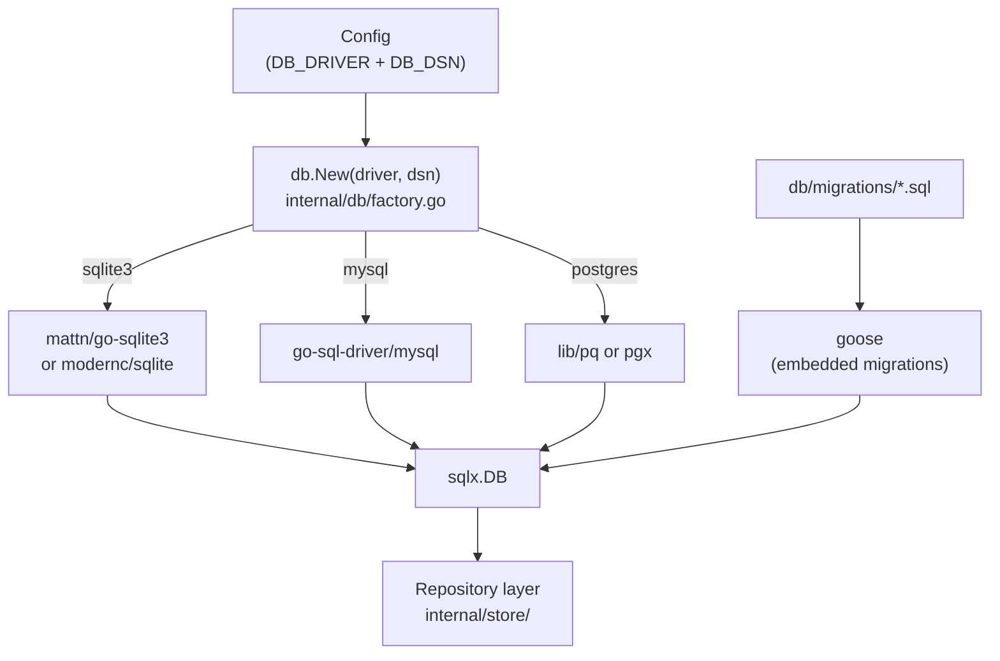

# ADR-0002: Pluggable Database Backend and Schema Migrations

## Context and Problem Statement

The application requires persistent storage. Different deployment environments have different constraints: SQLite is ideal for single-node or development deployments; MariaDB/MySQL and PostgreSQL are better for multi-node or production deployments. How do we support multiple relational database backends without duplicating business logic, and how do we manage schema migrations reliably across all of them?

## Decision Drivers

* Must support SQLite (local/dev), MariaDB (existing infra), and PostgreSQL (cloud/production)
* Database-specific SQL must be isolated — business logic must remain database-agnostic
* Schema migrations must be versioned, deterministic, and repeatable
* Operational simplicity: migrations should run automatically at startup or via a CLI command
* Should not require an ORM that obscures the SQL layer or imposes its own conventions

## Considered Options

* **`database/sql` + `sqlx` + `goose` migrations with driver abstraction** — standard library interfaces with a thin query helper and dedicated migration tool
* **GORM (ORM) + GORM Auto-Migrate** — full ORM with built-in schema migration
* **`sqlc` (generated typed queries) + `goose` migrations** — compile-time safe SQL with a separate migration tool

## Decision Outcome

Chosen option: **`database/sql` + `sqlx` + `goose` migrations**, because it provides a clean interface layer that is database-agnostic at the application level while keeping SQL explicit and readable. `sqlx` adds struct scanning and named queries without hiding SQL. `goose` is a mature, battle-tested migration tool that supports all three target databases and can be embedded into the Go binary for startup-time migrations.

The database driver is selected at runtime via a configuration value (e.g., `DB_DRIVER=sqlite3|mysql|postgres`), and a thin factory function returns a `*sqlx.DB` with the correct driver registered.

### Consequences

* Good, because SQL remains explicit and readable — no ORM magic hiding query behavior
* Good, because `goose` supports embedded migrations via `go:embed`, keeping the binary self-contained
* Good, because `sqlx` struct scanning eliminates boilerplate row scanning without a full ORM
* Good, because driver selection at startup allows the same binary to target different environments
* Bad, because SQL dialect differences (e.g., `RETURNING`, `AUTO_INCREMENT` vs `SERIAL`) must be managed by writing per-dialect migrations or using a lowest-common-denominator subset of SQL
* Bad, because `sqlx` named queries do not offer compile-time type checking (unlike `sqlc`)

### Confirmation

Confirmed by: `goose` migration files in `db/migrations/`, a `db.New(driver, dsn string) (*sqlx.DB, error)` factory in `internal/db/`, and zero direct `database/sql` driver imports in non-infrastructure packages.

## Pros and Cons of the Options

### `database/sql` + `sqlx` + `goose`

Standard library `database/sql` provides the common interface; `sqlx` extends it with named queries and struct scanning; `goose` handles versioned migrations embedded in the binary.

* Good, because `database/sql` is the Go standard — widely understood, stable API
* Good, because `goose` is actively maintained and supports SQLite, MySQL, PostgreSQL natively
* Good, because migrations are plain `.sql` files, editable without Go knowledge
* Good, because `go:embed` allows migrations to be bundled inside the compiled binary
* Neutral, because dialect differences in migrations must be handled per-driver or via SQL subsets
* Bad, because no compile-time query validation (queries fail at runtime if malformed)

### GORM + Auto-Migrate

Full ORM: models defined as Go structs with GORM tags; `AutoMigrate` keeps schema in sync.

* Good, because rapid initial development — define a struct, get a table
* Good, because single codebase handles all supported databases
* Bad, because `AutoMigrate` is not safe for production — it cannot reliably handle column renames, drops, or complex data migrations
* Bad, because GORM's query DSL abstracts SQL in ways that make debugging and optimization harder
* Bad, because GORM adds significant complexity and magic that can produce unexpected queries

### `sqlc` + `goose`

`sqlc` generates type-safe Go functions from annotated `.sql` files at build time; `goose` manages migrations.

* Good, because compile-time query validation eliminates an entire class of runtime SQL errors
* Good, because generated code is clean, idiomatic Go with zero runtime reflection
* Good, because `goose` handles migrations identically to option 1
* Bad, because `sqlc` requires a separate code generation step in the build process
* Bad, because `sqlc` support for dialect differences is still maturing (especially MySQL vs PostgreSQL edge cases)
* Neutral, because a good alternative to consider if type-safe queries become a priority later

## Architecture Diagram

## More Information

* `sqlx`: https://github.com/jmoiron/sqlx
* `goose`: https://github.com/pressly/goose
* Related: ADR-0001 (Technology Stack), ADR-0003 (AuthN/AuthZ — user table required)
* Migration files live in `db/migrations/` and are embedded with `//go:embed db/migrations/*.sql`
* For dialect-specific SQL, use goose's `+goose StatementBegin` annotations or per-driver migration directories
