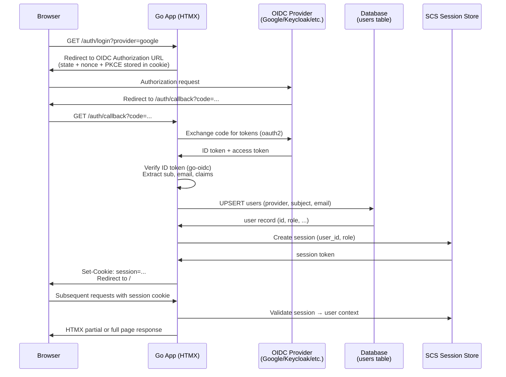

# ADR-0003: Authentication and Authorization with OIDC

## Context and Problem Statement

The application needs a user identity system that supports both authentication (who is this person?) and authorization (what are they allowed to do?). The primary identity protocol is OpenID Connect (OIDC), which enables delegated authentication via external identity providers (e.g., Google, GitHub, Keycloak, Authentik). How should we implement AuthN and AuthZ in a way that integrates OIDC, manages local user records, and enforces access control without becoming tightly coupled to a single provider?

## Decision Drivers

* OIDC must be the primary authentication mechanism — no username/password forms for identity
* A local `users` table must exist to store app-specific user state (roles, preferences, metadata) linked to OIDC subjects
* Authorization must support at minimum coarse-grained RBAC (role-based access control)
* Must be provider-agnostic: support Google, GitHub OAuth2 (via OIDC wrapper), Keycloak, Authentik, etc.
* Sessions must be server-side for security and revocability
* Must integrate cleanly with the Go + HTMX stack from ADR-0001

## Considered Options

* **`coreos/go-oidc` + `golang.org/x/oauth2` + server-side sessions (gorilla/sessions or SCS)** — build on well-maintained primitives with a local user sync layer
* **Casdoor (self-hosted IAM)** — full IAM product with OIDC provider, user management, and RBAC built in
* **Auth0 / Clerk (SaaS)** — third-party managed identity platform

## Decision Outcome

Chosen option: **`coreos/go-oidc` + `golang.org/x/oauth2` + server-side sessions with `alexedwards/scs`**, because it provides full control over the OIDC flow and user lifecycle while keeping the implementation within the Go monolith. The `go-oidc` library handles OIDC provider discovery, token validation, and claims extraction. Upon successful authentication, we upsert a local `users` record keyed on `(provider, subject)` and issue a server-side session. Authorization is implemented as middleware enforcing roles stored on the local user record.

### Consequences

* Good, because full ownership of the auth flow — no dependency on a third-party SaaS platform
* Good, because `go-oidc` handles provider discovery via `.well-known/openid-configuration`, making it provider-agnostic
* Good, because server-side sessions (SCS) are revocable and do not leak claims to the browser
* Good, because local `users` table allows app-specific roles/metadata decoupled from OIDC claims
* Good, because multiple OIDC providers can be registered simultaneously (e.g., Google + GitHub)
* Bad, because we own the session store infrastructure (requires a session backend: cookie, DB, or Redis)
* Bad, because token refresh logic and OIDC edge cases (nonce, PKCE, state) must be implemented correctly
* Bad, because no built-in admin UI for user management — requires building one

### Confirmation

Confirmed by: `internal/auth/` package containing OIDC client setup and callback handling; `users` table in migrations with `provider`, `subject`, `email`, `role` columns; session middleware applied in router setup; no plaintext passwords stored anywhere.

## Pros and Cons of the Options

### `go-oidc` + `oauth2` + SCS Sessions

Build the OIDC flow manually using `coreos/go-oidc` for token verification and `golang.org/x/oauth2` for the OAuth2 dance. `alexedwards/scs` manages server-side sessions backed by the application database or a cookie store.

* Good, because provider-agnostic: any OIDC-compliant IdP works via discovery URL
* Good, because `go-oidc` handles JWT validation, key rotation, and claims parsing
* Good, because SCS session store can use the existing DB backend (no separate Redis required for simple deployments)
* Good, because zero external service dependency — fully self-hosted
* Neutral, because PKCE and state parameter handling must be implemented (but `go-oidc` provides helpers)
* Bad, because more implementation work than a fully managed solution
* Bad, because token refresh flows (for long-lived sessions) require careful implementation

### Casdoor (Self-Hosted IAM)

Casdoor is an open-source IAM that provides its own OIDC provider, user management, RBAC policy engine, and admin UI.

* Good, because full-featured: user CRUD, RBAC, social login, MFA — out of the box
* Good, because acts as an OIDC provider itself, so the app only needs to trust Casdoor
* Bad, because introduces a separate service to deploy, maintain, and monitor
* Bad, because adds operational complexity — another database, another process, another failure point
* Bad, because Casdoor's RBAC model may not match application-specific access control needs

### Auth0 / Clerk (SaaS Identity)

Managed identity platforms that handle OIDC, social login, MFA, and user management as a service.

* Good, because zero infrastructure to manage — identity is fully outsourced
* Good, because rich dashboards, anomaly detection, and compliance features
* Bad, because ongoing cost that scales with user count
* Bad, because user data lives in a third-party system — potential compliance and data residency concerns
* Bad, because vendor lock-in; migrating away is painful

## Architecture Diagram

## More Information

* `coreos/go-oidc`: https://github.com/coreos/go-oidc
* `alexedwards/scs`: https://github.com/alexedwards/scs
* Related: ADR-0001 (Technology Stack), ADR-0002 (Database — users table lives here)
* The `users` table schema (at minimum): `id`, `provider`, `subject`, `email`, `display_name`, `role`, `created_at`, `updated_at`
* PKCE (RFC 7636) SHOULD be used for all authorization code flows
* State parameter MUST be validated on callback to prevent CSRF
* Sessions SHOULD have a configurable idle timeout and absolute expiry
