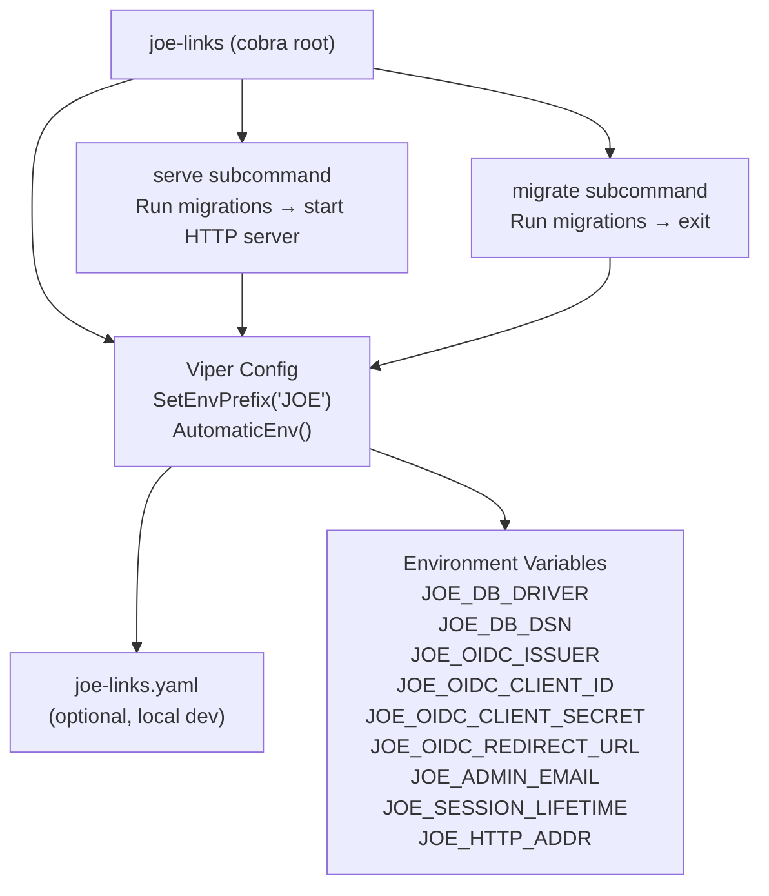

# ADR-0004: CLI Framework — Cobra + Viper with JOE_ Environment Variable Prefix

## Context and Problem Statement

The joe-links binary needs a CLI entrypoint that supports multiple subcommands (e.g., `serve`, `migrate`) and reads configuration from environment variables. How should we structure the CLI and configuration layer to be ergonomic, extensible, and consistent?

## Decision Drivers

* Multiple subcommands needed at minimum: `serve` (start HTTP server) and `migrate` (run migrations without starting the server)
* Configuration MUST be readable from environment variables with a consistent prefix to avoid collisions with other tools
* Configuration should also support a config file for local development convenience
* The CLI should produce helpful `--help` output automatically
* Must integrate cleanly with the Go standard library and the rest of the stack

## Considered Options

* **Cobra + Viper** — industry-standard Go CLI framework with environment variable binding and config file support
* **`flag` stdlib + `godotenv`** — minimal: standard library flags plus dotenv file loading
* **`urfave/cli`** — popular alternative CLI framework

## Decision Outcome

Chosen option: **Cobra + Viper**, because they are the de-facto standard for Go CLIs, work seamlessly together, and Viper's `SetEnvPrefix` makes it trivial to namespace all environment variables under `JOE_`. All configuration keys are bound to `JOE_`-prefixed environment variables (e.g., `JOE_DB_DRIVER`, `JOE_OIDC_ISSUER`, `JOE_ADMIN_EMAIL`). Viper also supports an optional config file (`joe-links.yaml`) for local development without environment variable overhead.

The root cobra command is `joe-links`. Subcommands:
- `joe-links serve` — run database migrations then start the HTTP server
- `joe-links migrate` — run pending migrations and exit (useful in CI/CD init containers)

### Consequences

* Good, because `--help` output is auto-generated for all commands and flags
* Good, because Viper's `AutomaticEnv()` + `SetEnvPrefix("JOE")` eliminates boilerplate env var reading
* Good, because config file support (yaml/toml/env) makes local dev ergonomic without environment pollution
* Good, because cobra's command tree makes it easy to add future subcommands (`joe-links admin`, `joe-links export`, etc.)
* Bad, because cobra + viper add ~2 transitive dependencies; acceptable given their ubiquity
* Bad, because Viper's key lookup is case-insensitive, which can cause surprising behavior with similarly-named keys

### Confirmation

Confirmed by: `cmd/` directory containing cobra command files; `go.mod` referencing `github.com/spf13/cobra` and `github.com/spf13/viper`; all configuration loaded via `viper.GetString()`; no direct `os.Getenv()` calls outside the viper initialization layer.

## Pros and Cons of the Options

### Cobra + Viper

* Good, because Cobra is the standard for Go CLIs (used by kubectl, hugo, docker, etc.)
* Good, because Viper's `SetEnvPrefix("JOE")` namespaces all env vars cleanly
* Good, because Viper supports env file, yaml config file, and env vars with consistent precedence
* Good, because cobra generates shell completion scripts for bash/zsh/fish
* Neutral, because viper's global state (singleton) is idiomatic but can complicate testing
* Bad, because the dependency graph is non-trivial (~10 indirect dependencies)

### `flag` stdlib + `godotenv`

* Good, because zero dependencies
* Good, because simple and transparent
* Bad, because no config file support built in
* Bad, because no env prefix support — requires manual `JOE_` string concatenation
* Bad, because subcommand support requires significant manual wiring

### `urfave/cli`

* Good, because good subcommand support and env var binding
* Good, because lighter dependency than cobra+viper
* Bad, because smaller ecosystem and community than cobra
* Bad, because no built-in config file support (viper equivalent not included)
* Bad, because less familiar to most Go developers than cobra

## Architecture Diagram

## More Information

* Cobra: https://github.com/spf13/cobra
* Viper: https://github.com/spf13/viper
* Related: ADR-0001 (Technology Stack), ADR-0002 (Database), ADR-0003 (AuthN/AuthZ)
* Config key → env var mapping: viper lowercases keys and adds the prefix. `db.driver` → `JOE_DB_DRIVER`, `oidc.issuer` → `JOE_OIDC_ISSUER`, etc.
