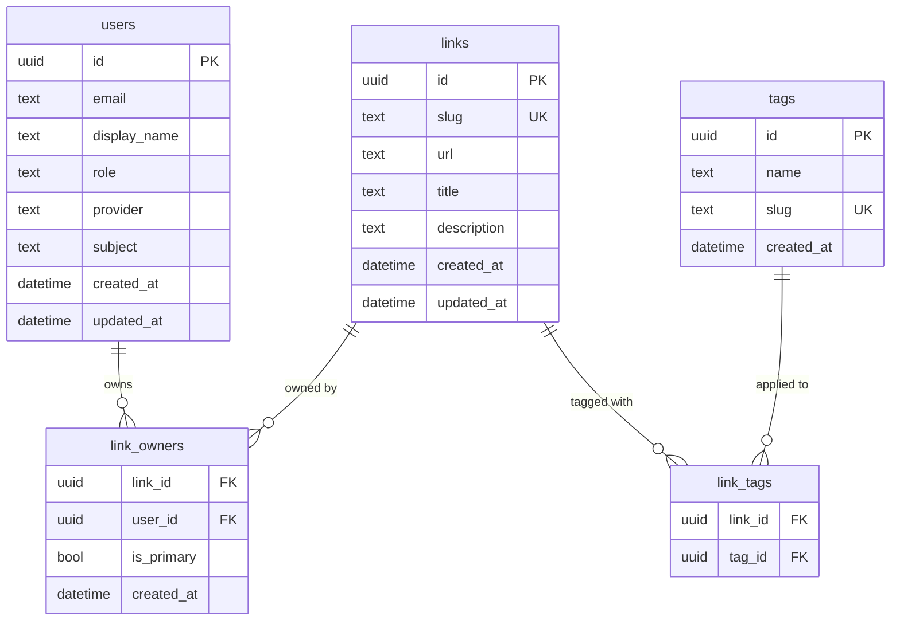

# ADR-0005: Data Model — Links, Tags, and Multi-Ownership

## Context and Problem Statement

The core domain object is the "go link" — a slug-to-URL mapping. Beyond simple key→value redirection, the application requires:

1. **Rich metadata per link**: a human-readable title, a longer description, and a tag set for organization.
2. **Multi-ownership**: a link is a team resource, not a personal bookmark. Multiple users should be able to edit and manage the same link. One user is the "primary owner" (the creator), but additional co-owners can be added.
3. **Global tag taxonomy**: tags are shared across all users, not scoped per-user. Any user can tag any link they own or co-own.

How do we model these relationships in the relational schema while keeping queries simple and supporting all three target databases (SQLite, MySQL, PostgreSQL)?

## Decision Drivers

* Links must be globally unique by slug
* A link must have at least one owner at all times (the primary creator)
* Multiple users can co-own a link (add/remove co-owners)
* Tags must be reusable across links (normalize, not denormalize)
* Tag lookup and filtering must be index-friendly
* Schema must work across SQLite, MySQL, and PostgreSQL without dialect-specific types

## Considered Options

* **Normalized relational model**: separate `links`, `link_owners`, `tags`, `link_tags` tables with foreign-key join tables
* **Denormalized JSON columns**: store owners as a JSON array in `links.owner_ids` and tags as `links.tags` JSON array
* **Single-owner with soft tags**: keep `links.owner_id` (single FK) and add `links.tags` as a comma-separated string column

## Decision Outcome

Chosen option: **Normalized relational model** with four tables — `links`, `link_owners`, `tags`, and `link_tags` — because it is the only approach that supports clean multi-owner queries, efficient tag-based filtering, referential integrity, and future extensibility without schema rewrites.

### Schema

#### `links`

| Column        | Type          | Notes                                             |
|---------------|---------------|---------------------------------------------------|
| `id`          | UUID / TEXT   | Primary key (UUID v4, stored as TEXT on SQLite)   |
| `slug`        | TEXT          | Globally unique; pattern `[a-z0-9][a-z0-9\-]*[a-z0-9]` or single `[a-z0-9]` |
| `url`         | TEXT          | The redirect target; MUST be a valid URL          |
| `title`       | TEXT          | Short human-readable label (optional, max 200 chars) |
| `description` | TEXT          | Longer free-text description (optional, max 2000 chars) |
| `created_at`  | DATETIME      | UTC timestamp, set on insert                      |
| `updated_at`  | DATETIME      | UTC timestamp, updated on every write             |

Unique index on `slug`. No `owner_id` column — ownership lives in `link_owners`.

#### `link_owners`

| Column       | Type  | Notes                                                    |
|--------------|-------|----------------------------------------------------------|
| `link_id`    | UUID  | FK → `links.id` ON DELETE CASCADE                        |
| `user_id`    | UUID  | FK → `users.id` ON DELETE CASCADE                        |
| `is_primary` | BOOL  | TRUE for the original creator; exactly one per link      |
| `created_at` | DATETIME | When this owner was added                             |

Composite primary key `(link_id, user_id)`. Partial unique index enforcing at most one `is_primary = TRUE` per `link_id` (enforced in application layer for SQLite compatibility).

#### `tags`

| Column       | Type  | Notes                                             |
|--------------|-------|---------------------------------------------------|
| `id`         | UUID  | Primary key                                       |
| `name`       | TEXT  | Display name (e.g., "Engineering", "Standup")     |
| `slug`       | TEXT  | URL-safe lowercase (e.g., "engineering", "standup"); unique |
| `created_at` | DATETIME |                                                |

Unique index on `slug`.

#### `link_tags`

| Column    | Type | Notes                              |
|-----------|------|------------------------------------|
| `link_id` | UUID | FK → `links.id` ON DELETE CASCADE  |
| `tag_id`  | UUID | FK → `tags.id` ON DELETE CASCADE   |

Composite primary key `(link_id, tag_id)`.

### Business Rules

* **Slug uniqueness**: enforced at the database level (unique index) AND validated at the application layer before insert to produce user-friendly errors.
* **Reserved slugs**: `auth`, `static`, `dashboard`, `admin` MUST be rejected at the application layer before any DB write.
* **Primary owner**: the user who creates a link is always added to `link_owners` with `is_primary = TRUE`. This row MUST NOT be deletable while the link exists (enforce in application layer).
* **Co-ownership**: any link owner may add or remove co-owners. Admins may modify ownership of any link.
* **Authorization**: a user may edit/delete a link if and only if they appear in `link_owners` for that link, or they hold the `admin` role.
* **Tag creation**: tags are auto-created on first use (upsert by `slug`). Tag slugs are derived from the display name (lowercased, spaces replaced with hyphens).
* **Tag orphan cleanup**: tags with zero associated links MAY be garbage-collected (background job or lazy deletion on unlink).

### Consequences

* Good, because `link_owners` supports clean `JOIN` queries for "links I can edit"
* Good, because tags are deduplicated and reusable across the full dataset
* Good, because cascading deletes keep orphan rows from accumulating
* Good, because no JSON columns — all three target databases handle this schema identically
* Bad, because listing a link with all owners and tags requires multiple JOINs (mitigated by indexing)
* Bad, because "at most one primary owner" invariant cannot be expressed as a pure SQL constraint on SQLite (must be enforced in application code)

### Confirmation

Confirmed by: `db/migrations/` containing migration files for `links`, `link_owners`, `tags`, `link_tags`; `internal/store/` containing a `LinkStore` interface with `Create`, `GetBySlug`, `ListByOwner`, `AddOwner`, `RemoveOwner`, `SetTags` methods; no `owner_id` column on `links` table.

## Pros and Cons of the Options

### Normalized relational model (chosen)

* Good, because referential integrity is enforced at the database level
* Good, because tag-based queries are index-efficient (`link_tags JOIN tags`)
* Good, because ownership queries are explicit and auditable
* Bad, because more complex initial schema; requires JOINs for common queries

### Denormalized JSON columns

* Good, because simpler initial schema — just add JSON columns
* Good, because reads require no JOINs
* Bad, because querying inside JSON is dialect-specific and not portable across SQLite/MySQL/PostgreSQL
* Bad, because referential integrity is not enforced — stale owner IDs or tag names can accumulate silently
* Bad, because filtering links by tag or owner requires full-table scans or JSON path operators

### Single-owner with comma-separated tags

* Good, because trivially simple — no extra tables
* Bad, because migrating to multi-ownership later requires a schema rewrite
* Bad, because comma-separated strings have no referential integrity and are difficult to query

## Architecture Diagram

## More Information

* Related: ADR-0002 (Database — goose migrations define these tables), ADR-0003 (AuthN/AuthZ — `users` table source of truth)
* SPEC-0001 REQ "Short Link Management" governs slug validation and ownership rules
* Tag slug derivation: `strings.ToLower(strings.ReplaceAll(name, " ", "-"))`, then strip non-`[a-z0-9-]` characters
* For SQLite, UUIDs are stored as `TEXT`; for MySQL/PostgreSQL, `CHAR(36)` or native `UUID` type is preferred per-dialect in migrations
