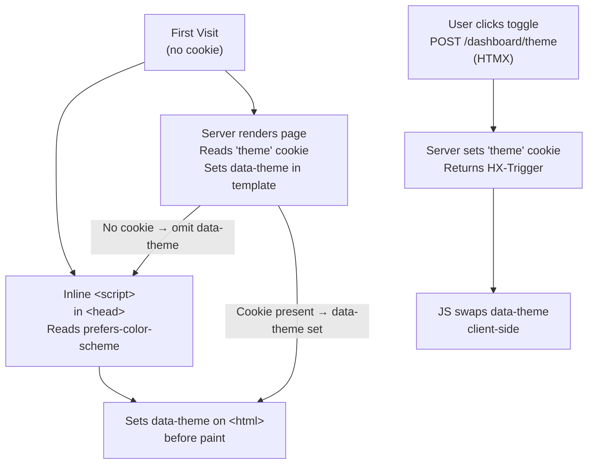

# ADR-0006: UI Design System — Pastel Themes, Dark/Light/System Modes

## Context and Problem Statement

The application needs a visual identity that is fun, approachable, and distinct from typical enterprise tooling. Go-links tools tend to look utilitarian; joe-links should feel friendly and personal. We also need to support dark mode (increasingly expected), light mode, and system-preference-respecting automatic switching. How do we define the color palette, implement theming, and persist the user's theme preference across sessions?

## Decision Drivers

* The app should feel fun and playful — pastels over grays and corporate blues
* Dark mode MUST be supported — many developers prefer dark interfaces
* System preference (`prefers-color-scheme`) SHOULD be the default — don't force a theme on first visit
* Theme preference MUST persist across page loads (cookie preferred over localStorage for SSR consistency)
* Theming MUST integrate naturally with DaisyUI's existing theme system (no bespoke CSS variables)
* The approach MUST work without JavaScript for the initial render (no flash of wrong theme)

## Considered Options

* **Custom DaisyUI themes (pastel-light + pastel-dark) with `data-theme` on `<html>` and cookie persistence**
* **DaisyUI built-in themes (e.g., `cupcake` / `dark`) with user selector**
* **Tailwind `dark:` variants with CSS custom properties and no DaisyUI theming**

## Decision Outcome

Chosen option: **Two custom DaisyUI themes (`joe-light` and `joe-dark`) with system-default detection, user override via a theme toggle, and cookie-based persistence.**

DaisyUI themes are defined as CSS property sets in `tailwind.config.js` under the `daisyui.themes` key. Both themes share the same pastel palette with light/dark variants. The active theme is applied via `data-theme` on the `<html>` element. On first visit (no cookie), the server reads the `prefers-color-scheme` media feature via a tiny inline `<script>` that runs before paint to set `data-theme` without a flash. Once the user explicitly toggles, the choice is written to a `theme` cookie and respected on subsequent server renders.

### Pastel Color Palette

Both themes are built around a warm pastel palette:

| Role            | Light (`joe-light`) | Dark (`joe-dark`)    |
|-----------------|---------------------|----------------------|
| Primary         | `#c084fc` (lilac)   | `#a855f7` (purple)   |
| Primary content | `#fafafa`           | `#fafafa`            |
| Secondary       | `#fb923c` (peach)   | `#f97316` (orange)   |
| Accent          | `#34d399` (mint)    | `#10b981` (emerald)  |
| Neutral         | `#6b7280` (slate)   | `#9ca3af`            |
| Base-100        | `#fdf4ff` (soft lavender-white) | `#1e1b2e` (deep purple-black) |
| Base-200        | `#f3e8ff`           | `#2d2840`            |
| Base-300        | `#e9d5ff`           | `#3d3756`            |
| Base content    | `#1f1335` (near-black purple) | `#e9d5ff`    |
| Info            | `#67e8f9` (sky)     | `#22d3ee`            |
| Success         | `#86efac` (sage)    | `#4ade80`            |
| Warning         | `#fde68a` (butter)  | `#fbbf24`            |
| Error           | `#fca5a5` (rose)    | `#f87171`            |

### Theme Switching UX

1. **First visit (no cookie)**: an inline `<script>` in `<head>` (before any stylesheet) reads `window.matchMedia('(prefers-color-scheme: dark)').matches` and sets `document.documentElement.setAttribute('data-theme', ...)`. This script is < 100 bytes and prevents any flash.
2. **Toggle control**: a sun/moon icon button in the navbar triggers `POST /dashboard/theme` (HTMX `hx-post`), which sets a `theme` cookie (`HttpOnly: false`, `SameSite: Lax`, `Max-Age: 365 days`) and returns an HTMX `HX-Trigger` event that swaps the `data-theme` attribute client-side.
3. **Server render**: all page handlers read the `theme` cookie and set `data-theme` on the `<html>` tag in the base layout. If no cookie, omit `data-theme` (the inline script handles it).

### Consequences

* Good, because DaisyUI theme variables cover all component colors automatically — no per-component theming needed
* Good, because cookie-based persistence works identically for HTMX partial requests and full page renders (SSR-safe)
* Good, because the inline anti-flash script is dependency-free and tiny
* Good, because the pastel palette is cohesive — both themes feel "fun" while remaining accessible
* Bad, because two custom themes add a small amount of Tailwind config boilerplate
* Bad, because the anti-flash inline script is a minor departure from "no inline JS" — acceptable given its size and purpose

### Confirmation

Confirmed by: `tailwind.config.js` containing `daisyui: { themes: ["joe-light", "joe-dark"] }` with full color definitions; base layout template setting `data-theme` from a template variable; a `/dashboard/theme` POST route; inline anti-flash `<script>` present before stylesheets in `<head>`.

## Pros and Cons of the Options

### Custom DaisyUI themes + cookie persistence (chosen)

* Good, because DaisyUI theme system is designed for this pattern — clean integration
* Good, because cookie is readable server-side — no hydration mismatch or SSR flash
* Good, because full control over the pastel palette — not constrained by a built-in theme
* Bad, because requires defining full color sets for both themes (one-time setup cost)

### DaisyUI built-in themes (cupcake / dark)

* Good, because zero configuration — just set `data-theme="cupcake"` or `data-theme="dark"`
* Bad, because built-in themes are not the fun pastel aesthetic desired for this project
* Bad, because less distinctive — many DaisyUI apps use the same built-in themes
* Neutral, because an acceptable fallback if custom theme maintenance becomes a burden

### Tailwind `dark:` variants with CSS custom properties

* Good, because no DaisyUI theme system coupling
* Bad, because requires hand-writing dark-mode variants for every component class
* Bad, because DaisyUI components don't participate in Tailwind's `dark:` strategy by default
* Bad, because significantly more CSS maintenance overhead

## Architecture Diagram

## More Information

* DaisyUI custom themes: https://daisyui.com/docs/themes/
* DaisyUI color system: https://daisyui.com/docs/colors/
* Related: ADR-0001 (DaisyUI + Tailwind stack), ADR-0007 (Views — navbar theme toggle placement)
* Anti-flash pattern reference: https://joshwcomeau.com/react/dark-mode/ (adapted for non-React SSR)
* WCAG AA contrast ratio SHOULD be maintained for all primary/content color pairs
