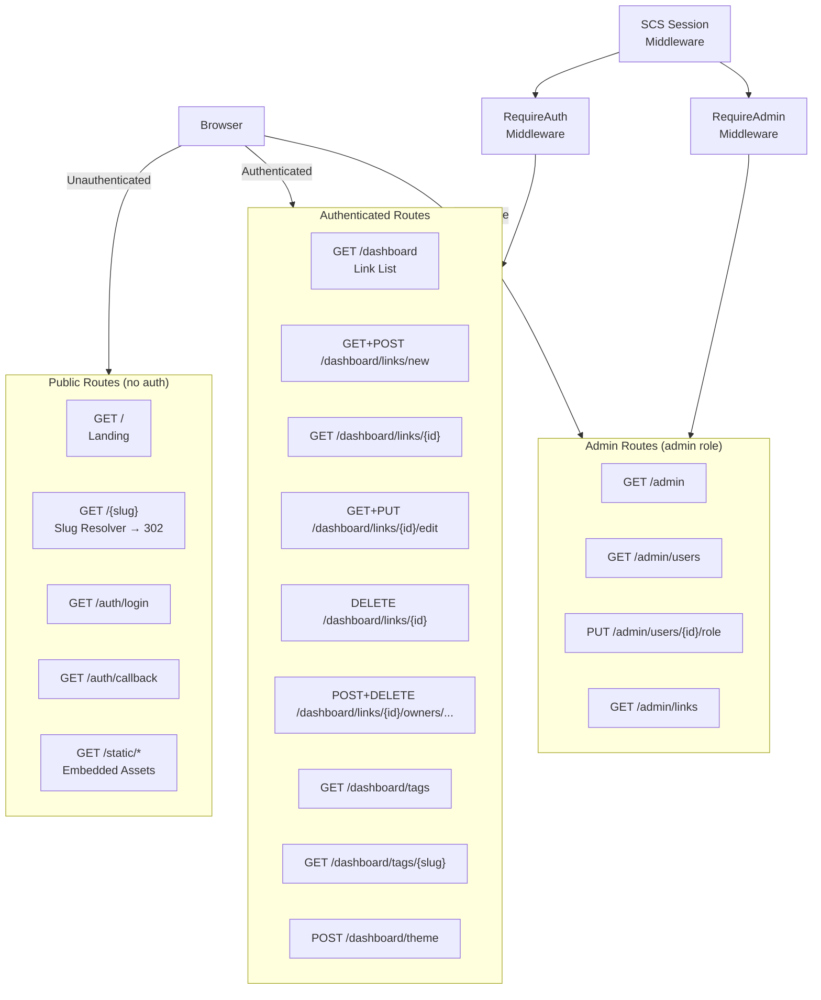

# ADR-0007: Application Views and Routing Architecture

## Context and Problem Statement

With the tech stack (ADR-0001), data model (ADR-0005), auth system (ADR-0003), and theming (ADR-0006) established, we need to define the complete set of application views (pages), their routes, and how they compose into a coherent user experience. This ADR answers: what pages exist, what does each one do, how are they structured, and what are the URL conventions?

The primary inspiration is [golinks.io](https://www.golinks.io/how-go-links-work.php): create short links like `go/jira`, `go/standup`, `go/onboarding` that redirect team members to canonical URLs. The UX should be simple, fast, and encourage link creation and discovery.

## Decision Drivers

* The core interaction (slug → redirect) MUST work for unauthenticated users — no login required to follow a link
* Link management (create/edit/delete) MUST require authentication
* Navigation should be minimal and obvious — this is a utility tool, not a content site
* HTMX-first: complex interactions (inline edit, modal confirm, live slug validation) MUST use HTMX fragments rather than full page navigations
* Admin views MUST be clearly separated from user views
* Reserved path prefixes (`auth`, `static`, `dashboard`, `admin`) MUST be registered before the catch-all slug resolver

## Considered Options

* **Flat routing with path prefix separation** (`/dashboard/*`, `/admin/*`, `/{slug}`)
* **Subdomain separation** (`links.example.com/{slug}` vs `app.example.com/dashboard`)
* **Single-page application with API backend**

## Decision Outcome

Chosen option: **Flat routing with path prefix separation**, because it matches the self-hosted go-links convention (users type `go/foobar` — the path `foobar` is the slug), keeps the entire app in one binary, and integrates naturally with HTMX and server-side rendering.

### Route Table

| Method | Path                                  | Auth Required | Role    | Description                                          |
|--------|---------------------------------------|---------------|---------|------------------------------------------------------|
| GET    | `/auth/login`                         | No            | —       | Initiate OIDC login flow                             |
| GET    | `/auth/callback`                      | No            | —       | OIDC callback; exchange code, create session         |
| POST   | `/auth/logout`                        | Yes           | any     | Destroy session, redirect to `/`                     |
| GET    | `/`                                   | No            | —       | Landing page / home                                  |
| GET    | `/dashboard`                          | Yes           | any     | User's link dashboard                                |
| GET    | `/dashboard/links/new`                | Yes           | any     | New link form (full page fallback)                   |
| POST   | `/dashboard/links`                    | Yes           | any     | Create link                                          |
| GET    | `/dashboard/links/{id}`               | Yes           | owner\|admin | Link detail view                              |
| GET    | `/dashboard/links/{id}/edit`          | Yes           | owner\|admin | Edit link form (full page fallback)           |
| PUT    | `/dashboard/links/{id}`               | Yes           | owner\|admin | Update link                                   |
| DELETE | `/dashboard/links/{id}`               | Yes           | owner\|admin | Delete link (HTMX confirm flow)               |
| POST   | `/dashboard/links/{id}/owners`        | Yes           | owner\|admin | Add a co-owner                                |
| DELETE | `/dashboard/links/{id}/owners/{uid}`  | Yes           | owner\|admin | Remove a co-owner                             |
| GET    | `/dashboard/tags`                     | Yes           | any     | Browse/search all tags                               |
| GET    | `/dashboard/tags/{slug}`              | Yes           | any     | All links tagged with this tag                       |
| POST   | `/dashboard/theme`                    | No            | —       | Set theme cookie (HTMX; returns HX-Trigger)          |
| GET    | `/admin`                              | Yes           | admin   | Admin dashboard (user list, link stats)              |
| GET    | `/admin/users`                        | Yes           | admin   | User management table                                |
| PUT    | `/admin/users/{id}/role`              | Yes           | admin   | Change a user's role                                 |
| GET    | `/admin/links`                        | Yes           | admin   | All links across all users                           |
| GET    | `/static/*`                           | No            | —       | Embedded static assets (CSS, JS, images)             |
| GET    | `/{slug}`                             | No            | —       | **Slug resolver** — redirect or 404                  |

### View Descriptions

#### `/` — Landing Page

Shown to unauthenticated visitors. Contains:
- Hero section explaining what joe-links does (1-2 sentences, inspired by golinks.io)
- A single prominent "Sign in" button
- Optional: a preview/screenshot of the dashboard if no session exists
- If the user IS authenticated, redirect `→ /dashboard`

#### `/dashboard` — User Dashboard

The primary authenticated view. Contains:
- **Link list**: paginated table/card grid of all links the user owns or co-owns
  - Each row/card: slug (clickable, copies `go/{slug}` to clipboard), title, description excerpt, tags (as chips), owner count, edit/delete actions
  - Empty state: friendly illustration + "Create your first link" CTA
- **Search/filter bar**: live HTMX search by slug, title, or tag (debounced `hx-get` on input)
- **Tag filter sidebar** (or chip row): click a tag to filter the list
- **"New Link" button**: opens the new link form (inline modal via HTMX, or navigates to `/dashboard/links/new`)
- **Stats strip**: total links, total tags, link clicks (future)

#### `/dashboard/links/new` — New Link Form

Inline (HTMX modal) or standalone page. Fields:
- **Slug** (required): text input with live validation (`hx-get /dashboard/links/validate-slug?slug=...`); shows green/red inline indicator as user types; reserved slug detection
- **URL** (required): URL input with basic format validation
- **Title** (optional): text input, max 200 chars
- **Description** (optional): textarea, max 2000 chars
- **Tags** (optional): tag input with autocomplete (`hx-get /dashboard/tags/suggest?q=...`); tags displayed as removable chips
- Submit: `POST /dashboard/links` → on success redirect to dashboard with success toast; on error re-render form with inline errors

#### `/dashboard/links/{id}` — Link Detail

Read-only detail view for a link. Shows:
- Full slug, URL (clickable), title, description
- Tags (as chips, each links to `/dashboard/tags/{slug}`)
- Owner list: avatars/names of all co-owners; "Add co-owner" control (owner/admin only)
- Edit / Delete buttons (owner/admin only)
- Copy button: copies the full go-link URL (`https://{host}/{slug}`) to clipboard

#### `/dashboard/links/{id}/edit` — Edit Link Form

Same fields as new link form, pre-populated. Slug is read-only after creation (changing a slug breaks existing links). Submit: `PUT /dashboard/links/{id}`.

#### `/dashboard/tags` — Tag Browser

Grid of all tags with link counts. Click a tag to navigate to `/dashboard/tags/{slug}`.

#### `/dashboard/tags/{slug}` — Tag Detail

Filtered link list showing all links tagged with this tag (that the current user can see — their own + co-owned links). Same card layout as dashboard.

#### `/admin` — Admin Dashboard

Summary stats: total users, total links, recent activity feed. Links to `/admin/users` and `/admin/links`.

#### `/admin/users` — User Management

Table of all users: email, display name, role, link count, created date. Role can be toggled inline (admin ↔ user) via HTMX `PUT /admin/users/{id}/role`.

#### `/admin/links` — All Links

Same as user dashboard but shows ALL links across all users, with an owner column. Admin can edit/delete any link.

#### `/{slug}` — Slug Resolver

No visible UI — immediately issues `302 Found` to the stored URL. If slug not found, renders a friendly 404 page that includes:
- "No link found for `{slug}`"
- A "Create it now" button that pre-fills the slug in the new link form (requires auth)
- A search bar to find similarly-named links

### Shared Layout Components

All authenticated pages share a base layout containing:
- **Navbar**: logo/wordmark ("joe-links"), navigation links (Dashboard, Tags, Admin if role=admin), user avatar/name with dropdown (Profile, Sign out), theme toggle (sun/moon icon)
- **Toast notification area**: HTMX `hx-swap-oob` target for success/error toasts
- **Page content slot**: `{{template "content" .}}`

Unauthenticated pages (landing, 404) use a minimal layout without the nav sidebar.

### HTMX Interaction Patterns

| Interaction                     | HTMX Pattern                                              |
|----------------------------------|-----------------------------------------------------------|
| Live slug validation            | `hx-get="/dashboard/links/validate-slug" hx-trigger="input delay:300ms"` → inline indicator fragment |
| Tag autocomplete                | `hx-get="/dashboard/tags/suggest" hx-trigger="input delay:200ms"` → dropdown fragment |
| Link search/filter              | `hx-get="/dashboard" hx-trigger="input delay:400ms"` → replaces link list fragment |
| Delete confirmation             | `hx-delete` + DaisyUI modal; confirm button issues the DELETE |
| Add co-owner                    | `hx-post="/dashboard/links/{id}/owners"` → replaces owners list fragment |
| Theme toggle                    | `hx-post="/dashboard/theme"` + `HX-Trigger` event → JS swaps `data-theme` |
| New link modal                  | `hx-get="/dashboard/links/new"` + `hx-target="#modal"` → opens DaisyUI modal |
| Toast notifications             | `hx-swap-oob="true"` on `#toast-area` in POST responses  |
| Role toggle (admin)             | `hx-put="/admin/users/{id}/role"` → replaces row fragment |

### Consequences

* Good, because all slug resolution happens at the root path level — no extra browser navigation overhead
* Good, because HTMX patterns are consistent and predictable across all views
* Good, because admin routes are clearly namespaced and middleware-protected
* Good, because the 404 page doubles as a link-creation entry point — reduces friction
* Bad, because HTMX modal state is not reflected in the browser URL (acceptable for this use case)
* Bad, because `DELETE` and `PUT` methods require HTMX or a `_method` override for older form fallbacks (not required — HTMX handles this natively)

### Confirmation

Confirmed by: chi router setup in `internal/server/` defining all routes above; `templates/` directory containing named templates matching each view; `HX-Request` header checked in every handler that returns fragments; no `fetch()` or XHR calls in JavaScript outside of HTMX.

## Pros and Cons of the Options

### Flat routing with prefix separation (chosen)

* Good, because standard go-links convention — DNS points to one host, paths are slugs
* Good, because single binary handles everything — no separate services
* Good, because HTMX naturally targets fragments within the same origin
* Bad, because reserved prefix list must be maintained to prevent slug collisions

### Subdomain separation

* Good, because clean separation between app UI and link resolution
* Good, because no reserved slug list needed
* Bad, because requires multiple DNS records and TLS certificates in self-hosted scenarios
* Bad, because breaks the `go/foobar` convention — the whole point of go-links is the short path

### Single-page application with API backend

* Good, because rich client-side state management
* Bad, because contradicts ADR-0001 (Go + HTMX — no SPA)
* Bad, because requires maintaining a JSON API contract separate from the UI

## Architecture Diagram

## More Information

* Inspired by: https://www.golinks.io/how-go-links-work.php
* Related: ADR-0001 (HTMX patterns), ADR-0003 (auth/session middleware), ADR-0005 (data model backing these views), ADR-0006 (theming — navbar toggle)
* SPEC-0001 governs slug resolution, CRUD authorization, and HTMX partial behavior
* Slug validation endpoint (`/dashboard/links/validate-slug`) is an HTMX-only route; it MUST NOT be called by unauthenticated users
* The copy-to-clipboard button uses `navigator.clipboard.writeText()` — the only non-HTMX JS interaction
