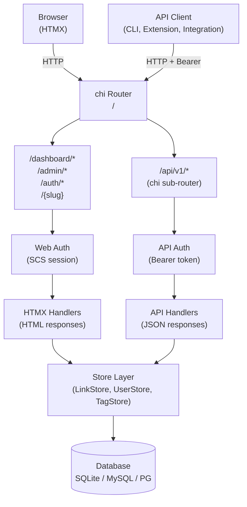

# ADR-0008: REST API Layer — JSON API at `/api/v1`

## Context and Problem Statement

ADR-0007 adopted an HTMX-first, server-rendered architecture with no standalone JSON API. This works well for browser-based web interactions but leaves programmatic clients unserved: browser extensions that register go-links from the current tab, CLI tools for bulk import/export, CI/CD integrations that create deployment links, and third-party dashboards. Should joe-links expose a machine-readable REST API alongside its HTMX web UI, and if so, how should it be structured?

## Decision Drivers

* Browser extensions and CLI tools need a machine-readable interface — HTMX endpoints return HTML
* The Go + chi stack is already in place; adding JSON responses requires minimal new infrastructure
* OpenAPI documentation (mandated by the Swagger UI requirement) needs a stable, versioned API surface
* The existing HTMX web UI MUST NOT be broken — the API is additive, not a replacement
* Admin and link-management operations should be fully accessible via the API (parity with web UI)

## Considered Options

* **JSON REST API at `/api/v1` using chi — additive alongside HTMX routes**
* **GraphQL endpoint at `/graphql`**
* **gRPC + grpc-gateway**
* **Content negotiation on existing HTMX endpoints (Accept: application/json)**

## Decision Outcome

Chosen option: **JSON REST API at `/api/v1` using chi, additive alongside existing HTMX routes.**

A new chi sub-router is mounted at `/api/v1`. All API routes return `application/json`. The API exposes the same operations available in the web UI: slug resolution, link CRUD, tag management, and admin user/role management. The HTMX web routes at `/dashboard/*` are unchanged.

### API Resource Model

| Method | Path | Description |
|--------|------|-------------|
| `GET` | `/api/v1/links` | List links (owned by caller; all for admin) |
| `POST` | `/api/v1/links` | Create a link |
| `GET` | `/api/v1/links/{id}` | Get a link by ID |
| `PUT` | `/api/v1/links/{id}` | Update a link (URL, title, description, tags) |
| `DELETE` | `/api/v1/links/{id}` | Delete a link |
| `GET` | `/api/v1/links/{id}/owners` | List co-owners |
| `POST` | `/api/v1/links/{id}/owners` | Add a co-owner |
| `DELETE` | `/api/v1/links/{id}/owners/{uid}` | Remove a co-owner |
| `GET` | `/api/v1/tags` | List tags with link counts |
| `GET` | `/api/v1/tags/{slug}/links` | List links for a tag |
| `GET` | `/api/v1/users/me` | Get the authenticated caller's profile |
| `GET` | `/api/v1/admin/users` | List all users (admin only) |
| `PUT` | `/api/v1/admin/users/{id}/role` | Update a user's role (admin only) |
| `GET` | `/api/v1/admin/links` | List all links (admin only) |

### HTTP Conventions

- All requests/responses use `Content-Type: application/json`
- Successful creates return `201 Created` with the created resource
- Successful deletes return `204 No Content`
- Validation errors return `400 Bad Request` with a structured error body
- Authorization failures return `401 Unauthorized` (no token) or `403 Forbidden` (wrong role/ownership)
- Not-found returns `404 Not Found`

### Error Response Format

```json
{
  "error": "slug already taken",
  "code": "SLUG_CONFLICT"
}
```

### Pagination

List endpoints accept `?limit=` (default 50, max 200) and `?cursor=` (opaque cursor for keyset pagination). Responses include a `"next_cursor"` field when more results exist.

### Consequences

* Good, because the existing HTMX web UI is completely unaffected — the API is purely additive
* Good, because chi sub-routers make it trivial to add `/api/v1` middleware (auth, JSON content-type) separately from web middleware
* Good, because a stable `/api/v1` prefix allows future `/api/v2` versioning without breaking existing clients
* Good, because REST over HTTP is universally supported — no special client library needed
* Bad, because some logic will be duplicated between HTML handlers and JSON API handlers (mitigated by sharing store methods and validation functions)
* Neutral, because GraphQL would give clients more flexibility, but adds query complexity and no Go HTTP UI ecosystem support

### Confirmation

Confirmed by: chi router mounting `handler.NewAPIRouter(deps)` at `/api/v1`; all API handlers returning `application/json`; API routes co-existing with HTMX routes without interference; `GET /api/v1/links` returning a JSON array of links.

## Pros and Cons of the Options

### JSON REST API at `/api/v1` (chosen)

* Good, because REST is universally understood and tooled (curl, Postman, Swagger UI)
* Good, because chi sub-routers provide clean middleware separation from the HTMX layer
* Good, because versioning via URL path is explicit and cacheable
* Bad, because some handler logic is duplicated across HTMX and API handlers

### GraphQL at `/graphql`

* Good, because clients can request exactly the fields they need — efficient for complex reads
* Good, because a single endpoint replaces all REST routes
* Bad, because adds a GraphQL library dependency (gqlgen or graphql-go) with significant setup overhead
* Bad, because Swagger UI does not apply — requires GraphiQL or a separate playground
* Bad, because Go's GraphQL ecosystem is less mature than its REST ecosystem

### gRPC + grpc-gateway

* Good, because strongly typed contracts via protobuf, excellent for service-to-service
* Bad, because browser/CLI clients need grpc-gateway transcoding, adding significant infrastructure
* Bad, because protobuf tooling is heavy for a single-binary self-hosted tool
* Bad, because Swagger UI support requires additional generation steps

### Content Negotiation on Existing Endpoints

* Good, because DRY — the same route serves both HTML and JSON
* Bad, because HTMX endpoints are optimized for HTML partial responses, not resource representation
* Bad, because mixing HTML and JSON logic in one handler makes HTMX-specific behavior (HX-Redirect, HX-Trigger) hard to isolate
* Bad, because versioning becomes impossible without URL prefix separation

## Architecture Diagram



## More Information

* Related: ADR-0001 (technology stack — chi router), ADR-0003 (OIDC auth), ADR-0005 (data model), ADR-0007 (routing)
* Supersedes the "no standalone JSON API" note in ADR-0007 for programmatic access scenarios
* See ADR-0009 for API authentication mechanism
* See ADR-0010 for OpenAPI documentation and Swagger UI
