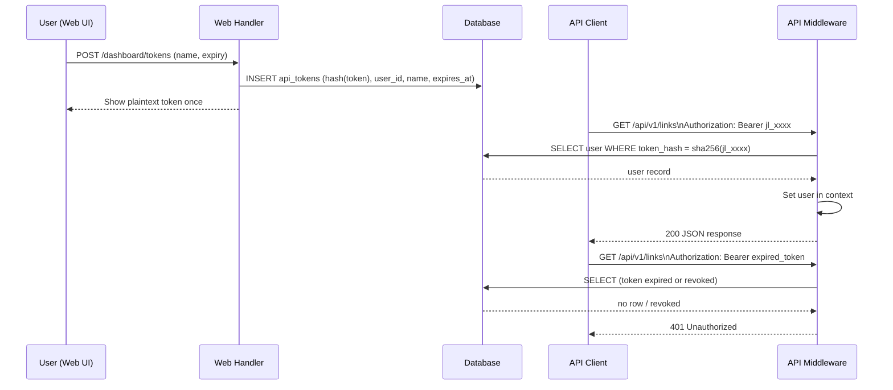

# ADR-0009: API Token Authentication — Personal Access Tokens

## Context and Problem Statement

The REST API introduced in ADR-0008 needs an authentication mechanism suited to programmatic clients. The existing OIDC + SCS session system (ADR-0003) is designed for browser-based login flows with redirect-based OAuth2. CLI tools, browser extensions, and CI/CD integrations cannot perform interactive OAuth2 redirects and cannot maintain cookie-based sessions across invocations. How should API clients authenticate?

## Decision Drivers

* CLI tools and automation scripts need a credential that can be stored in environment variables or config files
* Browser extensions need a credential they can store in extension storage and include on every request
* Credentials MUST be revocable by the user without requiring a full OIDC re-login
* The auth system MUST NOT require a second identity provider — it should integrate with the existing local user records
* Credentials SHOULD be scoped to a single user (not shared org-level tokens for now)
* Security: tokens MUST be stored hashed in the database; the plaintext is shown only once at creation time

## Considered Options

* **Personal Access Tokens (PATs) — user-generated opaque tokens, stored hashed, passed as `Authorization: Bearer <token>`**
* **Short-lived JWTs issued by the server after OIDC login**
* **Reuse existing SCS session cookie for API requests**
* **OAuth2 client credentials flow (machine-to-machine)**

## Decision Outcome

Chosen option: **Personal Access Tokens (PATs) stored hashed in a new `api_tokens` table, passed as `Authorization: Bearer <token>`.**

Users create named PATs via the web UI (Settings page) or the API itself. The plaintext token is displayed once at creation. Subsequent requests authenticate by sending `Authorization: Bearer <plaintext-token>`. The server hashes the received token and compares it against the stored hash. Tokens have an optional expiry date; unexpired, non-revoked tokens are valid.

### Token Format

Tokens use the format: `jl_<random-32-bytes-base62>` (prefix `jl_` makes tokens identifiable in logs and scanning tools; 32 random bytes provide 192 bits of entropy). Example: `jl_4K9mXzQ2nR8vL1wA3cE7hP6tY0sDfUgN`.

### `api_tokens` Schema

```sql
CREATE TABLE api_tokens (
    id          TEXT PRIMARY KEY,           -- UUID
    user_id     TEXT NOT NULL REFERENCES users(id) ON DELETE CASCADE,
    name        TEXT NOT NULL,              -- human-readable label
    token_hash  TEXT NOT NULL UNIQUE,       -- SHA-256 of plaintext token
    last_used_at TIMESTAMP,
    expires_at  TIMESTAMP,                  -- NULL means no expiry
    created_at  TIMESTAMP NOT NULL DEFAULT CURRENT_TIMESTAMP,
    revoked_at  TIMESTAMP                   -- NULL means active
);
```

### Middleware

The API sub-router uses a `BearerTokenMiddleware` that:
1. Reads the `Authorization: Bearer <token>` header
2. Hashes the token with SHA-256
3. Looks up the hash in `api_tokens` where `revoked_at IS NULL AND (expires_at IS NULL OR expires_at > NOW())`
4. Loads the associated `user` record and sets it in the request context (same context key as the OIDC middleware — API handlers share authorization logic with HTMX handlers)
5. Updates `last_used_at` asynchronously (non-blocking)
6. Returns `401 Unauthorized` if the token is missing, invalid, expired, or revoked

### Consequences

* Good, because PATs are the de-facto standard for developer API tokens (GitHub, GitLab, Gitea all use this pattern)
* Good, because tokens are fully revocable per-token without invalidating the user's OIDC session
* Good, because the token is completely independent of the OIDC provider — it works even if the provider is temporarily unavailable
* Good, because the `jl_` prefix makes accidental exposure (logs, screenshots) immediately identifiable and scannable
* Good, because the same context-based user injection used by OIDC middleware applies — API handlers don't need to know which auth method was used
* Bad, because PATs are long-lived credentials if the user sets no expiry — users should be encouraged to set expiry dates
* Bad, because PAT management requires a new UI surface (settings page to create, list, revoke)

### Confirmation

Confirmed by: `api_tokens` table present in goose migrations; `BearerTokenMiddleware` extracting and validating tokens; `GET /api/v1/users/me` returning 401 without a token and 200 with a valid token; tokens listed and revocable in the Settings UI.

## Pros and Cons of the Options

### Personal Access Tokens (chosen)

* Good, because universally understood — `Authorization: Bearer <token>` is standard HTTP
* Good, because easy to use in curl, environment variables, CI secrets
* Good, because per-token revocation without affecting other sessions
* Good, because no token refresh needed for long-lived automation (optional expiry)
* Bad, because long-lived if expiry not set — mitigated by encouraging expiry on creation UI
* Bad, because requires a new `api_tokens` table and settings UI

### Short-lived JWTs

* Good, because self-contained — no DB lookup on every request
* Bad, because JWTs expire (typically 15-60 min) — not suitable for unattended automation
* Bad, because revocation requires a deny-list (re-introduces DB lookup, negating the stateless benefit)
* Bad, because clients must implement token refresh, adding complexity

### Reuse SCS Session Cookie

* Good, because zero new infrastructure — just send the session cookie
* Bad, because session cookies are not safe to store in env vars or config files
* Bad, because SCS sessions are tied to the browser login flow — no way to create them programmatically
* Bad, because `SameSite=Lax` cookies are blocked on cross-origin requests from extensions

### OAuth2 Client Credentials

* Good, because the industry standard for machine-to-machine auth
* Bad, because requires implementing a full OAuth2 authorization server — overkill for a self-hosted go-links tool
* Bad, because clients need to implement token refresh and client secret management

## Architecture Diagram



## More Information

* Related: ADR-0003 (OIDC auth — PATs complement, not replace, OIDC sessions), ADR-0005 (data model), ADR-0008 (REST API)
* Token format inspired by GitHub PAT format (`ghp_...`) and Gitea token format (`gt_...`)
* SHA-256 hash chosen over bcrypt because token lookup must be fast on every API request; the 192-bit token entropy makes brute-force infeasible even with a fast hash
* See ADR-0010 for how PAT creation is documented in the Swagger UI
