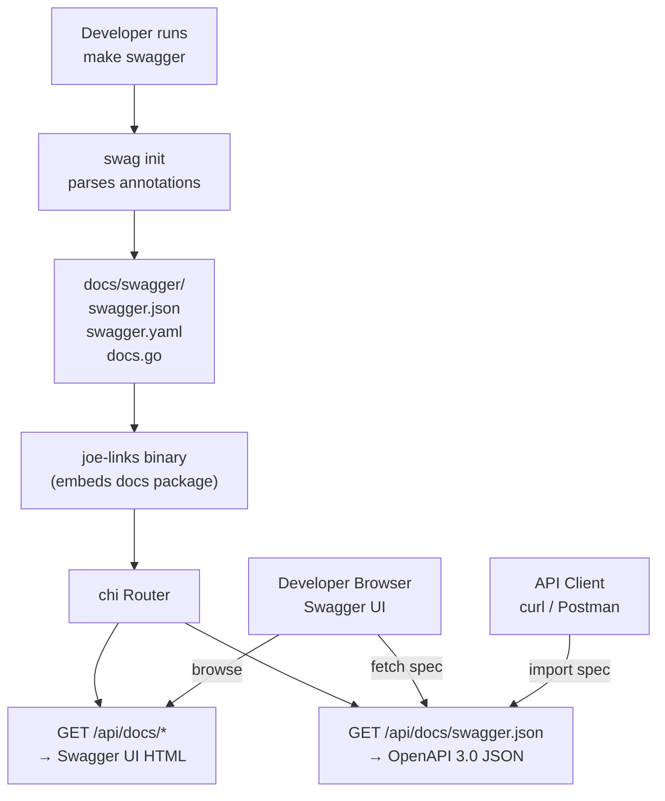

# ADR-0010: OpenAPI 3.0 Documentation and Swagger UI

## Context and Problem Statement

The REST API introduced in ADR-0008 needs interactive documentation so developers can discover endpoints, understand request/response shapes, and test calls directly in the browser. How should the OpenAPI specification be generated and how should the Swagger UI be served — in a way that stays in sync with the Go codebase and fits the single-binary deployment model?

## Decision Drivers

* The OpenAPI spec MUST stay in sync with the actual API — hand-maintained YAML drifts
* Swagger UI MUST be served by the same binary — no external documentation hosting
* The approach MUST integrate with Go and chi without a full code-generation framework inversion
* The spec MUST be accessible at a stable URL (for import into Postman, curl, etc.)
* All API endpoints (links, tags, users, admin, token management) MUST be documented
* Authentication via PAT Bearer token MUST be represented in the spec

## Considered Options

* **swaggo/swag — Go comment annotations → OpenAPI 3.0 spec, served via swaggerui handler**
* **oapi-codegen — spec-first: write OpenAPI YAML, generate Go server stubs**
* **go-swagger — OpenAPI 2.0 (Swagger 2.0) from Go struct comments**
* **Hand-written OpenAPI YAML committed to the repo, served as a static file**

## Decision Outcome

Chosen option: **swaggo/swag for annotation-driven OpenAPI 3.0 spec generation, with the generated `swagger.json` embedded and served via a Swagger UI handler at `/api/docs`.**

API handler functions are annotated with swaggo `// @Summary`, `// @Param`, `// @Success`, etc. comments. Running `swag init` (or `make swagger`) regenerates `docs/swagger.json` and `docs/swagger.go`. The generated `docs` package is imported by the binary; the spec is served as `/api/docs/swagger.json` and the Swagger UI at `/api/docs/`. The `swagger.json` file is committed to the repo so the binary can be built without requiring `swag` to be installed.

### Swagger UI Serving

The Swagger UI is served using `github.com/swaggo/http-swagger` (a chi-compatible handler). No static assets need to be embedded separately — the library serves the Swagger UI assets from a CDN-backed embed. The handler is registered on the main router (no auth required so docs are browsable without logging in):

```go
// Governing: ADR-0010 — Swagger UI at /api/docs
import httpswagger "github.com/swaggo/http-swagger/v2"
r.Get("/api/docs/*", httpswagger.WrapHandler)
```

### URL Structure

| URL | Content |
|-----|---------|
| `/api/docs/` | Swagger UI (interactive browser) |
| `/api/docs/swagger.json` | Raw OpenAPI 3.0 JSON spec |
| `/api/docs/swagger.yaml` | Raw OpenAPI 3.0 YAML spec (swag also generates this) |

### Annotation Example

```go
// CreateLink creates a new go-link.
//
// @Summary      Create a go-link
// @Description  Creates a new short link with the given slug and target URL.
// @Tags         links
// @Accept       json
// @Produce      json
// @Param        body  body      api.CreateLinkRequest  true  "Link to create"
// @Success      201   {object}  api.LinkResponse
// @Failure      400   {object}  api.ErrorResponse
// @Failure      401   {object}  api.ErrorResponse
// @Failure      409   {object}  api.ErrorResponse  "Slug conflict"
// @Security     BearerToken
// @Router       /api/v1/links [post]
func (h *LinksAPIHandler) Create(w http.ResponseWriter, r *http.Request) {
```

### Security Definition

The `BearerToken` security scheme is declared in the main annotation block:

```go
// @securityDefinitions.apikey BearerToken
// @in header
// @name Authorization
// @description Type "Bearer" followed by a space and your API token.
```

### Makefile Target

```makefile
.PHONY: swagger
swagger:
	swag init -g cmd/joe-links/main.go -o docs/swagger --outputTypes json,yaml,go
```

### Consequences

* Good, because annotations live next to the handler code — documentation stays in sync naturally
* Good, because `swag init` is a `go generate` step, not a runtime dependency — the binary builds without it
* Good, because the generated `swagger.json` is committed so `go build` works anywhere
* Good, because `http-swagger` serves the full Swagger UI with zero separate asset management
* Good, because Swagger UI is accessible without auth — developers can explore the API without a token
* Bad, because swaggo annotation syntax is verbose and comment-based — not as IDE-friendly as typed schemas
* Bad, because `swag init` must be re-run when annotations change — stale spec if forgotten (mitigated by CI check)
* Neutral, because spec-first (oapi-codegen) would give stronger type guarantees, but inverts the development workflow for a primarily UI-driven app

### Confirmation

Confirmed by: `GET /api/docs/` returns Swagger UI HTML; `GET /api/docs/swagger.json` returns valid OpenAPI 3.0 JSON; all `/api/v1` endpoints appear in the spec; the `BearerToken` security scheme is listed; `make swagger` regenerates `docs/swagger/` without errors.

## Pros and Cons of the Options

### swaggo/swag (chosen)

* Good, because code-first — no separate spec to maintain alongside handlers
* Good, because widely adopted in the Go ecosystem, excellent chi integration
* Good, because generates both JSON and YAML; `http-swagger` serves Swagger UI directly
* Good, because `swagger.json` can be committed, keeping the build reproducible
* Bad, because annotation syntax is verbose Go comments, not native Go types
* Bad, because annotations can drift from actual handler behavior if not kept in sync (use `make swagger` in CI)

### oapi-codegen (spec-first)

* Good, because the spec is the contract — handlers are generated, guaranteeing alignment
* Good, because strongly typed request/response validation via generated code
* Bad, because spec-first workflow inverts the normal development order for a UI-driven app
* Bad, because regenerating after spec changes can clobber hand-written handler logic (mitigated with overlays, but complex)
* Neutral, because better suited for API-first products than a primarily web app with an API layer

### go-swagger (OpenAPI 2.0)

* Good, because mature and widely deployed
* Bad, because generates Swagger 2.0, not OpenAPI 3.0 — lacks `oneOf`, `anyOf`, `requestBody`, newer features
* Bad, because the project has had reduced maintenance activity

### Hand-written YAML

* Good, because full control over spec — no tooling dependency
* Bad, because guaranteed to drift from the actual implementation over time
* Bad, because requires a separate spec authoring workflow

## Architecture Diagram



## More Information

* swaggo/swag: https://github.com/swaggo/swag
* http-swagger handler: https://github.com/swaggo/http-swagger
* Related: ADR-0008 (REST API), ADR-0009 (API auth — BearerToken security scheme)
* OpenAPI 3.0 spec: https://spec.openapis.org/oas/v3.0.3
* The Swagger UI is intentionally unauthenticated — developers must provide their PAT in the Swagger UI's "Authorize" dialog to test protected endpoints
