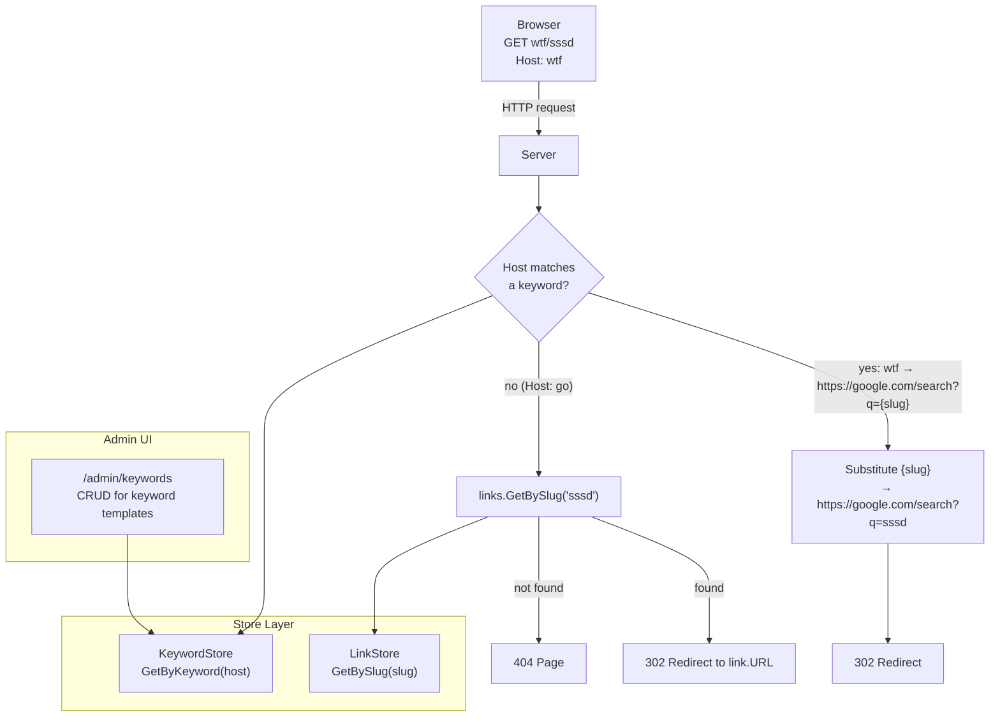

# ADR-0011: Root Forward Keywords (Admin-Configurable Hostname Templates)

## Context and Problem Statement

joe-links currently operates as a single-hostname go-links service: `go/slug` resolves a slug
to an exact URL. There is demand for *parameterized* shortcuts — additional hostnames whose
path segment is substituted into a URL template rather than looked up as an exact slug.
Examples: `wtf/sssd` → Google search for "sssd", `gh/joe-links` → GitHub repository page,
`jira/PROJ-42` → Jira ticket. How should the server model, store, and route these
admin-defined hostname→template mappings without breaking the existing slug system?

## Decision Drivers

* Admins need live control — changing keywords should not require a server restart
* The existing link model only supports exact URL mappings; templates are a fundamentally
  different abstraction and MUST NOT pollute the `links` table
* The server is already hostname-agnostic; it must learn to inspect the `Host` header
* Each new keyword hostname requires a matching `/etc/hosts` entry on the client (or equivalent
  DNS config); this is an operator concern, not an app concern
* The browser extension (see companion work) should be able to resolve keyword hosts the same
  way it resolves `go/slug` — by knowing the full set of registered keywords

## Considered Options

* **Option A — Database-backed `keywords` table with admin CRUD UI** (chosen)
* **Option B — Config-file keyword map in `joe-links.yaml`**
* **Option C — Extend the existing `links` table with a `is_template` flag**

## Decision Outcome

Chosen option: **Option A**, because it gives admins live control through the existing admin
dashboard pattern without requiring a server restart, and keeps templates cleanly separated from
exact-match links.

### Consequences

* Good, because admins can add/edit/delete keyword templates without touching config files or
  restarting the server
* Good, because the `links` table remains a pure exact-match store; no conflation of concepts
* Good, because the resolver change is minimal — check `Host`, look up keyword, fall through to
  slug if no match — preserving the existing `/{slug}` catch-all
* Bad, because it adds a new DB table, store, and admin handler (scope increase)
* Bad, because each keyword hostname still requires a client-side `/etc/hosts` (or DNS) entry;
  the app cannot automate that step

### Confirmation

Implementation is confirmed when:
1. `GET wtf/sssd` (with `wtf` registered as `https://google.com/search?q={slug}`) returns a
   `302` to `https://google.com/search?q=sssd`
2. `GET go/some-slug` is unaffected — resolver falls through to normal slug lookup
3. Admin UI at `/admin/keywords` allows create/edit/delete of keyword templates

## Pros and Cons of the Options

### Option A — Database-backed `keywords` table

New table: `keywords(id UUID, keyword TEXT UNIQUE, url_template TEXT, description TEXT,
created_at TIMESTAMP)`. Template variable: `{slug}` is replaced with the URL path segment.
New `KeywordStore` in `internal/store/`. Resolver checks `strings.SplitN(r.Host, ":", 2)[0]`
against `keywords.keyword`; on match, substitutes `{slug}` and redirects. Admin CRUD at
`/admin/keywords` using the existing admin handler pattern.

* Good, because live updates without restart
* Good, because clean separation from the `links` table
* Good, because fits naturally into the existing admin dashboard and store pattern
* Neutral, because one new migration, one new store, one new handler — small but real scope

### Option B — Config-file keyword map

Keywords defined in `joe-links.yaml` under a `keywords:` block, loaded at startup via viper.

* Good, because no DB schema change
* Bad, because requires a server restart to add or change a keyword — defeats the admin UX goal
* Bad, because keywords live in a config file that is gitignored in dev, creating drift risk

### Option C — Extend `links` with `is_template` flag

Add `is_template BOOL` and `keyword_host TEXT` columns to `links`. A "template link" whose slug
matches the Host header applies the `url` field as a template with the path substituted.

* Good, because reuses existing CRUD and store code
* Bad, because conflates two different abstractions (exact redirect vs. parameterized template)
  in a single table and model
* Bad, because slug validation rules (uniqueness, reserved prefixes) don't apply to keywords,
  creating confusing edge cases

## Architecture Diagram

## More Information

* The `{slug}` placeholder in `url_template` is the path segment from the request URL
  (i.e., `chi.URLParam(r, "slug")`). No other substitutions are defined in this ADR.
* Template URLs MUST be valid URL prefixes; validation at save time should reject templates that
  produce invalid URLs when `{slug}` is substituted with a representative value.
* Keyword strings follow the same character rules as hostnames; they are lowercase alphanumeric
  and hyphens only (no dots, matching the `/etc/hosts` single-word format).
* The browser extension can fetch `/api/v1/keywords` (a future endpoint) to discover registered
  keyword hosts and apply them client-side, enabling `wtf/foo` to navigate correctly without
  needing the `http://` prefix.
* Related: ADR-0007 (routing), ADR-0005 (data model), ADR-0008 (REST API layer).
