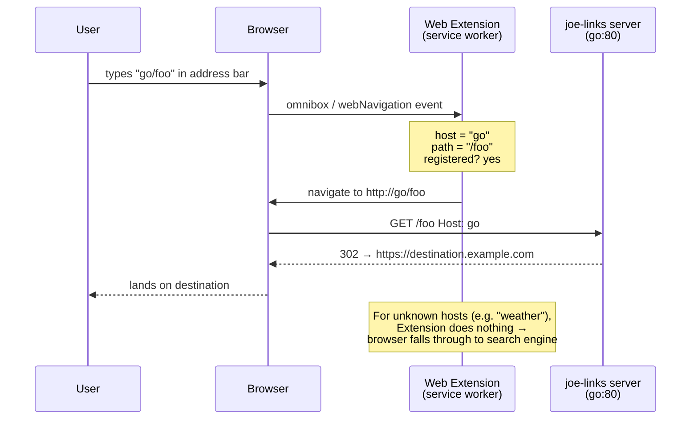

# ADR-0012: Browser Extension for Single-Word Hostname Navigation

## Context and Problem Statement

joe-links uses a bare single-word hostname (`go`) configured via `/etc/hosts`. All modern
browsers — Safari, Chrome, and Firefox — treat single-word address-bar entries as search
queries before attempting DNS resolution. This means typing `go/foo` in any browser opens a
search for "go/foo" rather than navigating to the go-links service. How should we make
`go/foo` (and future keyword hosts like `wtf/foo`, `gh/foo`) resolve correctly in the browser
without requiring users to prefix every URL with `http://`?

## Decision Drivers

* The whole point of go-links is frictionless navigation — requiring `http://` defeats the UX
* The solution must work on macOS for personal use (not a corporate MDM/policy environment)
* Safari, Chrome, and Firefox all need to work (or at least Chrome + Safari as primary targets)
* Future keyword hostnames (ADR-0011) follow the same single-word pattern and need the same fix
* The solution should not require changing the hostname format (e.g., adding `.lan`) because
  that breaks the canonical `go/foo` UX that go-links is known for

## Considered Options

* **Option A — Web Extension (Manifest V3, cross-browser)** (chosen)
* **Option B — Dot-suffix hostname (e.g., `go.lan`)**
* **Option C — OS-level PAC (Proxy Auto-Config) file**
* **Option D — Local DNS resolver (dnsmasq) + browser intranet heuristics**
* **Option E — Require explicit `http://` prefix**

## Decision Outcome

Chosen option: **Option A — Web Extension**, because it is the only approach that reliably
intercepts the address bar before the browser sends input to the search engine, works across
Chrome and Safari, and scales naturally to the multi-keyword-host feature (ADR-0011) by reading
the server's registered keyword list at runtime.

### Consequences

* Good, because `go/foo` works exactly as intended in Chrome (sideloaded unpacked extension)
  and Safari (converted via `xcrun safari-web-extension-converter`)
* Good, because the extension can fetch `/api/v1/keywords` to dynamically discover keyword
  hosts, making ADR-0011's `wtf/foo` and `gh/foo` work automatically
* Good, because the extension is ~30–50 lines of JS and a manifest — low maintenance surface
* Bad, because users must install the extension in each browser (one-time setup)
* Bad, because Safari requires an Xcode project and macOS app wrapper for distribution;
  sideloading is possible but more involved than Chrome
* Bad, because Chrome's Manifest V3 restricts `webRequest` blocking; the extension must use
  `declarativeNetRequest` or the `omnibox` API instead of intercepting raw requests

### Confirmation

Implementation is confirmed when:
1. Typing `go/foo` (no `http://`) in Chrome navigates to the go-links service
2. Typing `go/foo` in Safari navigates to the go-links service (via converted extension)
3. Typing a non-go-link term (e.g., `weather`) still goes to the default search engine
4. Adding a new keyword host (`wtf`) causes `wtf/foo` to navigate correctly without
   reinstalling or reconfiguring the extension

## Pros and Cons of the Options

### Option A — Web Extension (Manifest V3, cross-browser)

A service worker registers an `omnibox` keyword or uses `declarativeNetRequest` rules combined
with `webNavigation` listeners to detect single-word-hostname patterns and rewrite them to
`http://{host}/{path}` before the browser sends the request. The extension ships a
`manifest.json`, one background service worker, and optionally a small options page. Chrome can
load it as an unpacked extension; Safari uses `xcrun safari-web-extension-converter` to wrap
it in a macOS app.

* Good, because it solves the problem at exactly the right layer (browser input → URL rewrite)
* Good, because MV3 is supported in Chrome, Edge, Firefox, and (via converter) Safari
* Good, because the extension can query the joe-links API for registered keyword hosts,
  enabling dynamic support for ADR-0011 keyword forwarding
* Neutral, because MV3 `declarativeNetRequest` is more complex than the old `webRequest` API
* Bad, because manual install is required per browser; no auto-update without a CWS listing
* Bad, because Safari distribution requires Xcode and signing (sideload is possible but hacky)

### Option B — Dot-suffix hostname (`go.lan`, `go.local`, `go.test`)

Add a dot to the hostname so browsers recognise it as a domain rather than a search term.
Update `/etc/hosts` to `127.0.0.1 go.lan`, update Dex redirectURIs, update the app config.

* Good, because no extension needed — works in all browsers immediately
* Bad, because `go.lan/foo` is not the same UX as `go/foo`; `.local` is mDNS-reserved
* Bad, because every new keyword host also needs a dot suffix, compounding the UX regression
* Bad, because this directly contradicts the premise of go-links as a frictionless shortcut

### Option C — OS-level PAC (Proxy Auto-Config) file

Configure macOS Network Settings to use a `file://` PAC that intercepts certain hostnames and
proxies them to the local server.

* Good, because it's OS-wide — all browsers and apps benefit
* Bad, because PAC files are evaluated *after* the browser decides whether to search or
  navigate; a single-word entry never becomes an HTTP request for the PAC to intercept
* Bad, because PAC requires maintaining a separate JS file and configuring Network settings

### Option D — Local DNS (dnsmasq) + browser intranet heuristics

Run dnsmasq locally to resolve `go` → 127.0.0.1 and hope browsers' intranet-detection
heuristics eventually learn to navigate rather than search.

* Good, because it's transparent to the user after initial setup
* Bad, because browser heuristics are not reliable or documented; Chrome removed the
  "search single-word intranet names" setting in recent versions; Safari has no such setting
* Bad, because dnsmasq adds a persistent background service and DNS configuration complexity
* Bad, because it still doesn't reliably work in Safari

### Option E — Require explicit `http://` prefix

Document that users must type `http://go/foo`. No code changes needed.

* Good, because zero implementation cost
* Bad, because this is exactly the friction go-links is designed to eliminate
* Bad, because new users will consistently make the mistake and file bugs

## Architecture Diagram

## More Information

* The extension interacts with ADR-0011 keyword hosts: it fetches `/api/v1/keywords` from the
  configured joe-links base URL to build its list of recognised single-word hostnames at
  startup and on a periodic refresh interval.
* The canonical go-links hostname (`go`) is always included in the extension's host list,
  even before any keyword hosts are configured.
* For Chrome, the extension can be distributed as an unpacked load from the repo directory.
  For Safari, `xcrun safari-web-extension-converter integrations/extension/` produces an Xcode project
  that can be built and sideloaded with a free Apple Developer account.
* Related: ADR-0011 (root forward keywords), ADR-0007 (routing).
* Web Extensions specification: https://developer.mozilla.org/en-US/docs/Mozilla/Add-ons/WebExtensions
