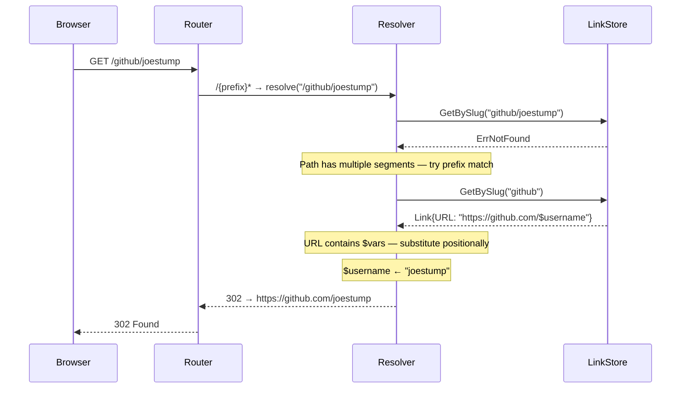

# ADR-0013: URL Variable Substitution in Short Links

## Context and Problem Statement

Short links are currently static: a slug maps to exactly one URL. Users who want to navigate
to parameterized destinations (e.g. `go/github/joestump` → `https://github.com/joestump`) must
create one link per target — there is no way to build a reusable "template" link. Should we add
user-managed parameterized links with `$variable` substitution in URL templates, and if so, how
should variables be declared, matched, and substituted in the resolver?

## Decision Drivers

* Users want reusable go-links that accept path segments as arguments (e.g. `go/jira/PROJ-123`)
* The feature must be entirely user-facing — no admin configuration or per-host DNS tricks required
* Multiple ordered variables must be supported (`go/mylink/$foo/$bar`)
* Syntax must be unambiguous and not break existing single-segment, static links
* The resolver already handles a similar problem for keyword host routing (ADR-0011) — the solution
  should compose cleanly with it
* No breaking changes to the existing `links` table schema where avoidable

## Considered Options

* **Option A — `$varname` in URL field, prefix-slug matching in resolver** (chosen)
* **Option B — explicit `variables` column listing variable names in order**
* **Option C — positional `{1}`, `{2}` placeholder syntax, no variable naming**

## Decision Outcome

Chosen option: **Option A — `$varname` markers in the URL field, prefix slug matching**,
because it requires no schema migration, variable names are self-documenting in the URL template,
and the matching algorithm generalises the pattern already established for keyword routing.

### How it works

1. A user creates a link with slug `github` and URL `https://github.com/$username`.
2. When the browser navigates to `go/github/joestump`, the resolver receives path `/github/joestump`.
3. The resolver tries an exact match on `github/joestump` — not found.
4. It then splits the path on `/` and tries progressively shorter prefixes:
   - slug `github` → found; URL contains `$username`; remaining segments `["joestump"]` are
     substituted in left-to-right order: `$username = joestump`.
5. The resolved URL `https://github.com/joestump` is returned as a 302 redirect.

Multiple variables use the same positional approach:

```
slug:  my-link      URL: https://example.com/search?q=$query&page=$page
path:  /my-link/widgets/3
→     https://example.com/search?q=widgets&page=3
```

Variable names (`$varname`) MUST match `\$[a-z][a-z0-9_]*` (lowercase letters, digits,
underscores). The number of path segments beyond the slug MUST equal the number of `$var`
markers in the URL template; mismatches fall through to a 404.

### Router change

The catch-all resolver route changes from `/{slug}` (single segment) to `/{prefix}*` (wildcard
suffix), ensuring multi-segment paths reach the resolver. All existing named routes remain
registered before the catch-all and are unaffected.

### Consequences

* Good, because no new database table or column is required — `$var` syntax in `links.url` is
  entirely backward-compatible; existing static links continue to work unchanged
* Good, because variable names are visible in the URL template, making links self-documenting
* Good, because prefix-slug matching is O(path depth) lookups, not a full table scan
* Good, because the feature is entirely in user-space; no admin configuration required
* Bad, because prefix matching adds latency to 404 paths (multiple failed DB lookups before
  giving up) — mitigated by trying the exact slug first and only falling back when the URL
  starts with `/`-delimited segments
* Bad, because slug uniqueness constraint now needs consideration: `github` and `github/joestump`
  as separate slugs could ambiguously overlap — resolved by always trying the longest exact match
  first, then shortening
* Neutral, because variable count validation happens at resolution time, not at link creation —
  users won't see errors until they actually navigate with wrong arity

### Confirmation

Implementation is confirmed when:
- A link with `$varname` in its URL can be created through the existing link CRUD UI
- A request to `/{slug}/{v1}/{v2}` correctly substitutes all variables and redirects
- A request with wrong variable count returns 404
- Existing single-segment static links are unaffected
- The API endpoint `GET /api/v1/links` includes the URL template as-is

## Pros and Cons of the Options

### Option A — `$varname` in URL field, prefix slug matching

Variables are embedded in the URL template itself using `$varname` syntax. The resolver detects
`$` in the URL to recognise a parameterised link and substitutes path segments positionally.

* Good, because no schema changes; works with the existing `links.url` text column
* Good, because variable names are self-documenting (`$username` vs `{1}`)
* Good, because creation/editing uses the existing link form with no new UI fields required
* Good, because consistent with `{slug}` placeholder syntax used in keyword URL templates (ADR-0011)
* Bad, because variable arity errors surface at request time, not at save time
* Bad, because prefix-slug matching adds complexity to the resolver

### Option B — explicit `variables` column

Add a nullable `variables TEXT` column (JSON array of names) to the `links` table. The resolver
reads variable names from this column and knows exactly how many segments to expect.

* Good, because explicit variable count enables validation at link save time
* Good, because query `WHERE variables IS NOT NULL` can build an efficient index of variable links
* Bad, because requires a schema migration
* Bad, because the form UI needs new fields to declare variable names separately from the URL
* Neutral, because the UI complexity is moderate but noticeable

### Option C — positional `{1}`, `{2}` placeholder syntax

Use `{1}`, `{2}` numbered placeholders in the URL, keeping the same resolver approach as Option A
but without variable names.

* Good, because no schema changes
* Good, because arity can be inferred by counting `{N}` tokens
* Bad, because positional indices are not self-documenting (what is `{1}` in `https://github.com/{1}/{2}`?)
* Bad, because inconsistent with `{slug}` usage in keyword templates (ADR-0011), where `{slug}`
  is a named, not numbered, placeholder

## Architecture Diagram



## More Information

- ADR-0005 describes the links data model (slug uniqueness, URL field)
- ADR-0011 describes keyword host routing using `{slug}` substitution — a related but admin-only
  pattern; this ADR extends the concept to user-space with multi-segment path variables
- SPEC-0009 will formalise the requirements, scenarios, and acceptance criteria for implementation
