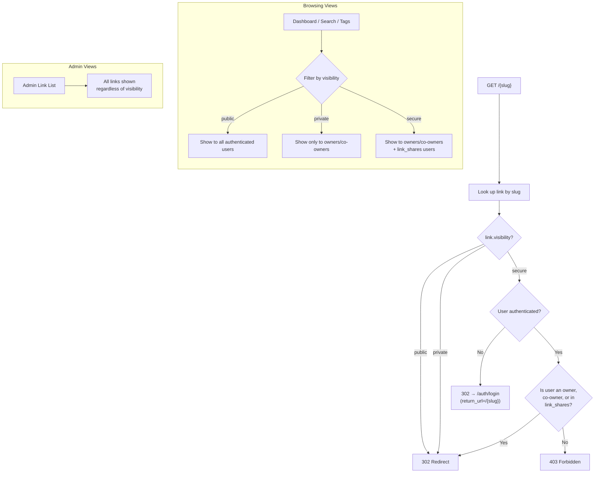
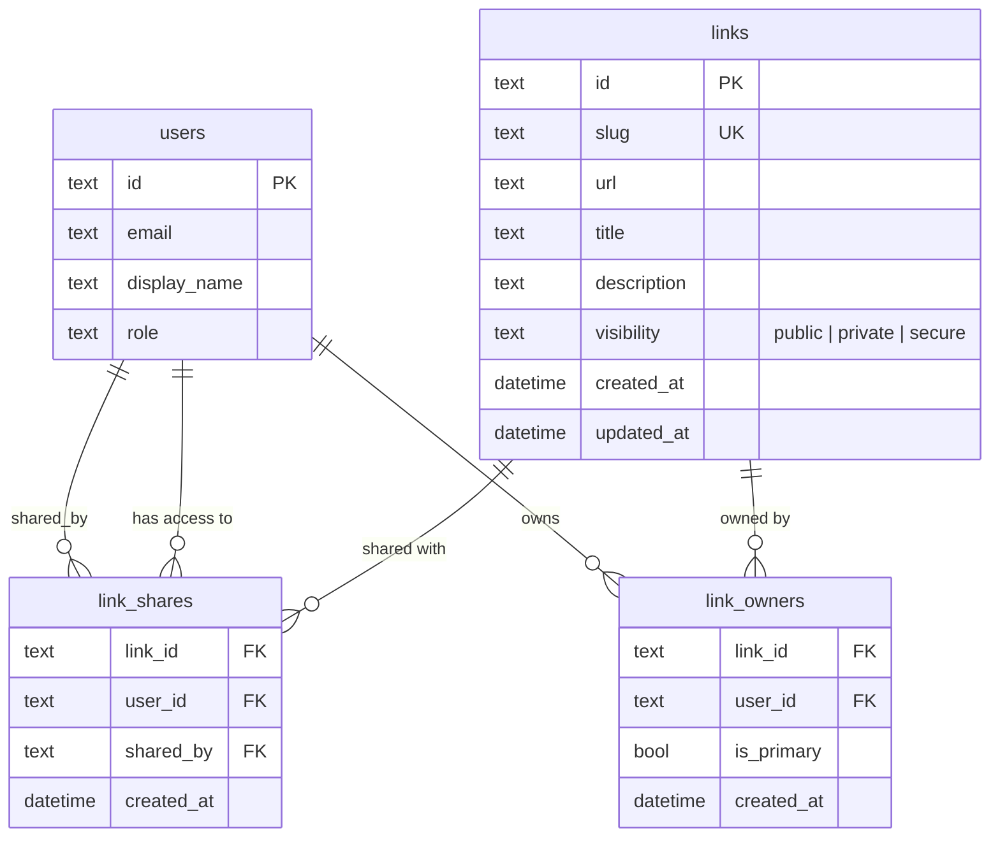

# ADR-0014: Link Visibility Modes

## Context and Problem Statement

All links in joe-links are currently implicitly public: any person who navigates to `/{slug}` receives a 302 redirect, and all links appear in browsing views (dashboard search, tag listings, admin link lists). This one-size-fits-all model is insufficient for teams that need to share internal or sensitive URLs. Some links should be discoverable only by their owners, and some should only redirect for explicitly authorized users.

How should we model and enforce per-link visibility so that link creators can control who can discover and follow their links, without breaking the existing public-by-default behavior?

## Decision Drivers

* The default behavior MUST remain unchanged — existing links continue to work as public links with no migration action required
* The solution must support at least three tiers of visibility: fully public, unlisted/hidden from browsing, and access-controlled
* Visibility enforcement must apply to both the redirect resolver (`/{slug}`) and the browsing/search views (`/dashboard`, tag listings, admin views)
* Access-controlled links require a sharing mechanism to grant access to specific users
* The data model must work across all three supported databases (SQLite, MySQL, PostgreSQL) without dialect-specific features
* The design must compose cleanly with multi-ownership (ADR-0005) — co-owners always have full access regardless of visibility mode
* Performance impact on the redirect hot path must be minimal for public links

## Considered Options

* **Option A — `visibility` enum column on `links` + `link_shares` join table** (chosen)
* **Option B — Boolean flags (`is_listed`, `is_restricted`) on `links`**
* **Option C — ACL table with permission types per user per link**

## Decision Outcome

Chosen option: **Option A — `visibility` enum column on `links` + `link_shares` join table**, because it cleanly encodes three distinct modes in a single column, requires only one new table for access grants, defaults to the existing public behavior, and avoids the combinatorial complexity of multiple boolean flags or a full ACL system.

### Visibility Modes

| Mode       | Stored Value | Redirect Behavior                                           | Browsing Behavior                                        |
|------------|--------------|-------------------------------------------------------------|----------------------------------------------------------|
| **Public** | `public`     | Redirects for anyone (authenticated or not)                 | Appears in all browsing views, search results, tag lists |
| **Private**| `private`    | Redirects for anyone who knows the slug (no auth required)  | Hidden from public browsing views; visible only to owners/co-owners in their dashboard |
| **Secure** | `secure`     | Redirects ONLY for authenticated users who are an owner/co-owner OR have a `link_shares` record | Hidden from all public views; visible only to owners/co-owners and shared users in their dashboards |

### Schema Changes

#### `links` table — new column

| Column       | Type | Default    | Notes                                         |
|--------------|------|------------|-----------------------------------------------|
| `visibility` | TEXT | `'public'` | One of `public`, `private`, `secure`          |

Added via a goose migration as `ALTER TABLE links ADD COLUMN visibility TEXT NOT NULL DEFAULT 'public'`. Existing rows automatically receive `public`, preserving backward compatibility.

#### `link_shares` — new table

| Column      | Type     | Notes                                                 |
|-------------|----------|-------------------------------------------------------|
| `link_id`   | TEXT     | FK to `links.id` ON DELETE CASCADE                    |
| `user_id`   | TEXT     | FK to `users.id` ON DELETE CASCADE                    |
| `shared_by` | TEXT     | FK to `users.id` — the user who granted the share     |
| `created_at`| DATETIME | UTC timestamp, set on insert                          |

Composite primary key `(link_id, user_id)`. Only relevant when `links.visibility = 'secure'`; rows for non-secure links are ignored by the resolver but MAY exist (pre-sharing before switching to secure mode).

### Resolver Logic

The slug resolver at `/{slug}` (and `/{prefix}*` for variable links per ADR-0013) is modified as follows:

1. Look up the link by slug (unchanged).
2. Check `link.visibility`:
   - **`public`**: redirect immediately (no change from current behavior).
   - **`private`**: redirect immediately (the user already knows the slug; no auth check).
   - **`secure`**: require authentication. If not authenticated, redirect to `/auth/login` with a return URL. If authenticated, check whether the user is an owner/co-owner (`link_owners`) OR has a `link_shares` record for this link. If authorized, redirect. If not, return 403.
3. For public and private links, the resolver hot path is unchanged — no additional DB queries.

### Browsing / Search Visibility Rules

| View                              | Public Links | Private Links                | Secure Links                           |
|-----------------------------------|--------------|------------------------------|----------------------------------------|
| Dashboard (own links)             | Shown        | Shown (owner sees own links) | Shown (owner sees own links)           |
| Dashboard (shared with me)        | N/A          | N/A                          | Shown if user has `link_shares` record |
| Dashboard search / tag filter     | Shown        | Hidden unless owner          | Hidden unless owner or shared          |
| Tag listing (`/dashboard/tags/*`) | Shown        | Hidden unless owner          | Hidden unless owner or shared          |
| Admin link list (`/admin/links`)  | Shown        | Shown (admin sees all)       | Shown (admin sees all)                 |
| API `GET /api/v1/links`           | Shown        | Hidden unless owner or admin | Hidden unless owner, shared, or admin  |

### UI Changes

The link create and edit forms gain a `visibility` select/dropdown with three options: Public (default), Private, and Secure. When a link is set to `secure`, a "Share" panel appears on the link detail page allowing owners to search for users and grant/revoke access.

A "Shared with me" section or filter is added to the dashboard so users can find secure links that have been shared with them.

### Consequences

* Good, because existing links remain public by default — zero-friction migration
* Good, because the `visibility` column is a simple TEXT field that works identically across SQLite, MySQL, and PostgreSQL
* Good, because the resolver hot path for public and private links has zero additional overhead (no new queries)
* Good, because `link_shares` is a simple join table consistent with the existing `link_owners` pattern (ADR-0005)
* Good, because admins retain full visibility regardless of link visibility mode
* Good, because the three modes map to clear, intuitive mental models (public = anyone sees, private = unlisted, secure = access-controlled)
* Bad, because secure link resolution adds one additional query (check `link_shares`) on the redirect path — mitigated by a composite index on `(link_id, user_id)`
* Bad, because the "Shared with me" dashboard view adds query complexity — mitigated by indexed joins
* Bad, because `link_shares` rows for non-secure links are inert but can accumulate — acceptable; cleanup can be done lazily when visibility is changed away from `secure`

### Confirmation

Implementation is confirmed when:
- The `links` table has a `visibility` column defaulting to `public`
- A `link_shares` table exists with the schema described above
- `GET /{slug}` for a `secure` link returns 403 for unauthenticated users and unauthorized authenticated users
- `GET /{slug}` for a `secure` link returns 302 for owners, co-owners, and shared users
- `GET /{slug}` for `private` links continues to redirect for anyone
- Dashboard and tag views filter out `private` and `secure` links for non-owner, non-shared users
- Admin views show all links regardless of visibility
- Link create/edit forms include a visibility selector
- Secure link detail pages include a share management panel

## Pros and Cons of the Options

### Option A — `visibility` enum column + `link_shares` table (chosen)

A single `visibility` TEXT column on `links` encodes the mode. A `link_shares` join table grants per-user access to secure links.

* Good, because a single column captures the full visibility state — no ambiguous flag combinations
* Good, because the `link_shares` table follows the same pattern as `link_owners` — consistent schema design
* Good, because default value `'public'` means existing data needs no backfill
* Good, because queries can filter on `visibility` directly with an index
* Bad, because the `visibility` column is a TEXT enum enforced at the application layer, not a database constraint (acceptable for cross-DB portability)

### Option B — Boolean flags (`is_listed`, `is_restricted`)

Two boolean columns on `links`: `is_listed` controls browsing visibility, `is_restricted` controls redirect access.

* Good, because booleans are simple to understand individually
* Bad, because four combinations exist (`true/true`, `true/false`, `false/true`, `false/false`) but only three are meaningful — the fourth (`is_listed = true` AND `is_restricted = true`) is contradictory (visible to browse but can't redirect?)
* Bad, because naming is ambiguous — developers must remember which flag controls which behavior
* Bad, because adding a fourth visibility tier later requires yet another boolean, worsening the combinatorial problem

### Option C — Full ACL table with permission types

A `link_permissions` table with columns `(link_id, user_id, permission)` where `permission` can be `view`, `redirect`, `edit`, `admin`, etc.

* Good, because maximum flexibility for fine-grained access control
* Good, because future permission types can be added without schema changes
* Bad, because dramatically over-engineered for three visibility tiers
* Bad, because every browsing query and redirect must join against the permissions table — significant performance impact
* Bad, because managing per-user, per-permission grants adds substantial UI and API complexity
* Bad, because the existing `link_owners` table already handles edit/delete authorization — this would duplicate that concern

## Architecture Diagram

## More Information

* ADR-0003 defines the authentication system (OIDC + SCS sessions) used to identify users for secure link access checks
* ADR-0005 defines the `links` and `link_owners` tables that this ADR extends — the `link_shares` table follows the same join-table pattern
* ADR-0007 defines the routing architecture — the resolver at `/{slug}` is the primary enforcement point for visibility
* ADR-0013 defines variable URL substitution — visibility checks occur before variable substitution in the resolver pipeline
* The `visibility` column uses TEXT rather than a database-native ENUM for cross-database portability (same rationale as ADR-0005 using TEXT for UUIDs on SQLite)
* SPEC-0010 will formalize the requirements, scenarios, and acceptance criteria for implementation
