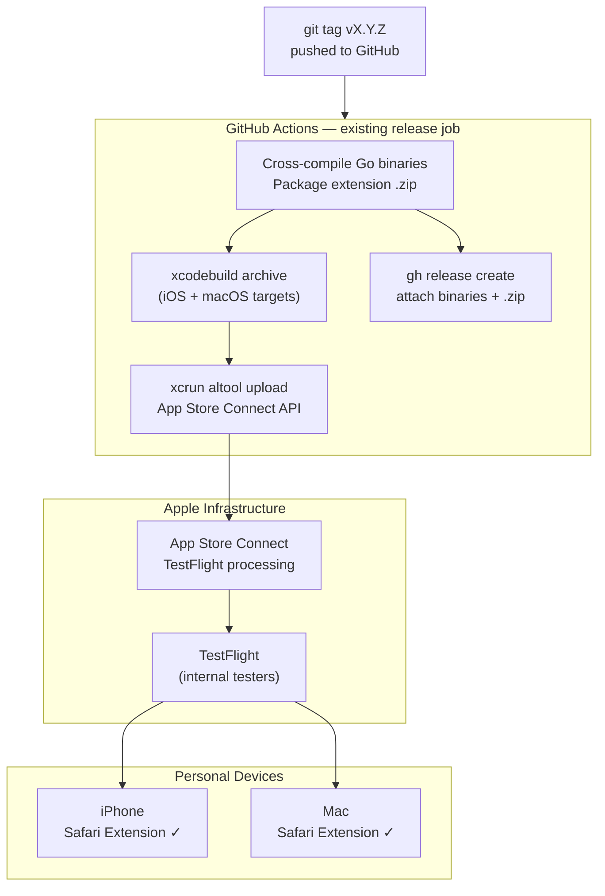

# ADR-0015: Safari Web Extension Distribution via Apple Developer Program and TestFlight

## Context and Problem Statement

ADR-0012 established a Manifest V3 Web Extension as the canonical solution for single-word
hostname navigation. The extension works in Chrome (unpacked sideload) and Firefox (signed
`.xpi`), but Safari on both macOS and iOS requires a native app wrapper built with Xcode and
signed with an Apple identity. How should the Safari extension be signed, built, and distributed
to personal devices — and maintained without ongoing manual effort?

## Decision Drivers

* Safari on iOS 15+ supports Web Extensions but **only** allows them inside an App Store or
  TestFlight-distributed app; sideloading requires a free Apple ID but carries a hard 7-day
  expiry that requires manual re-signing
* macOS Safari also requires the wrapper app to be notarized for Gatekeeper; a free Apple ID
  cannot notarize, making distribution to any machine other than the build machine impractical
* The existing CI pipeline (GitHub Actions) already builds binaries and pushes Docker images on
  every tag; extension distribution should follow the same release cadence
* The target audience is a single operator (personal instance) and a small circle of trusted
  users — not the general public — so App Store review overhead is unnecessary
* `xcrun safari-web-extension-converter` already produces a valid Xcode project from the
  existing `extension/` directory; the conversion cost is a one-time effort

## Considered Options

* **Option A — Apple Developer Program + TestFlight** (chosen)
* **Option B — Free Apple ID + AltStore for iOS, unsigned for macOS**
* **Option C — Apple Developer Program + App Store public release**
* **Option D — Skip iOS; macOS-only Safari extension via Developer Program**

## Decision Outcome

Chosen option: **Option A — Apple Developer Program + TestFlight**, because it eliminates the
7-day re-signing loop, works on both iOS and macOS with a single Xcode project, integrates
naturally into the existing GitHub Actions release pipeline, and keeps distribution intentionally
private (no public App Store listing required).

### Consequences

* Good, because TestFlight builds last 90 days and can be refreshed by simply uploading a new
  build — no manual device tethering required
* Good, because the same Apple Developer account covers iOS and macOS targets, and the same
  Xcode project can produce both with a single archive
* Good, because CI can upload to TestFlight automatically on every tagged release using
  `xcrun altool` or the App Store Connect API, matching the existing binary + Docker release flow
* Good, because internal TestFlight testers can be added by email — easy to share with
  trusted friends running their own instances
* Bad, because the Apple Developer Program costs $99/year regardless of usage
* Bad, because each CI upload requires an App Store Connect API key stored as a GitHub Actions
  secret (one-time setup cost)
* Bad, because TestFlight builds expire after 90 days; a release tag must be cut at least that
  often to keep the extension active (in practice, active development makes this a non-issue)

### Confirmation

Implementation is confirmed when:
1. A tagged release (`vX.Y.Z`) in GitHub Actions produces a `.xcarchive`, uploads it to
   TestFlight, and the build appears in App Store Connect within minutes
2. Installing the TestFlight build on an iPhone enables the extension in Safari → Settings →
   Safari → Extensions
3. Typing `go/slack` in iOS Safari navigates to the joe-links server (via WireGuard or LAN)
4. The macOS build from the same archive installs and passes Gatekeeper on a clean Mac
5. The 90-day build expiry is visible in App Store Connect; a calendar reminder or CI job
   ensures a new build is uploaded before it lapses

## Pros and Cons of the Options

### Option A — Apple Developer Program + TestFlight

Enroll in the Apple Developer Program ($99/year). Use `xcrun safari-web-extension-converter`
to generate an Xcode project from `integrations/extension/`. Configure GitHub Actions with an App Store
Connect API key to run `xcodebuild archive` and upload via `xcrun altool` or
`fastlane deliver` on every tag. Add personal device as an internal tester in App Store Connect.

* Good, because no expiry management — 90-day TestFlight window is refreshed with each release tag
* Good, because supports both iOS and macOS from one Xcode project and one CI job
* Good, because internal TestFlight has no App Store review — builds are available minutes
  after upload
* Good, because the Apple Developer account also enables notarization for any future macOS
  distribution outside the App Store
* Neutral, because $99/year is a recurring cost for what is effectively a personal tool
* Bad, because initial Xcode project setup and CI secret configuration requires one-time effort

### Option B — Free Apple ID + AltStore (iOS) + unsigned (macOS)

Use a free Apple ID to sign locally via Xcode. Install AltServer on a Mac to automatically
re-sign the iOS app via AltStore every 7 days when the phone is on the same Wi-Fi.

* Good, because zero monetary cost
* Good, because AltServer handles re-signing transparently in the background
* Bad, because the 7-day window is a hard constraint — if AltServer is unavailable (travel,
  Mac offline) the extension stops working
* Bad, because free signing cannot notarize macOS builds, so macOS Gatekeeper must be
  bypassed manually on each machine (`xattr -d com.apple.quarantine`)
* Bad, because AltStore itself requires trusting a third-party app that communicates with
  Apple's signing servers on your behalf
* Bad, because CI integration is not possible — signing requires a live Xcode session on a
  Mac with your Apple ID credentials

### Option C — Apple Developer Program + App Store Public Release

Same as Option A but submit for full App Store review and publish publicly.

* Good, because auto-update — users always get the latest version without TestFlight
* Good, because any Safari user could install it without a TestFlight invite
* Bad, because App Store review adds days of latency to every release
* Bad, because Apple's App Review guidelines require a privacy policy, screenshots, and a
  substantive app experience — significant overhead for a personal tool
* Bad, because a public extension implies a support surface and maintenance commitment

### Option D — Skip iOS; macOS-Only via Developer Program

Only wrap the extension for macOS Safari. Distribute as a signed `.app` via GitHub Releases
(notarized). Accept that iOS Safari is not supported.

* Good, because simpler Xcode project (macOS only) and no TestFlight needed
* Good, because the notarized `.app` can be distributed directly from the GitHub release page
* Bad, because iOS Safari is not covered — the primary motivation for this ADR is iOS support
* Bad, because no auto-update mechanism; users must re-download from GitHub Releases manually

## Architecture Diagram

## More Information

* The Xcode project is generated once via `xcrun safari-web-extension-converter integrations/extension/`
  and committed to the repository under `integrations/apple/`. The generated Swift app shell is minimal
  (a single view explaining how to enable the extension in Safari).
* CI signing requires: an App Store Connect API key (Issuer ID + Key ID + `.p8` private key),
  a distribution certificate (`.p12` + passphrase), and a provisioning profile — all stored
  as GitHub Actions secrets.
* `fastlane match` is an alternative to manual certificate management and may simplify
  multi-machine setup if additional contributors join.
* TestFlight internal testers are added by Apple ID email in App Store Connect with no review.
  External testers (up to 10,000) require a lighter beta review.
* Related ADRs: ADR-0012 (extension architecture), ADR-0011 (keyword host routing).
* Apple documentation: https://developer.apple.com/documentation/safariservices/safari_web_extensions
* `safari-web-extension-converter` docs: https://developer.apple.com/documentation/safariservices/converting_a_web_extension_for_safari
