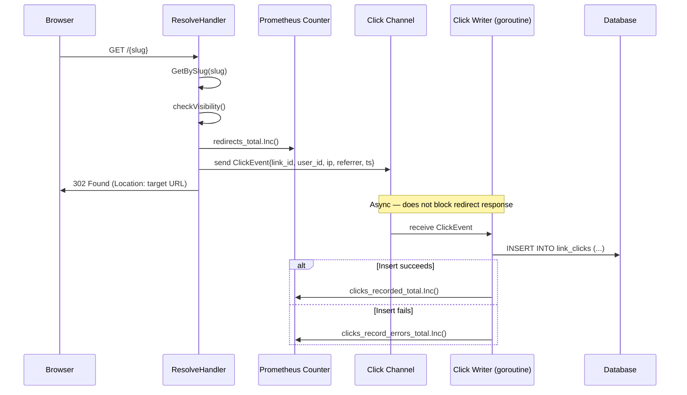
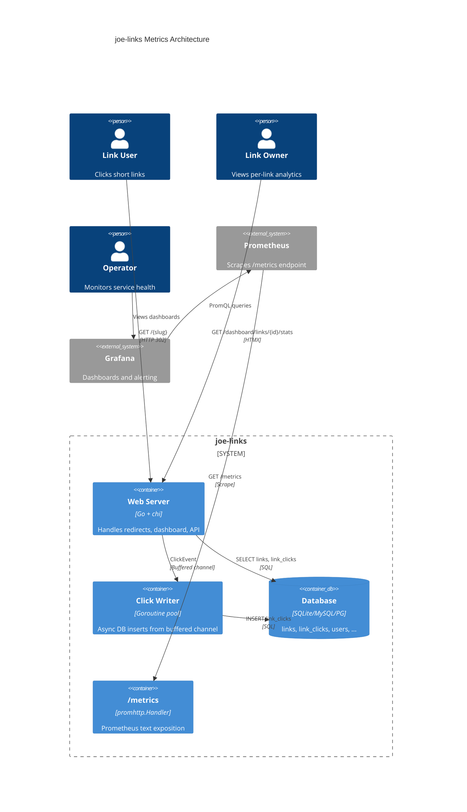

# ADR-0016: Link Analytics and Prometheus Metrics

## Context and Problem Statement

joe-links records no data about link usage today. When a slug is resolved in `resolve.go`, the handler issues a `302 Found` redirect and the request is gone. Link owners have no visibility into how often their links are clicked, who is clicking them, or usage trends over time. Operators have no application-level metrics to feed into monitoring infrastructure.

We need to answer two related but distinct questions:

1. **Per-link analytics**: How do we record, store, and surface click data so link owners can see usage stats (click counts, recent clicks, referrers)?
2. **Operational metrics**: How do we expose application-level metrics (request rates, redirect latency, active links) in a Prometheus-compatible format for infrastructure monitoring?

## Decision Drivers

* **Redirect latency must not degrade** — click recording happens on the hot path (`/{slug}*`); any solution must add negligible latency to the 302 response
* **Multi-database compatibility** — the storage model must work identically across SQLite, MySQL, and PostgreSQL (per ADR-0002)
* **Minimal new dependencies** — the project is a single-binary Go service; heavy frameworks or external services (Kafka, Redis) are disproportionate
* **Privacy-aware defaults** — click data may include user identity and IP metadata; the design should store only what is needed and hash sensitive fields
* **Existing schema conventions** — new tables should follow the UUID primary key, `created_at` timestamp, and goose migration patterns established in ADR-0005

## Considered Options

### Click Storage Model

#### Option A: Append-only `link_clicks` table

An append-only events table where every click inserts a new row:

| Column       | Type     | Notes                                              |
|--------------|----------|----------------------------------------------------|
| `id`         | UUID     | Primary key                                        |
| `link_id`    | UUID     | FK -> `links.id` ON DELETE CASCADE                 |
| `user_id`    | UUID     | FK -> `users.id` ON DELETE SET NULL; nullable       |
| `ip_hash`    | TEXT     | SHA-256 of client IP (privacy-preserving)          |
| `user_agent` | TEXT     | Raw User-Agent header (nullable, truncated to 512) |
| `referrer`   | TEXT     | Referer header (nullable, truncated to 2048)       |
| `clicked_at` | DATETIME | UTC timestamp of the click                         |

Queries for per-link analytics (`COUNT`, `GROUP BY date`, recent clicks) are standard SQL.

* Good, because every click is an immutable fact — full audit trail, no data loss
* Good, because arbitrary analytics queries are possible (clicks per day, unique clickers, referrer breakdown)
* Good, because inserts are append-only with no read-modify-write contention
* Bad, because the table grows unboundedly — high-traffic links could produce millions of rows
* Bad, because aggregate queries (`COUNT(*) WHERE link_id = ?`) become slow without periodic summarization or partitioning
* Bad, because storing per-click metadata (IP hash, user agent, referrer) increases storage and may raise privacy concerns

#### Option B: Counter column on `links` + bounded recent-clicks table

Add a `click_count INTEGER DEFAULT 0` column to the `links` table for totals, plus a `recent_clicks` table capped at N rows per link (ring buffer implemented via application-level DELETE + INSERT):

* Good, because total click count is a single column read — zero-cost for dashboard display
* Good, because the recent-clicks table stays bounded, avoiding unbounded growth
* Bad, because the counter column requires `UPDATE links SET click_count = click_count + 1` on every redirect — write contention on the same row under concurrent traffic
* Bad, because the ring-buffer eviction logic is application-level complexity that must work across three SQL dialects
* Bad, because historical data older than the ring buffer window is permanently lost — no way to reconstruct daily click trends retroactively

#### Option C: In-memory counters flushed periodically to DB

Maintain `sync.Map` or sharded counters in the Go process, flush to the database on a timer (e.g., every 30 seconds) or at shutdown:

* Good, because redirect hot path has zero DB overhead — just an atomic counter increment
* Good, because batch inserts amortize write cost
* Bad, because clicks are lost on crash or ungraceful shutdown (data loss window = flush interval)
* Bad, because horizontal scaling (multiple processes) requires coordination or merging of counters
* Bad, because in-memory state complicates testing and adds shutdown-hook complexity

### Prometheus Metrics Endpoint

#### Option D: `prometheus/client_golang` library

The standard Prometheus Go client. Register counters, histograms, and gauges; expose via `promhttp.Handler()` at `/metrics`.

* Good, because it is the canonical, officially supported library — every Prometheus tutorial and dashboard template assumes it
* Good, because provides histograms (redirect latency), counters (total redirects), and gauges (active links) out of the box
* Good, because the `promhttp.Handler()` is a single line to mount on the chi router
* Bad, because adds a new dependency (~5 packages in the `prometheus/` org)
* Bad, because label cardinality must be managed carefully — a `slug` label on a counter creates one time series per link, which can be expensive at scale

#### Option E: `expvar` (stdlib)

Go's built-in `expvar` package exposes JSON key-value metrics at `/debug/vars`.

* Good, because zero external dependencies — stdlib only
* Good, because trivially simple API (`expvar.NewInt`, `expvar.NewMap`)
* Bad, because the output format is JSON, not Prometheus text exposition format — requires a separate adapter (e.g., `prometheus_expvar_exporter`) to scrape into Prometheus
* Bad, because no histograms or summaries — only counters and string values
* Bad, because `/debug/vars` exposes all Go runtime metrics (memstats) with no filtering, which may leak operational details

#### Option F: No in-process metrics; scrape from DB directly

Skip application-level metrics. Instead, run SQL queries against the `link_clicks` table from an external exporter (e.g., `sql_exporter`).

* Good, because zero application code changes for metrics
* Bad, because requires deploying and configuring a separate exporter process — contradicts the single-binary philosophy
* Bad, because SQL-based metric queries add load to the database on every scrape interval
* Bad, because latency histograms and in-flight request gauges cannot be derived from database rows

## Decision Outcome

### Click Storage: Option A — Append-only `link_clicks` table

We choose the append-only events table because it preserves the complete click history as immutable facts, enabling arbitrary analytics queries now and in the future. The unbounded growth concern is mitigated by:

1. **Indexed queries**: A composite index on `(link_id, clicked_at DESC)` makes per-link recent-click queries fast regardless of table size.
2. **Future retention policy**: A background goroutine or CLI command can purge rows older than a configurable retention window (e.g., 90 days). This is additive and does not require a schema change.
3. **Practical scale**: A go-links service typically handles hundreds to low thousands of clicks per day, not millions. The table will remain manageable for years on SQLite, let alone MySQL/PostgreSQL.

Click recording is performed **asynchronously** — the redirect handler fires a goroutine (or sends to a buffered channel) to insert the click row, so the 302 response is not blocked on the database write. This preserves redirect latency while accepting that a small number of clicks may be lost on crash (an acceptable trade-off for a link shortener).

### Prometheus Metrics: Option D — `prometheus/client_golang`

We choose the standard Prometheus client library because it is the ecosystem default and provides histograms for latency measurement, which `expvar` cannot. The `/metrics` endpoint is mounted on the chi router with no authentication (standard for Prometheus scrape targets behind a firewall). Key metrics:

| Metric | Type | Labels | Description |
|--------|------|--------|-------------|
| `joelinks_redirects_total` | Counter | `status` (found, not_found) | Total slug resolution attempts |
| `joelinks_redirect_duration_seconds` | Histogram | — | Time from request to 302 response |
| `joelinks_clicks_recorded_total` | Counter | — | Click rows successfully inserted |
| `joelinks_clicks_record_errors_total` | Counter | — | Click insert failures |
| `joelinks_links_total` | Gauge | — | Total number of links in the database |
| `joelinks_users_total` | Gauge | — | Total number of registered users |

We deliberately avoid a `slug` label on counters to prevent unbounded cardinality. Per-link click counts are available via the analytics page and API, not Prometheus.

### Analytics Page: `/dashboard/links/{id}/stats`

The per-link stats page lives within the authenticated dashboard, consistent with the existing route structure. It shows:

- Total click count (all time)
- Click count over the last 7 and 30 days
- A list of recent clicks (last 50) with timestamp, referrer, and user display name (if authenticated)
- A simple daily click count chart (rendered server-side as an HTML table or via a lightweight JS chart library)

Only link owners, co-owners, and admins can view a link's stats page (same authorization as link editing).

### REST API Extension

A new API endpoint exposes click analytics programmatically:

| Method | Path | Description |
|--------|------|-------------|
| `GET` | `/api/v1/links/{id}/stats` | Click summary (totals, 7d/30d counts) |
| `GET` | `/api/v1/links/{id}/clicks` | Paginated recent clicks |

These endpoints follow the conventions established in ADR-0008 (JSON responses, cursor pagination, bearer token auth).

## Click Recording Flow

## Metrics Architecture

## Consequences

### Positive

* Link owners gain visibility into how their links are used — previously a complete blind spot
* Operators can monitor redirect rates, error rates, and latency via standard Prometheus/Grafana tooling
* The append-only click table is a clean, extensible foundation — future features (click-through rate dashboards, popular links leaderboard, A/B testing) can query the same data
* Async click recording keeps the redirect path fast — users see no latency increase

### Negative

* The `link_clicks` table will become the largest table in the database over time; operators may need to run periodic purges or add retention policies
* The `prometheus/client_golang` dependency adds ~5 packages to `go.mod`; this is the first non-application external dependency (beyond SQL drivers, auth, and web framework)
* Click data includes IP hashes and user agents — even with SHA-256 hashing, operators should understand the privacy implications and may need to configure retention limits

### Neutral

* The buffered channel for async writes means a small number of clicks (up to the channel buffer size) may be lost on ungraceful shutdown — acceptable for analytics data, not acceptable for financial transactions
* Per-link stats are only visible to link owners and admins; there is no public analytics view (this could be added later if desired)

## Confirmation

Confirmed by:

* A goose migration file `000XX_create_link_clicks.sql` creating the `link_clicks` table with the schema above
* `internal/store/click_store.go` implementing `RecordClick`, `GetClickStats`, and `ListRecentClicks` methods
* `internal/handler/resolve.go` sending click events to a buffered channel after issuing the redirect
* `internal/handler/router.go` mounting `promhttp.Handler()` at `/metrics`
* `prometheus/client_golang` present in `go.mod`
* `joelinks_redirects_total` counter incrementing on each slug resolution
* `GET /dashboard/links/{id}/stats` rendering a stats page for authenticated link owners
* `GET /api/v1/links/{id}/stats` returning JSON click summary

## More Information

* Related: ADR-0005 (data model — `links` table this extends), ADR-0008 (REST API layer — stats API endpoints follow the same conventions), ADR-0014 (visibility modes — stats page respects the same ownership/admin authorization)
* Prometheus Go client: https://github.com/prometheus/client_golang
* The `ip_hash` column stores `SHA-256(client_ip + daily_salt)` — the daily salt rotation prevents rainbow-table correlation across days while still allowing same-day deduplication
