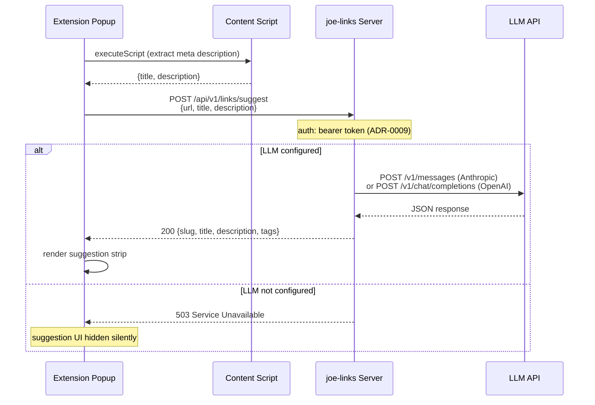

# ADR-0017: LLM-Powered Metadata Suggestions for Link Creation

## Context and Problem Statement

When creating a go-link, users must manually supply a slug, title, description, and tags. For most URLs these values are predictable from the page content — a developer bookmarking a GitHub PR can often guess a good slug — but the friction of filling in four fields slows down link creation, especially in the browser extension popup where screen space is tight. How should joe-links use an LLM to suggest slug, title, description, and tags from the URL being bookmarked?

## Decision Drivers

* **Minimal friction**: suggestions should appear in the extension popup with one click to accept, not require a separate workflow
* **Operator-controlled**: API keys and model choice belong on the server, not in each user's browser extension settings
* **Opt-in/zero-cost when disabled**: deployments without LLM config must behave identically to today
* **Self-hosted philosophy**: must work with local models (Ollama) as well as hosted APIs (Anthropic, OpenAI)
* **Existing API conventions**: new endpoints follow ADR-0008 (REST layer) and ADR-0009 (bearer token auth)
* **No new hard dependencies**: Go standard library `net/http` is sufficient; avoid pulling in provider SDKs

## Considered Options

* **Option A — Server-side suggestion endpoint** (recommended)
* **Option B — Extension-side LLM call (client-side)**
* **Option C — Server-side with page-crawl**

## Decision Outcome

Chosen option: **Option A — Server-side suggestion endpoint**, because it centralises API key management, lets the operator choose the model once, and keeps the extension simple. The extension already calls the server for keyword templates and existing-link lookup; adding a suggestion call fits the same pattern.

The extension extracts the tab's title and a short content snippet (via `chrome.scripting.executeScript` reading `<meta name="description">` and `<title>`) and posts them to the server. The server calls the configured LLM and returns structured suggestions. If no LLM is configured the endpoint returns 503 and the extension silently skips the suggestion UI.

### Consequences

* Good, because a single `JOE_LLM_*` config on the server covers all users and all clients
* Good, because Ollama (local) and cloud providers (Anthropic, OpenAI-compatible) are supported via the same config surface
* Good, because the extension requires no new LLM API key or settings UI
* Good, because zero-config deployments are completely unaffected
* Bad, because the extension needs an additional `scripting` permission to read page meta tags
* Bad, because server-side LLM calls add latency to the popup load (mitigated by async: suggestions appear after the popup is already interactive)
* Bad, because the server cannot see page content behind authentication (only public meta tags are reliably available)
* Neutral, because prompt engineering lives in the server config as a `JOE_LLM_PROMPT` override; the default prompt is baked into the binary

### Confirmation

* `GET /api/v1/links/suggest` endpoint present and documented in Swagger
* `JOE_LLM_PROVIDER`, `JOE_LLM_API_KEY`, `JOE_LLM_MODEL`, `JOE_LLM_BASE_URL` wired into `internal/config/config.go`
* Extension popup shows a "Suggested" section when suggestions are returned, with one-click fill buttons for each field
* `JOE_LLM_PROVIDER` unset → endpoint returns 503 → popup hides suggestion UI entirely

## Pros and Cons of the Options

### Option A — Server-side suggestion endpoint

The extension sends `{url, title, description}` (extracted from the active tab) to `POST /api/v1/links/suggest`. The server renders a prompt, calls the configured LLM, and returns `{slug, title, description, tags}`.

* Good, because API key lives on the server — no distribution to clients
* Good, because model selection and prompt tuning are ops concerns, not user concerns
* Good, because the extension change is small: one additional fetch after popup load
* Good, because consistent behaviour across Chrome, Firefox, and Safari extensions (all hit the same endpoint)
* Bad, because adds a network round-trip before suggestions appear
* Bad, because server cannot see page content that requires the user's session (authenticated internal tools)

### Option B — Extension-side LLM call

The extension reads the full page content via a content script and calls an LLM API (e.g. `api.anthropic.com`) directly from the popup, using a key stored in `chrome.storage.local`.

* Good, because the server needs no changes
* Good, because the extension can read the full authenticated page DOM (useful for internal tools)
* Bad, because every user must configure their own LLM API key in the extension options
* Bad, because `content_security_policy` and cross-origin restrictions complicate direct API calls from extensions
* Bad, because the model and prompt are per-user, not operator-controlled
* Bad, because the LLM API key is stored in browser storage (lower-trust environment than server secrets)

### Option C — Server-side with page-crawl

The extension sends only the URL; the server fetches and parses the page itself before calling the LLM.

* Good, because the extension sends minimal data (just the URL)
* Bad, because the server cannot access pages requiring the user's session (most internal tools)
* Bad, because server-side HTTP fetches add attack surface (SSRF) and latency
* Bad, because robots.txt, auth walls, and JS-rendered content make server-side scraping unreliable

## Architecture

### Configuration

| Env var | Default | Description |
|---------|---------|-------------|
| `JOE_LLM_PROVIDER` | *(unset — disabled)* | `anthropic`, `openai`, or `openai-compatible` |
| `JOE_LLM_API_KEY` | — | API key for the provider |
| `JOE_LLM_MODEL` | *(provider default)* | Model name, e.g. `claude-haiku-4-5-20251001`, `gpt-4o-mini`, `llama3` |
| `JOE_LLM_BASE_URL` | *(provider default)* | Override base URL — use for Ollama (`http://localhost:11434/v1`) or any OpenAI-compatible endpoint |
| `JOE_LLM_PROMPT` | *(built-in default)* | Override the system prompt sent to the LLM |

**Default prompt** (built into binary):
```
You are helping a user create a short memorable go-link for a web page.
Given the URL, page title, and description, suggest values for a new link.

Rules:
- slug: lowercase letters, digits, and hyphens only; max 30 characters; no leading/trailing hyphens
- title: concise, max 60 characters
- description: one sentence, max 120 characters
- tags: 2–5 lowercase single-word or hyphenated tags relevant to the content

Respond with ONLY valid JSON, no prose:
{"slug":"...","title":"...","description":"...","tags":["..."]}

URL: {{.URL}}
Title: {{.Title}}
Description: {{.Description}}
```

### Data Flow



### Provider Abstraction

A minimal `internal/llm` package with a single interface keeps the server decoupled from provider specifics:

```go
type Suggester interface {
    Suggest(ctx context.Context, req SuggestRequest) (*SuggestResponse, error)
}

type SuggestRequest struct {
    URL         string
    Title       string
    Description string
}

type SuggestResponse struct {
    Slug        string   `json:"slug"`
    Title       string   `json:"title"`
    Description string   `json:"description"`
    Tags        []string `json:"tags"`
}
```

Implementations:
- `anthropicSuggester` — calls `api.anthropic.com/v1/messages` (Messages API)
- `openaiSuggester` — calls OpenAI `v1/chat/completions` (also covers Ollama and any OpenAI-compatible endpoint via `JOE_LLM_BASE_URL`)

### Extension UX

After existing-link lookup completes, the popup fires the suggestion request in parallel. When suggestions arrive, a **"AI suggestions"** strip appears above the form fields with one-click "Use" buttons for each suggested value. The user can accept all, accept individually, or ignore entirely.

```
┌─────────────────────────────────────┐
│ ✦ Suggested                    ×    │
│  slug:  my-cool-link      [Use]     │
│  title: My Cool Link      [Use]     │
│  desc:  A link to …       [Use]     │
│  tags:  go  tools         [Use]     │
└─────────────────────────────────────┘
```

## More Information

* Related: ADR-0008 (REST API layer — suggest endpoint follows same conventions), ADR-0009 (bearer token auth — suggest endpoint requires auth), ADR-0012 (browser extension — popup.js is the integration point)
* Anthropic Messages API: https://docs.anthropic.com/en/api/messages
* OpenAI Chat Completions API (also used by Ollama): https://platform.openai.com/docs/api-reference/chat
* The `chrome.scripting` permission requires `"scripting"` in `manifest.json` and `"activeTab"` (already present)
