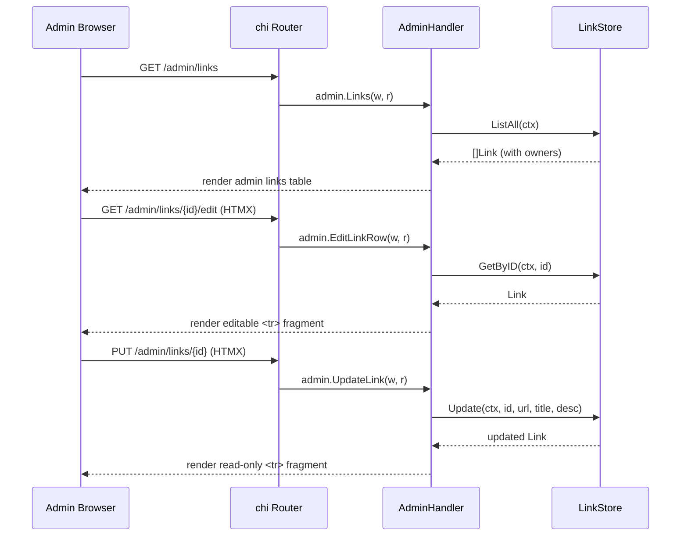
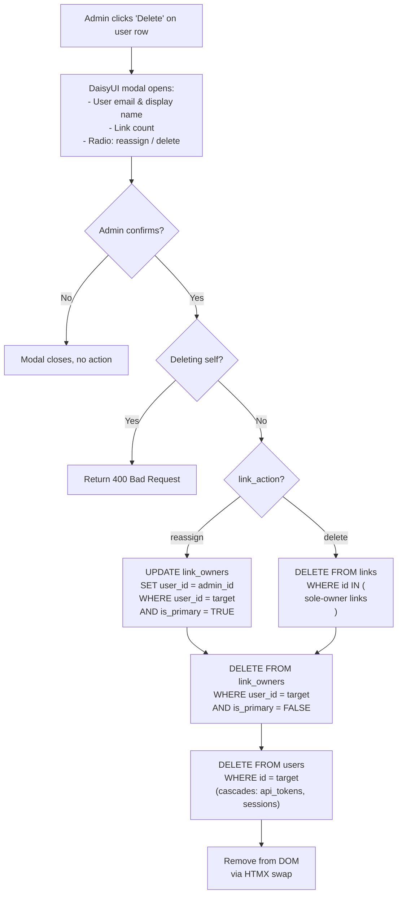
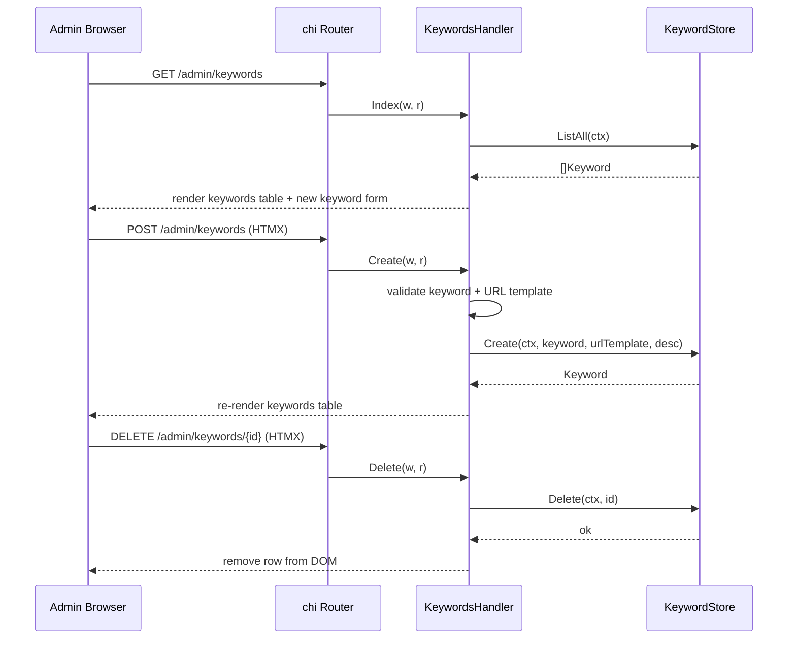

# Design: Admin Management Screens (SPEC-0011)

## Context

joe-links has basic admin views (SPEC-0004): an admin dashboard with summary stats, a user list with inline role changes, and a links list showing all links. However, the admin experience is limited — link editing requires navigating to the user-facing edit form, user deletion uses a browser `confirm()` dialog with no link handling, and keyword management is minimal. As the service scales to more users and links, admins need more powerful management tools directly in the admin interface.

This spec enhances the admin screens with inline editing, proper confirmation modals, safe user deletion with link disposition choices, and a complete keyword management interface.

Related: SPEC-0004 (Application Views and Routing), SPEC-0002 (Link Data Model), ADR-0007 (Views and Routing), ADR-0005 (Data Model).

## Goals / Non-Goals

### Goals
- Enable admins to edit any link's URL, title, and description inline without leaving the admin links screen
- Provide admin link deletion with DaisyUI confirmation modals (not browser `confirm()`)
- Display link owner display names in the admin links table
- Complete keyword management: list, create with validation, and delete with confirmation
- Safe user deletion with explicit link disposition (reassign or delete)
- Admin self-deletion prevention

### Non-Goals
- Bulk operations (select multiple links, bulk delete) — deferred to a future spec
- Admin audit log — would require a new table and is out of scope
- Link transfer between arbitrary users — only reassignment to the deleting admin is supported
- Keyword editing (update) — create and delete are sufficient for the initial release

## Decisions

### Inline Editing via HTMX Row Swap

**Choice**: Clicking "Edit" on an admin link row replaces the `<tr>` with an editable form row via HTMX `hx-get` targeting the same row ID. Saving swaps back the read-only row.

**Rationale**: Inline editing avoids page navigation, keeping the admin in context. The HTMX pattern is already established in the codebase (e.g., role changes in the users table use the same row-swap approach). Each row has a unique `id="link-row-{id}"` attribute that serves as the HTMX swap target.

**Alternatives considered**:
- Modal edit form: more disruptive; the admin loses visual context of the row's position in the table
- Navigate to `/dashboard/links/{id}/edit`: breaks the admin workflow by redirecting to the user-facing edit form

### DaisyUI Modals for All Destructive Actions

**Choice**: All destructive admin actions (delete link, delete keyword, delete user) use DaisyUI modal components with explicit confirm/cancel buttons.

**Rationale**: Browser `confirm()` dialogs are not styleable, don't support rich content (like link counts or disposition choices), and feel jarring in a polished UI. DaisyUI modals integrate with the existing theme system (SPEC-0003) and can display contextual information like the link slug, user email, and link counts.

### User Deletion with Link Disposition

**Choice**: The user deletion modal presents two radio options: "Reassign links to me" (admin absorbs the links) or "Delete all links" (cascade delete). The choice is sent as a `link_action` parameter.

**Rationale**: Deleting a user who owns links creates an orphan problem — links without owners become unreachable from the dashboard. The two-choice approach covers the most common admin scenarios: (1) the user left the team but their links are still valuable (reassign), or (2) the user was a test account or their links are obsolete (delete). Reassignment always goes to the performing admin because they are the one making the judgment call about the links' value.

**Alternatives considered**:
- Reassign to any user (dropdown): adds UI complexity and requires the admin to know which user should receive the links
- Always cascade delete: risks losing valuable links when offboarding team members
- Block deletion if user has links: frustrating — forces the admin to manually reassign or delete each link first

### Admin-Specific Link Endpoints

**Choice**: `PUT /admin/links/{id}` and `DELETE /admin/links/{id}` are separate endpoints from the user-facing `PUT /dashboard/links/{id}` and `DELETE /dashboard/links/{id}`.

**Rationale**: Admin endpoints live in the admin middleware group (RequireRole("admin")) and return admin-specific HTMX fragments (table rows, not detail page content). Sharing endpoints would require branching on role inside handlers and producing different HTML based on the request source. Separate endpoints keep each handler focused.

## Architecture

### Admin Links Inline Edit Flow



### User Deletion Flow



### Admin Keyword CRUD Flow



### Route and Handler Structure

```
Routes (admin middleware group):
  GET    /admin/links              → admin.Links
  GET    /admin/links/{id}/edit    → admin.EditLinkRow    (HTMX fragment)
  PUT    /admin/links/{id}         → admin.UpdateLink     (HTMX fragment)
  DELETE /admin/links/{id}         → admin.DeleteLink     (HTMX swap)
  GET    /admin/keywords           → keywords.Index
  POST   /admin/keywords           → keywords.Create
  DELETE /admin/keywords/{id}      → keywords.Delete
  DELETE /admin/users/{id}         → admin.DeleteUser     (HTMX swap)

Handler files:
  internal/handler/admin.go       — enhanced with inline edit + delete + user delete
  internal/handler/keywords.go    — already exists, enhanced with validation

Templates:
  web/templates/pages/admin/links.html       — full page + link row partial
  web/templates/pages/admin/links_edit.html   — inline edit row partial
  web/templates/pages/admin/keywords.html     — full page + keyword row partial
  web/templates/pages/admin/users.html        — enhanced with modal delete
```

## Risks / Trade-offs

- **Admin power without audit trail** — admins can edit or delete any link and delete users. Mitigated by: this is a self-hosted team tool with a small number of admins; an audit log can be added in a future spec.
- **Link reassignment is admin-only** — reassigned links go to the performing admin, not to an arbitrary user. This is intentional to keep the UX simple; admins can transfer ownership afterward via the link detail page.
- **Inline edit row complexity** — the editable row template must match the column layout of the read-only row. If the admin links table layout changes, both templates must be updated. Mitigated by keeping them in adjacent template files with shared column structure.

## Migration Plan

No database schema changes are needed for this spec. The existing `links`, `link_owners`, `keywords`, and `users` tables already support all required operations. Changes are limited to:

1. New routes in the admin middleware group
2. New/enhanced handler methods in `admin.go` and `keywords.go`
3. New/updated templates for admin link rows (read-only + edit) and user deletion modal

Rollback: remove the new routes and templates; the existing admin views remain functional.

## Open Questions

- Should inline link editing also support tag modification? Currently scoped out — tag editing via inline controls is complex (autocomplete dropdown in a table cell). Admins can use the link detail page for tag changes.
- Should the admin keywords screen support editing an existing keyword's URL template? Deferred — admins can delete and recreate with the correct template.
