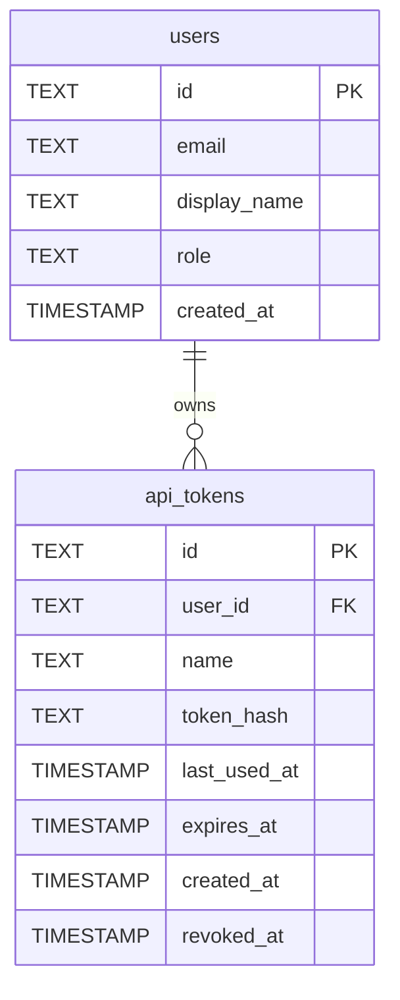
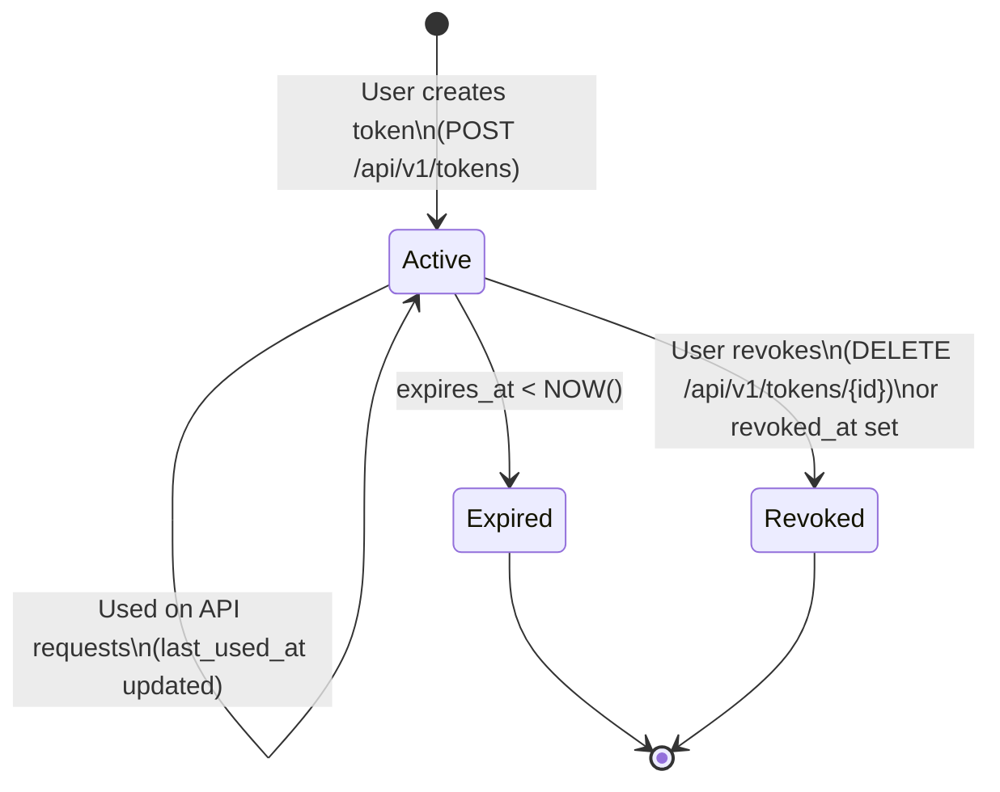
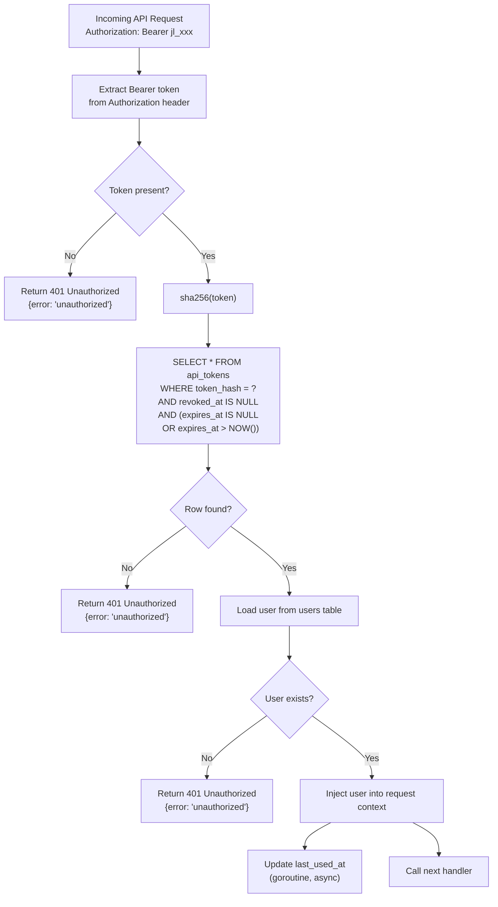

# Design: API Token Authentication (SPEC-0006)

## Context

The REST API (SPEC-0005, ADR-0008) requires an authentication mechanism for programmatic clients. The existing auth system (ADR-0003) uses OIDC with redirect-based OAuth2 flows and SCS server-side session cookies — neither of which is usable from a CLI, CI/CD pipeline, or browser extension that cannot perform interactive redirects or maintain cookie jars.

Personal Access Tokens (PATs) are the established solution for this class of client. GitHub, GitLab, Gitea, and Homebrew all use the same pattern: user generates a named opaque token in a UI, stores the plaintext once, and includes it as `Authorization: Bearer <token>` on subsequent requests. The server stores only a hash of the token, never the plaintext.

Related: ADR-0009 (API Token Authentication), ADR-0003 (OIDC auth), ADR-0005 (data model), SPEC-0005 (REST API).

## Goals / Non-Goals

### Goals
- Enable CLI tools, browser extensions, and CI/CD pipelines to authenticate to `/api/v1` without browser interaction
- Tokens are revocable per-token without affecting the user's OIDC session or other tokens
- Token plaintext is shown exactly once (at creation); the database stores only a SHA-256 hash
- Token owners can see last-used timestamps for audit purposes
- Tokens use a recognizable `jl_` prefix for accidental-exposure detection in logs and code scanners
- Web UI and API endpoint for token lifecycle management (create, list, revoke)

### Non-Goals
- OAuth2 authorization server — no client credentials flow, no token introspection endpoint
- Shared org-level API tokens — all tokens are scoped to the creating user
- Token rotation — users create new tokens and revoke old ones manually
- Token scoping / permissions — all tokens carry the full permissions of the creating user (including admin if applicable)

## Decisions

### SHA-256 for Token Hashing (Not bcrypt)

**Choice**: Store `sha256(plaintext_token)` in `token_hash`.

**Rationale**: Token lookup runs on every API request. bcrypt is intentionally slow (100ms+) — fine for password hashing, but unacceptable latency overhead for every API call. SHA-256 is fast but provides adequate security *because* the token itself has 192 bits of entropy. An attacker who steals the hash database cannot brute-force 192-bit tokens regardless of hash speed. bcrypt's slowness is only needed when the secret has low entropy (e.g., human passwords).

**Alternatives considered**:
- bcrypt: secure for low-entropy secrets, unacceptable latency for per-request DB lookups
- HMAC-SHA256 with a server secret: adds key management complexity with no security benefit given 192-bit entropy

### 192-Bit Token Entropy (`jl_` + 32 random bytes in base62)

**Choice**: `jl_<base62(crypto/rand 32 bytes)>` — approximately 43 characters of base62 after the prefix.

**Rationale**: 192 bits is far above the NIST recommendation of 128 bits for session tokens. The `jl_` prefix serves two purposes: (1) it identifies joe-links tokens in accidental exposure contexts (logs, GitHub secret scanning, etc.) and (2) it makes the token format self-documenting. Base62 (`[A-Za-z0-9]`) is URL-safe without encoding and printable in all contexts.

**Alternatives considered**:
- UUID v4 (122 bits): below recommended entropy; also lacks prefix
- base64url: contains `+`, `/`, `=` — awkward in some shell contexts

### `revoked_at` Soft Delete (Not Row Deletion)

**Choice**: Revocation sets `revoked_at = NOW()` rather than deleting the row.

**Rationale**: Soft delete preserves audit history — admins or security teams can see when a token was revoked and whether it was used after a potential compromise window. Hard-deleting a token that may have been leaked removes evidence. The middleware filters on `revoked_at IS NULL`.

### Asynchronous `last_used_at` Update

**Choice**: `last_used_at` is updated in a goroutine after the response is sent (fire-and-forget), not as part of the critical request path.

**Rationale**: Updating `last_used_at` on every API request adds a write to every read. For high-frequency API usage (browser extension checking links on every page load), this doubles DB write load. The last-used timestamp is for audit visibility, not for security enforcement — a small delay is acceptable. If the goroutine fails, the timestamp is simply not updated; the token remains valid.

**Alternatives considered**:
- Synchronous update in middleware: adds write latency to every request
- Batch update on a timer: more complex, minimal benefit

### Token Management on Both Web UI and API

**Choice**: Token CRUD is available via both the HTMX web UI (`/dashboard/settings/tokens`) and the API (`/api/v1/tokens`).

**Rationale**: Initial token creation requires a web UI (the user must log in via OIDC to create their first token). Once a token exists, the API endpoints allow scripts to create additional tokens or rotate existing ones without opening a browser. Both surfaces share the same `TokenStore` methods.

## Architecture

### Data Model



### Token Lifecycle



### Token Validation Flow



### Package Structure

```
internal/
  auth/
    token_middleware.go  # BearerTokenMiddleware
    token_store.go       # TokenStore interface + sqlx implementation
  api/
    tokens.go            # TokensAPIHandler (list, create, revoke)
web/
  templates/
    pages/
      settings/
        tokens.html      # Token management UI
```

## Risks / Trade-offs

- **Long-lived credentials** — tokens without an expiry date are valid indefinitely. Mitigated by: the creation UI defaults to a 1-year expiry with a visible reminder; the token list shows last-used dates so stale tokens are visible.
- **Token theft** — a stolen `jl_` token grants full user access until revoked. Mitigated by: `jl_` prefix enables GitHub secret scanning / automated leak detection; per-token revocation minimizes blast radius.
- **No token scoping** — all tokens carry the user's full role. A future iteration could add scope flags (e.g., `read:links`, `write:links`) but is deferred to avoid over-engineering for a self-hosted tool.
- **API bootstrap problem** — the very first token requires a browser login. This is acceptable because joe-links is a team tool where users always have browser access.

## Migration Plan

Greenfield addition. Steps:
1. Add `goose` migration for `api_tokens` table
2. Implement `TokenStore` in `internal/auth/`
3. Implement `BearerTokenMiddleware` in `internal/auth/`
4. Wire middleware into `NewAPIRouter`
5. Add `TokensAPIHandler` in `internal/api/tokens.go`
6. Add token settings page in the web UI

Rollback: remove the `api_tokens` migration (down migration drops the table) and the middleware.

## Open Questions

- Should there be an admin endpoint to revoke another user's tokens (e.g., for offboarding)? Currently scoped out — admins can delete users (which cascades to tokens), but cannot revoke individual tokens belonging to other users.
- Should token scopes be added in a future iteration? Deferred — the current use cases (CLI, extension) all require full user access.
