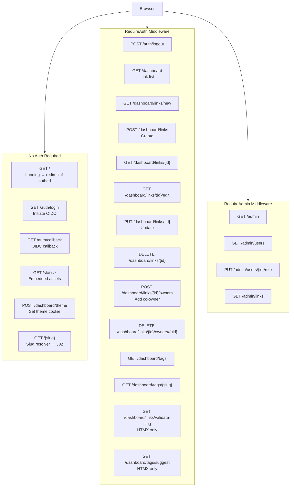
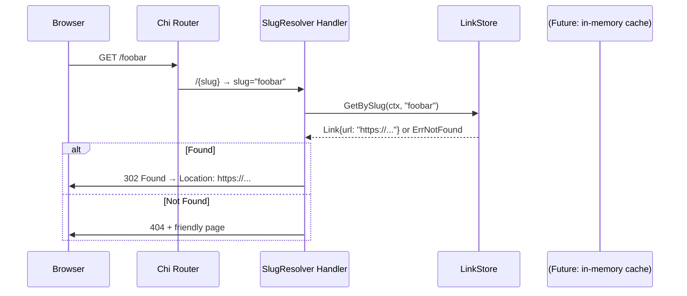

# Design: Application Views and Routing

## Context

joe-links is modeled after [golinks.io](https://www.golinks.io/how-go-links-work.php): users point DNS at the server and type `go/slug` in their browser. The key architectural tension is that the same server must handle:
1. Instant anonymous redirects (`GET /{slug}` — no auth, < 5ms latency goal)
2. A full authenticated web app (dashboard, CRUD, admin)

Chi's route priority (named routes before wildcards) solves this elegantly. The entire UI is server-rendered via Go templates with HTMX handling all dynamic interactions. See ADR-0007 for the full decision record.

## Goals / Non-Goals

### Goals
- Define all routes, their auth requirements, and their handler contracts
- Specify every view's content and layout at a level sufficient for implementation
- Define consistent HTMX interaction patterns across all dynamic interactions
- Ensure the slug resolver is the last route and has no auth requirement

### Non-Goals
- Pixel-perfect UI mockups (theming/colors governed by SPEC-0003)
- API endpoints for external consumers (this is a UI-only app)
- Pagination implementation details (limit/offset vs cursor — deferred)
- Real-time collaboration or WebSocket features

## Decisions

### Chi Middleware Group Structure

**Choice**: Use chi's `r.Group()` and `r.With()` to apply auth middleware at the route group level rather than inside handlers.

```go
// Unauthenticated
r.Get("/", handlers.Landing)
r.Get("/auth/login", handlers.AuthLogin)
r.Get("/auth/callback", handlers.AuthCallback)
r.Get("/{slug}", handlers.SlugResolver)

// Authenticated
r.Group(func(r chi.Router) {
    r.Use(middleware.RequireAuth)
    r.Post("/auth/logout", handlers.AuthLogout)
    r.Get("/dashboard", handlers.Dashboard)
    // ...
})

// Admin only
r.Group(func(r chi.Router) {
    r.Use(middleware.RequireAuth)
    r.Use(middleware.RequireAdmin)
    r.Get("/admin", handlers.AdminDash)
    // ...
})
```

**Rationale**: Centralizing auth enforcement in middleware prevents accidental unprotected handlers and makes the auth contract visible at the routing layer.

### HTMX Fragment vs Full-Page Pattern

**Choice**: Every handler checks `r.Header.Get("HX-Request")` and returns either a full layout or a fragment. Fragment templates are named `{view}-fragment` and full-page templates are named `{view}`.

```go
func (h *Handlers) Dashboard(w http.ResponseWriter, r *http.Request) {
    data := h.buildDashboardData(r)
    if r.Header.Get("HX-Request") != "" {
        h.tmpl.ExecuteTemplate(w, "dashboard-fragment", data)
        return
    }
    h.tmpl.ExecuteTemplate(w, "dashboard", data)
}
```

**Rationale**: Consistent pattern across all handlers. Full-page template embeds the base layout plus the fragment; the fragment is reusable for HTMX swaps.

### Modal Pattern via `#modal` Target

**Choice**: New link and confirm-delete modals are injected via `hx-target="#modal"`. The base layout always renders a hidden `<dialog id="modal">` that handlers populate.

**Rationale**: This avoids managing separate modal state in each view. HTMX fills the modal content server-side and DaisyUI's `<dialog>` element handles focus trapping and backdrop.

### Clipboard Copy — Only Non-HTMX JS

**Choice**: The "Copy go-link URL" button uses `navigator.clipboard.writeText()` via an `hx-on:click` attribute.

**Rationale**: Clipboard access requires JavaScript and cannot be server-side. Using `hx-on` keeps the JS inline and minimal (one line), consistent with ADR-0001's "minimize JS surface area."

## Architecture

### Route Map



### View Component Hierarchy

```mermaid
flowchart TD
    BaseLayout["base.html\n(html, head, navbar, modal, toast-area, footer)"]
    AuthLayout["auth-layout.html\n(minimal: logo + content only)"]

    Landing["landing.html → AuthLayout"]
    Dashboard["dashboard.html → BaseLayout"]
    LinkNew["link-new.html → BaseLayout (or modal fragment)"]
    LinkDetail["link-detail.html → BaseLayout"]
    LinkEdit["link-edit.html → BaseLayout"]
    TagBrowser["tags.html → BaseLayout"]
    TagDetail["tag-detail.html → BaseLayout"]
    AdminDash["admin.html → BaseLayout"]
    AdminUsers["admin-users.html → BaseLayout"]
    AdminLinks["admin-links.html → BaseLayout"]
    NotFound["404.html → AuthLayout"]

    BaseLayout --> Dashboard
    BaseLayout --> LinkNew
    BaseLayout --> LinkDetail
    BaseLayout --> LinkEdit
    BaseLayout --> TagBrowser
    BaseLayout --> TagDetail
    BaseLayout --> AdminDash
    BaseLayout --> AdminUsers
    BaseLayout --> AdminLinks
    AuthLayout --> Landing
    AuthLayout --> NotFound
```



### Key HTMX Interactions

| Trigger | HTMX Attrs | Server Returns |
|---------|------------|----------------|
| Slug validation typing | `hx-get="/dashboard/links/validate-slug" hx-trigger="input delay:300ms" hx-target="#slug-status"` | `<span>` fragment (green ✓ or red ✗) |
| Tag autocomplete | `hx-get="/dashboard/tags/suggest" hx-trigger="input delay:200ms" hx-target="#tag-dropdown"` | `<ul>` dropdown fragment |
| Dashboard search | `hx-get="/dashboard" hx-trigger="input delay:400ms" hx-target="#link-list"` | Link list fragment |
| New link modal | `hx-get="/dashboard/links/new" hx-target="#modal" hx-swap="innerHTML"` | Full modal content |
| Delete confirm modal | `hx-get="/dashboard/links/{id}/confirm-delete" hx-target="#modal"` | Confirmation modal fragment |
| Confirm delete | `hx-delete="/dashboard/links/{id}" hx-target="#link-row-{id}" hx-swap="outerHTML"` | Empty `<tr>` or OOB toast |
| Add co-owner | `hx-post="/dashboard/links/{id}/owners" hx-target="#owners-list"` | Owners list fragment |
| Admin role toggle | `hx-put="/admin/users/{id}/role" hx-target="#user-row-{id}" hx-swap="outerHTML"` | Updated row fragment |
| Theme toggle | `hx-post="/dashboard/theme" hx-swap="none"` + `HX-Trigger` event | 200 + cookie |

### Slug Resolver Handler (Performance Critical)



## Risks / Trade-offs

- **Slug resolver performance** → Every `go/foo` request hits the DB. For high-traffic deployments, an in-memory LRU cache on `GetBySlug` is the obvious optimization. Not in scope for v1 but the `LinkStore` interface makes it easy to wrap with a caching layer.
- **HTMX modal URL state** → When a new-link modal opens via HTMX, the browser URL doesn't change to `/dashboard/links/new`. Deep-linking to the form requires using the full-page fallback route. Acceptable for v1.
- **DELETE / PUT method support** → Some intermediaries (proxies, old browsers) don't support `DELETE`/`PUT`. HTMX handles this natively via `hx-delete`/`hx-put`; no `_method` override is needed.
- **Admin actions are irreversible** → Deleting a link or changing a role has no undo. Confirmation modals are the only safeguard for v1.

## Migration Plan

This is greenfield. Route registration order is critical:
1. Register static file server first
2. Register all named routes (`/auth/*`, `/dashboard/*`, `/admin/*`)
3. Register slug catch-all last: `r.Get("/{slug}", handlers.SlugResolver)`

## Open Questions

- Should `GET /dashboard/links/{id}` be accessible to any authenticated user (read-only view) or restricted to owners/admins? Current spec restricts to owners/admins — confirm.
- Should the dashboard show link click counts (requires an analytics table)? Deferred, but the route should plan for an optional `?sort=clicks` parameter.
- Should the 404 page suggest similar slugs (Levenshtein distance search)? Nice-to-have for v2.
