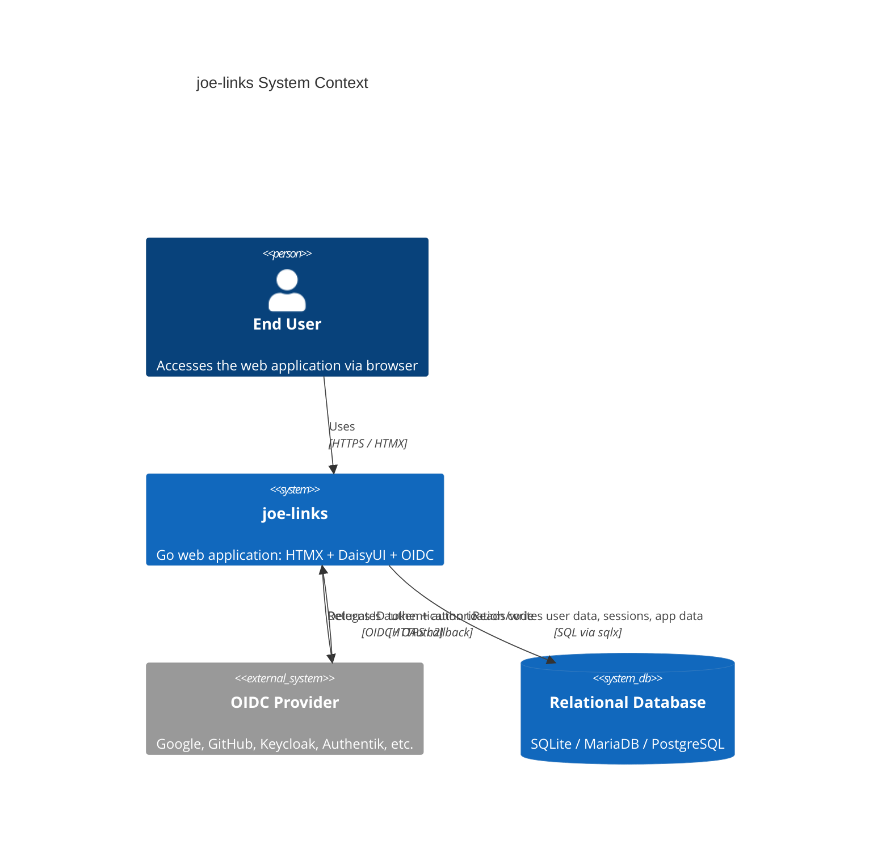
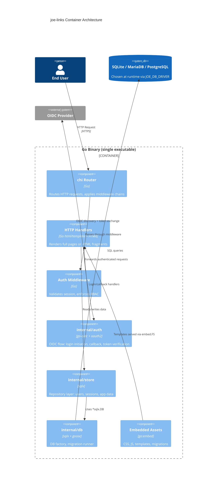
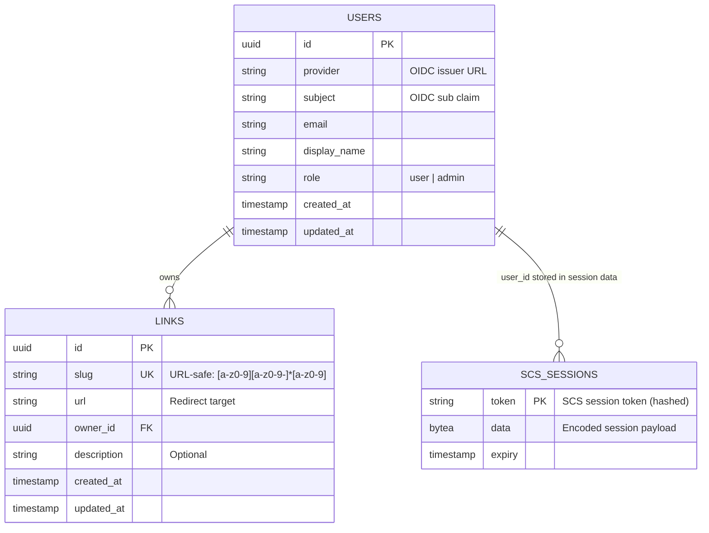

# Design: joe-links Web Application

## Context

**Joe Links** is a self-hosted "go links" service — a riff on [Go Links](https://www.golinks.io/). Users create short memorable slugs (e.g., `jira`, `standup`) that redirect to long URLs. Visiting `https://joe-links.example.com/jira` instantly redirects to whatever URL `jira` maps to. The application is built on a Go + HTMX + DaisyUI/Tailwind stack with a pluggable relational database backend and OIDC-based authentication. The design prioritizes operational simplicity (single binary), developer clarity (explicit SQL, no ORM magic), and provider-agnostic identity (OIDC with local user sync). This document describes the high-level architecture and the rationale for key implementation decisions.

References:
- [SPEC-0001: joe-links Web Application](./spec.md)
- [ADR-0001: Technology Stack](../../adrs/ADR-0001-technology-stack.md)
- [ADR-0002: Pluggable Database & Migrations](../../adrs/ADR-0002-pluggable-database-and-migrations.md)
- [ADR-0003: AuthN/AuthZ with OIDC](../../adrs/ADR-0003-authn-authz-oidc.md)
- [ADR-0004: CLI Framework — Cobra + Viper](../../adrs/ADR-0004-cli-framework.md)

---

## Goals / Non-Goals

### Goals

- Deliver a production-ready Go web application scaffold with HTMX + DaisyUI
- Support SQLite (dev/single-node), MariaDB, and PostgreSQL interchangeably via runtime config
- Provide versioned, embedded, auto-applied schema migrations
- Implement OIDC authentication with a single configured identity provider
- Maintain a local `users` table with RBAC roles decoupled from OIDC claims
- Keep the compiled binary fully self-contained (assets, migrations, templates embedded)

### Non-Goals

- Username/password or magic-link authentication
- A full OIDC Identity Provider (this app is a Relying Party only)
- Multi-tenant isolation (single-tenant application)
- GraphQL or REST API endpoints for external consumers
- Real-time WebSocket features (future concern)

---

## Decisions

### CLI Framework

**Choice**: `spf13/cobra` + `spf13/viper` with `SetEnvPrefix("JOE")`
**Rationale**: Cobra is the de-facto standard for Go CLIs (used by kubectl, hugo, etc.) and gives us subcommands (`serve`, `migrate`) with auto-generated `--help`. Viper's `AutomaticEnv()` + `SetEnvPrefix("JOE")` means every config key maps to a `JOE_`-prefixed env var with zero boilerplate. An optional `joe-links.yaml` supports local dev without environment variable overhead.
**Alternatives considered**:
- `flag` stdlib: No subcommand support, no env prefix binding — rejected
- `urfave/cli`: Solid but smaller ecosystem; cobra is more familiar to Go operators

### HTTP Router

**Choice**: `chi` router (`go-chi/chi`)
**Rationale**: `chi` is lightweight, composable, and `net/http` compatible — it works with standard `http.Handler` middleware. It supports route groups and middleware chains cleanly, which maps directly to the auth middleware layering needed for RBAC.
**Alternatives considered**:
- `gin`: More opinionated, uses its own `Context` type which complicates middleware reuse
- `gorilla/mux`: Less actively maintained; `chi` is considered its modern successor
- `net/http` ServeMux (stdlib): Insufficient for route parameter extraction and middleware grouping

### Template Engine

**Choice**: Go's `html/template` with a base layout + block pattern, templates embedded via `//go:embed`
**Rationale**: Stdlib templates are safe (auto-escaping), well-understood, and require no dependencies. The block/define pattern allows HTMX partial responses to reuse the same templates as full-page renders. Embedding templates in the binary keeps deployment simple.
**Alternatives considered**:
- `Templ` (typed Go template DSL): Compile-time type safety is appealing but adds a codegen step; can be adopted later
- `Jet`, `Plush`: Third-party engines with richer syntax but at the cost of stdlib compatibility

### Database Query Layer

**Choice**: `jmoiron/sqlx` over `database/sql` directly
**Rationale**: `sqlx` extends `database/sql` with named queries, struct scanning, and `In()` slice expansion — all common needs — without hiding the SQL layer. Queries remain readable SQL strings. No ORM abstraction that generates unpredictable queries.
**Alternatives considered**:
- `sqlc`: Compile-time type-safe queries are attractive; deferred because it requires a separate code-generation step and has dialect edge cases with MySQL
- GORM: Rejected per ADR-0002 — `AutoMigrate` is unsafe for production and ORM abstraction obscures query behavior

### Migration Tool

**Choice**: `pressly/goose` with `go:embed` for migration files
**Rationale**: `goose` is mature, supports all three target databases natively, and can be run programmatically at startup. Embedding migrations in the binary means no external migration files are needed in production. `goose` tracks applied migrations in a `goose_db_version` table.
**Alternatives considered**:
- `golang-migrate/migrate`: Also solid; goose chosen for better programmatic API and SQL-only migration file support
- Custom migration runner: Reinventing the wheel; rejected

### Session Store

**Choice**: `alexedwards/scs` with a database-backed store (the application DB)
**Rationale**: SCS is a lightweight, well-maintained session library with first-class support for `database/sql`-backed stores. Using the application database as the session store avoids a separate Redis/Memcached dependency for simple deployments. The store can be swapped to Redis for high-scale deployments without changing application code.
**Session lifetime**: 30-day absolute expiry; no idle timeout. Configured via `JOE_SESSION_LIFETIME` env var (default `720h`).
**Alternatives considered**:
- `gorilla/sessions` with cookie store: Cookie-based sessions cannot be server-side revoked; rejected for security
- `gorilla/sessions` with DB store: Less actively maintained than SCS; SCS has cleaner API

### Admin Role Assignment

**Choice**: Match `JOE_ADMIN_EMAIL` environment variable against the authenticated user's email on first sign-in.
**Rationale**: Simple, operator-controlled, requires no seed data or separate bootstrap step. If the signing-in user's OIDC email matches `JOE_ADMIN_EMAIL`, their role is set to `admin` during the upsert; otherwise it defaults to `user`. Subsequent logins preserve the stored role — `JOE_ADMIN_EMAIL` only applies during the initial record creation.
**Alternatives considered**:
- Auto-assign admin to the first user ever: Fragile — depends on insertion order and can be a security issue in shared environments
- Admin promoted via CLI command: Requires operational tooling that isn't yet built

### OIDC Provider Count

**Choice**: Single provider at launch. Provider configuration is a flat set of env vars (`JOE_OIDC_ISSUER`, `JOE_OIDC_CLIENT_ID`, `JOE_OIDC_CLIENT_SECRET`, `JOE_OIDC_REDIRECT_URL`).
**Rationale**: Keeps configuration simple and the auth code path linear. Multi-provider support can be layered on later by moving to a provider map keyed by a short name.
**Alternatives considered**:
- Multi-provider from day one: Adds routing complexity (which provider handles the callback?) without immediate need

### Identity Trust

**Choice**: Trust OIDC claims fully — no application-level email verification step.
**Rationale**: The OIDC provider is responsible for verifying user identity (including email ownership). Adding a second verification layer duplicates work and degrades UX without meaningful security gain for a single-provider setup.

### PKCE and State

**Choice**: PKCE (RFC 7636) is required for all authorization code flows; state is a random nonce stored in a short-lived pre-auth cookie
**Rationale**: PKCE protects against authorization code interception attacks even for confidential clients. State prevents CSRF on the callback. Both are stored in a `__auth_state` cookie that is deleted after the callback completes.

---

## Architecture

### System Context (C4)



### Container Diagram



### OIDC Authentication Flow

```mermaid
sequenceDiagram
    participant B as Browser
    participant A as Go App
    participant O as OIDC Provider
    participant D as Database

    B->>A: GET /protected-route (no session)
    A->>B: 302 → /auth/login?redirect=/protected-route
    B->>A: GET /auth/login
    A->>B: 302 → OIDC AuthZ URL (state + PKCE stored in __auth_state cookie)
    B->>O: GET /authorize?code_challenge=...&state=...
    O->>B: 302 → /auth/callback?code=ABC&state=XYZ
    B->>A: GET /auth/callback?code=ABC&state=XYZ
    A->>A: Validate state vs __auth_state cookie
    A->>O: POST /token (code + code_verifier)
    O->>A: ID token + access token
    A->>A: Verify ID token (iss, aud, exp, sig)
    A->>D: UPSERT users (provider, subject, email, display_name)
    D->>A: user record (id, role)
    A->>D: INSERT scs_sessions (token, data, expiry)
    A->>B: Set-Cookie: session=... ; HttpOnly; Secure
    B->>A: GET /protected-route (with session cookie)
    A->>D: SELECT scs_sessions WHERE token=...
    D->>A: session data (user_id, role)
    A->>B: 200 OK — rendered page
```

### Project Directory Structure

```
joe-links/
├── cmd/
│   └── joe-links/
│       ├── main.go              # cobra root: sets up viper, JOE_ prefix, adds subcommands
│       ├── serve.go             # `joe-links serve` subcommand
│       └── migrate.go           # `joe-links migrate` subcommand
├── internal/
│   ├── config/
│   │   └── config.go            # Typed config struct populated from viper
│   ├── auth/                    # OIDC flow: provider setup, login, callback, middleware
│   │   ├── oidc.go              # go-oidc provider + oauth2 config
│   │   ├── handlers.go          # /auth/login, /auth/callback, /auth/logout
│   │   ├── middleware.go        # RequireAuth, RequireRole
│   │   └── session.go           # SCS session manager setup
│   ├── db/
│   │   └── factory.go           # db.New(driver, dsn string) → (*sqlx.DB, error)
│   ├── store/
│   │   ├── users.go             # User model + Upsert
│   │   └── links.go             # Link model + CRUD
│   └── handler/                 # HTTP handlers (full page + HTMX partials)
│       ├── dashboard.go         # /dashboard — link list
│       ├── links.go             # /links/new, /links/:id/edit, /links/:id/delete
│       └── resolve.go           # /{slug} — the core redirect handler
├── db/
│   └── migrations/
│       ├── 00001_create_users.sql
│       ├── 00002_create_sessions.sql
│       └── 00003_create_links.sql
├── templates/
│   ├── base.html                # Base layout (HTMX CDN, DaisyUI, navbar)
│   ├── partials/
│   │   └── link_row.html        # HTMX partial: single link table row
│   └── pages/
│       ├── dashboard.html
│       ├── links/
│       │   ├── new.html
│       │   └── edit.html
│       └── 404.html
├── static/
│   ├── css/
│   │   └── app.css              # Compiled Tailwind/DaisyUI output
│   └── js/
│       └── htmx.min.js
├── tailwind.config.js
├── package.json                 # Tailwind + DaisyUI dev deps only
├── Makefile
└── go.mod
```

### Data Model (ERD)



### Route Map

| Method | Path | Auth | Description |
|--------|------|------|-------------|
| GET | `/{slug}` | None | Resolve slug → 302 redirect |
| GET | `/dashboard` | `user` | List user's links |
| GET | `/links/new` | `user` | New link form |
| POST | `/links` | `user` | Create link |
| GET | `/links/{id}/edit` | `user` | Edit link form |
| PUT | `/links/{id}` | `user` | Update link |
| DELETE | `/links/{id}` | `user` | Delete link |
| GET | `/auth/login` | None | Initiate OIDC flow |
| GET | `/auth/callback` | None | OIDC callback |
| POST | `/auth/logout` | `user` | Destroy session |
| GET | `/static/*` | None | Embedded static assets |

---

## Risks / Trade-offs

- **SQL dialect differences** → Use a lowest-common-denominator SQL subset in application queries. Dialect-specific DDL (e.g., `AUTOINCREMENT` vs `SERIAL`) must be handled in migration files using goose's per-driver migration directories or conditional annotations.
- **goose embedded migrations + SQLite CGO** → `mattn/go-sqlite3` requires CGO; for CGO-free builds use `modernc.org/sqlite` as an alternative driver. Cross-compilation targets must account for this.
- **SCS DB session store performance** → For high-throughput deployments, the database session store may become a bottleneck. Mitigation: SCS supports swapping to a Redis store without changing application code.
- **OIDC provider downtime** → Existing authenticated sessions continue to work (they hit the local DB, not the OIDC provider). New logins will fail if the provider is unreachable. Mitigation: clear error messaging; consider local admin bypass in emergency scenarios.
- **RBAC simplicity** → Two-role (`user`/`admin`) RBAC is sufficient for initial scope but may need expansion. The `role` column design allows simple enum extension without schema changes for additional roles.

---

## Migration Plan

This is a greenfield project. The migration sequence at initial startup is:

1. `00001_create_users.sql` — creates the `users` table
2. `00002_create_sessions.sql` — creates the `scs_sessions` table (SCS database store schema)

Future migrations are added as sequential goose files in `db/migrations/`.

---

## Open Questions

_All questions resolved. Decisions recorded above._
