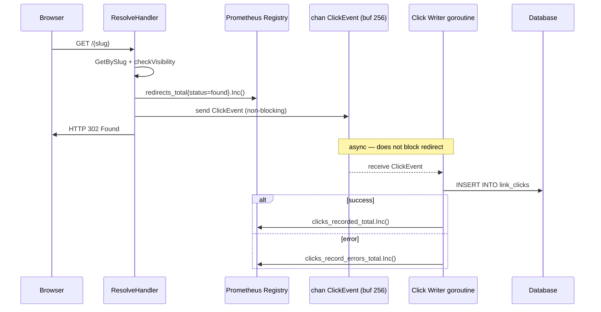
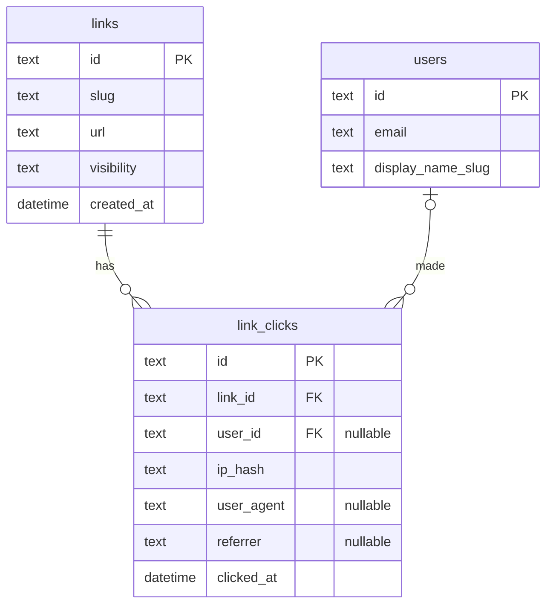
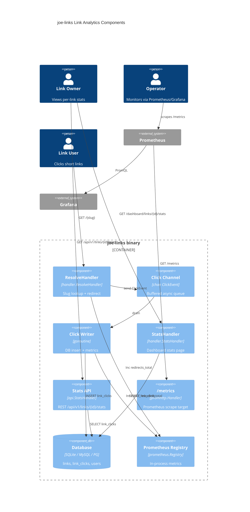

# Design: Link Analytics and Prometheus Metrics

## Context

joe-links currently has zero observability into link usage. The only signal
available is chi's stdout HTTP log. Link owners cannot see whether their links
are being used, operators cannot alert on redirect error rates, and there is no
foundation for future features like popular-links leaderboards or A/B testing.

ADR-0016 documents the architectural decisions: append-only `link_clicks` table
for storage, `prometheus/client_golang` for the metrics endpoint, and
`/dashboard/links/{id}/stats` for the analytics UI.

## Goals / Non-Goals

### Goals
- Record every successful redirect as an immutable click event
- Expose per-link analytics (totals, recent clicks, referrers, user identity) to link owners
- Provide a Prometheus `/metrics` endpoint for infrastructure monitoring
- Extend the REST API with stats and paginated click-list endpoints
- Keep redirect latency unaffected (async write path)

### Non-Goals
- Real-time streaming analytics (SSE/WebSocket push of live clicks)
- Public analytics pages visible to non-owners
- Automated data retention / purge jobs (additive follow-on work)
- Bot/crawler filtering or deduplication
- Geographic enrichment of IP addresses

## Decisions

### Async Click Recording via Buffered Channel

**Choice**: The resolve handler sends a `ClickEvent` struct to a `chan ClickEvent`
(buffer size 256) and returns immediately. A single background goroutine drains
the channel and performs DB inserts.

**Rationale**: The redirect hot path is latency-sensitive. A synchronous DB
insert would add 1–10 ms per request. The buffered channel decouples the HTTP
response from the write, keeping P99 redirect latency unaffected. A single
writer goroutine also serialises inserts, avoiding write contention.

**Alternatives considered**:
- Synchronous insert: rejected — adds measurable latency to every redirect
- `sync.Map` counters flushed on a timer: rejected — data loss window on crash,
  no per-click metadata (referrer, user identity)
- Multiple writer goroutines: unnecessary at expected traffic levels; single
  writer simplifies shutdown drain

### Daily-Salted IP Hash

**Choice**: `ip_hash = SHA-256(clientIP + ":" + YYYYMMDD_UTC)`

**Rationale**: Raw IPs are PII. A stable hash would allow cross-temporal
correlation of a user across the entire dataset. A daily salt prevents
correlation across days while still allowing same-day deduplication if needed.

**Alternatives considered**:
- Store raw IP: privacy risk, potential GDPR/CCPA exposure
- No IP at all: loses the ability to detect duplicate clicks within a session
- HMAC with a server secret: adds key management complexity with no clear benefit
  over a rotating date salt

### Prometheus Rather Than expvar

**Choice**: `prometheus/client_golang` mounted at `/metrics`

**Rationale**: Standard Prometheus client provides histograms (latency buckets),
counters, and gauges. The output format is natively consumed by Prometheus;
expvar requires a separate adapter and cannot express histograms. The dependency
cost (~5 packages) is justified.

### Analytics Page Within Authenticated Dashboard

**Choice**: `/dashboard/links/{id}/stats` (authenticated, owner/co-owner/admin only)

**Rationale**: Consistent with the existing link detail/edit flow at
`/dashboard/links/{id}`. Reuses existing `AuthMiddleware.RequireAuth` and
ownership-check patterns. No new auth surface.

## Architecture

### Data Flow: Click Recording

### Data Model: link_clicks ERD

### Component Overview

## New Files

| Path | Purpose |
|------|---------|
| `internal/db/migrations/00011_create_link_clicks.sql` | Goose migration: `link_clicks` table + index |
| `internal/store/click_store.go` | `ClickStore`: `RecordClick`, `GetClickStats`, `ListRecentClicks` |
| `internal/handler/stats.go` | `StatsHandler`: dashboard stats page |
| `internal/api/stats.go` | REST stats + clicks endpoints |
| `internal/metrics/metrics.go` | Prometheus registry, counter/histogram/gauge definitions |

## Modified Files

| Path | Change |
|------|--------|
| `internal/handler/resolve.go` | Send to click channel after redirect; increment Prometheus counter/histogram |
| `internal/handler/router.go` | Mount `/metrics`, wire `StatsHandler`, add `ClickStore` to `Deps` |
| `internal/api/router.go` | Register `/api/v1/links/{id}/stats` and `/api/v1/links/{id}/clicks` |
| `cmd/joe-links/serve.go` | Start click writer goroutine; inject `ClickStore` and metrics registry |
| `go.mod` / `go.sum` | Add `github.com/prometheus/client_golang` |

## Risks / Trade-offs

- **Click loss on crash**: Events queued in the channel but not yet inserted are
  lost on ungraceful shutdown. Acceptable for analytics; the writer drains on
  graceful shutdown so normal restarts lose nothing.
- **Table growth**: `link_clicks` is unbounded by default. For personal/small-team
  deployments this is not a problem. A future retention-policy feature can add
  a CLI command or background job to purge old rows.
- **New dependency**: `prometheus/client_golang` (~5 packages) is the first
  pure-monitoring dependency in `go.mod`. Adds ~2 MB to the binary. Acceptable.
- **Histogram bucket tuning**: Default latency buckets in the Prometheus client
  may not match the actual redirect latency distribution (typically 1–20 ms).
  Custom buckets (e.g., 0.001, 0.005, 0.01, 0.025, 0.05, 0.1) SHOULD be used.

## Migration Plan

1. Run `go get github.com/prometheus/client_golang` and commit `go.mod`/`go.sum`.
2. Apply migration `00011_create_link_clicks.sql` via `joe-links migrate`.
3. Deploy the new binary. The `/metrics` endpoint and click recording begin immediately.
4. Configure Prometheus to scrape `http://<host>/metrics`.
5. The stats page at `/dashboard/links/{id}/stats` is gated behind auth — no
   public-facing surface changes.

Rollback: remove the `00011` migration (drop table), revert binary. No data
loss risk to existing links or users.

## Open Questions

- Should the stats page include a simple sparkline chart (server-rendered SVG or
  a small JS chart library), or is a table of daily counts sufficient for v1?
- Should `/metrics` be behind a secret query parameter or network firewall rule,
  or is unauthenticated access acceptable given typical firewall posture?
- What is the desired default retention window for click data (90 days? 1 year?
  unlimited)? This informs whether the retention CLI command is in scope for v1.
