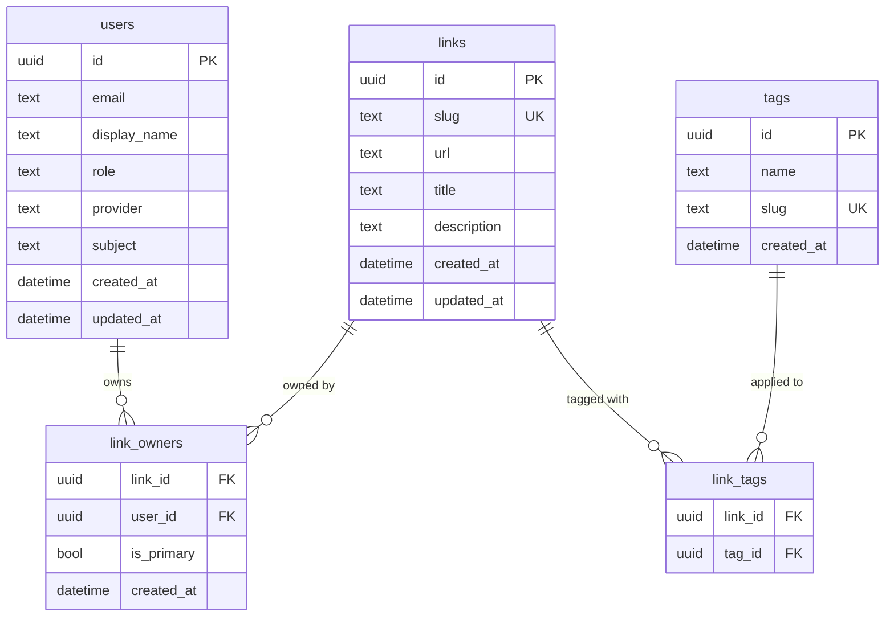
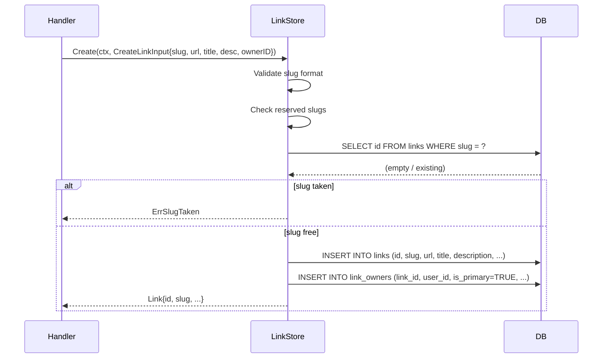

# Design: Link Data Model — Links, Tags, and Multi-Ownership

## Context

joe-links stores short slug-to-URL mappings. The initial simple model (`links.owner_id` FK) is insufficient because links are team resources: multiple users need to co-manage the same link. The application also needs discoverability features (tags, search) that require a normalized tag taxonomy rather than free-text strings. See ADR-0005 for the full decision record.

This design governs `db/migrations/` files, the `internal/store/` package, and any handler that touches link or tag data.

## Goals / Non-Goals

### Goals
- Normalize ownership into a join table to support multiple owners per link
- Normalize tags into a shared taxonomy to enable tag-based filtering across all users
- Define a clean `LinkStore` interface that handlers depend on (not raw `sqlx.DB`)
- Ensure all three target databases (SQLite, MySQL, PostgreSQL) can execute the schema identically

### Non-Goals
- Full-text search or elasticsearch integration (out of scope)
- Link click analytics / visit counting (future work, tracked separately)
- User-scoped private tags (all tags are global)
- Soft delete / link history / versioning

## Decisions

### No `owner_id` on the `links` Table

**Choice**: ownership is expressed exclusively through the `link_owners` join table; `links` has no `owner_id` column.

**Rationale**: adding co-ownership to a column-based model (`owner_id`) would require either a JSON array (non-portable) or a second `co_owners` table that duplicates the concept. Starting with `link_owners` as the canonical ownership source eliminates this fork.

**Alternatives considered**:
- `links.owner_id` + `links.co_owners JSON`: non-portable across SQLite/MySQL/PostgreSQL; no referential integrity
- `links.owner_id` + separate `link_co_owners` table: maintains a privileged primary-owner column separately from co-owners, increasing the chance of inconsistency

### Tag Slug as the Upsert Key

**Choice**: tags are created/reused via upsert on the derived `slug` field, not the display `name`.

**Rationale**: display names are case- and whitespace-sensitive ("Engineering" vs "engineering"). Using the normalized slug as the upsert key means "Engineering Tools" and "engineering tools" resolve to the same tag object, preventing tag proliferation.

**Alternatives considered**:
- Case-insensitive match on `name`: dialect-specific (`COLLATE NOCASE` in SQLite vs `LOWER()` in PostgreSQL)
- Exact match on `name`: leads to duplicate tags differing only in capitalization

### Sentinel Error for Not-Found

**Choice**: `GetBySlug` and `GetByID` return a package-level `ErrNotFound` sentinel when the record does not exist, rather than returning `nil, nil` or a wrapped `sql.ErrNoRows`.

**Rationale**: callers (handlers, tests) can check `errors.Is(err, store.ErrNotFound)` without importing `database/sql`. This decouples handlers from the DB layer and makes the store interface mockable without driver imports.

### Application-Layer Primary-Owner Invariant

**Choice**: the "exactly one `is_primary = TRUE` per link" invariant is enforced in application code, not via a SQL partial unique index.

**Rationale**: partial indexes (`CREATE UNIQUE INDEX ... WHERE is_primary = TRUE`) are not universally supported across SQLite, MySQL, and PostgreSQL in the same syntax. Since this is an append-only constraint (primary owner is set once at creation, never transferred), application-layer enforcement is simple and correct.

## Architecture

### Entity-Relationship Diagram



### Link Creation Flow



### Package Structure

```
internal/
  store/
    store.go          // LinkStore interface + sentinel errors
    link_store.go     // sqlx implementation
    tag_store.go      // TagStore interface + sqlx implementation
    errors.go         // ErrNotFound, ErrSlugTaken, ErrDuplicateOwner
db/
  migrations/
    00001_create_users.sql
    00002_create_links.sql
    00003_create_link_owners.sql
    00004_create_tags.sql
    00005_create_link_tags.sql
```

## Risks / Trade-offs

- **SQLite foreign key enforcement** → SQLite requires `PRAGMA foreign_keys = ON` at connection time; the `db.New()` factory MUST set this pragma for SQLite connections or CASCADE DELETEs will be silently ignored.
- **UUID generation in Go vs database** → UUIDs are generated in Go (`google/uuid`) before insert rather than relying on `gen_random_uuid()` (PostgreSQL-only). This ensures portability.
- **Tag orphan accumulation** → Tags with zero `link_tags` rows will accumulate over time. A background cleanup job or lazy deletion on `RemoveTag` MAY be added in a future iteration; for now orphans are harmless.
- **Slug immutability** → Changing a slug after creation breaks existing links embedded in browser history, bookmarks, and team wikis. The spec enforces slug immutability; the UI renders slug as a read-only field on the edit form.

## Open Questions

- Should `tags.name` be mutable (allow renaming a tag)? If so, slug must stay stable as the canonical key.
- Should `ListByOwner` include links where the user is a co-owner only, or only primary-owned links? Current spec says all ownership rows (primary or co-owner). Confirm before implementation.
- Is a `links.is_active` soft-disable flag wanted for admin use without full deletion?
