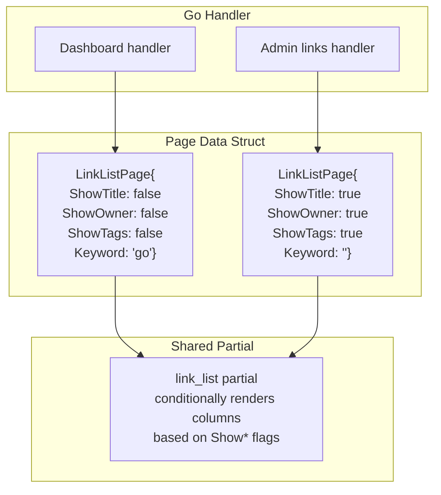

# Design: Link List UI Consistency

## Context

The joe-links UI currently has two separate link table implementations: the dashboard view in `web/templates/partials/link_list.html` and the admin view inline in `web/templates/pages/admin/links.html`. These diverged over time as columns were added to the admin view (Title, Owner, Tags) that the dashboard view does not need. This creates a maintenance burden — changes to row layout, action buttons, or styling must be duplicated. Additionally, several small UX issues have accumulated: a redundant View button in the actions column (the slug is already a link), the copy button buried in the actions column instead of near the slug it copies, a missing Keywords link in the admin sidebar, and an inconsistent text-based delete button on the Keywords page.

See SPEC-0004 (Application Views and Routing), SPEC-0011 (Admin Management), SPEC-0013 (UI/UX Improvements).

## Goals / Non-Goals

### Goals
- Consolidate two link table templates into one configurable shared partial
- Display `keyword/slug` format with visually distinct keyword prefix
- Move the copy button inline with the slug for better discoverability
- Remove the redundant View (eye) button from actions
- Add the missing Keywords link to the admin sidebar
- Convert the Keywords delete button to an icon button for visual consistency

### Non-Goals
- Changing the link data model or adding new database columns
- Modifying the admin inline-edit row template (`admin_link_edit_row`) — it has different layout needs and remains separate
- Adding pagination or infinite scroll to the link list (separate concern)
- Changing the link list HTMX partial swap behavior
- Responsive/mobile layout changes

## Decisions

### Shared Partial with Column Flags Over Template Inheritance

**Choice**: Use a single `link_list` partial that accepts boolean flags (e.g., `ShowTitle`, `ShowOwner`, `ShowTags`) in the template data to conditionally render columns. The calling template passes these flags as fields in the page data struct.

**Rationale**: Go's `html/template` does not support template inheritance or parameterized template calls in the way that Jinja2 or Blade do. The simplest approach is boolean flags on the data struct. This avoids introducing a new abstraction (like a column descriptor slice) that would be over-engineered for the two known column sets. If a third view is added later, the flags pattern extends naturally.

**Alternative considered**: A `Columns []string` slice that the template iterates over — rejected because Go templates lack the ability to dynamically look up struct fields by string name without reflection helpers, which would add complexity for no clear benefit.

### Keyword Prefix Styling with Nested Spans

**Choice**: Render the slug cell as `<a href="/{slug}"><span class="text-base-content/50">{keyword}/</span>{slug}</a>` — the keyword prefix uses a muted color class while the slug portion inherits the link's primary color.

**Rationale**: This keeps the entire text as a single clickable link while visually distinguishing the keyword prefix. The muted class (`text-base-content/50`) is already used throughout the codebase for secondary text. No JavaScript is needed.

### Copy Button Inline with Slug

**Choice**: Place the copy button inside the slug `<td>` cell, immediately after the link element, using a `flex items-center gap-1` wrapper. Remove the copy button from the actions `<td>`.

**Rationale**: The copy button's purpose is tightly coupled to the slug text. Placing it inline makes the relationship obvious and reduces visual clutter in the actions column. The `gap-1` spacing keeps it visually attached to the slug without overlapping.

### Admin Edit Row Stays Separate

**Choice**: The `admin_link_edit_row` template remains a standalone define, not merged into the shared partial.

**Rationale**: The inline edit row has a fundamentally different layout (input fields, Save/Cancel buttons, different column spans). Trying to make the shared partial handle both read and edit modes would significantly increase template complexity for no reuse benefit — only the admin view uses inline editing.

## Architecture

### Template Data Flow



### Slug Cell Layout

```
+--------------------------------------------------+
| go/my-slug  [copy icon]                          |
| ^muted      ^primary    ^btn-ghost btn-xs        |
+--------------------------------------------------+
```

### Sidebar Admin Section (Updated)

```
Admin (details/summary)
  +-- Overview    /admin
  +-- Users       /admin/users
  +-- Links       /admin/links
  +-- Keywords    /admin/keywords    <-- NEW
```

## Template Changes

### Shared Link List Partial (`web/templates/partials/link_list.html`)

The partial checks `Show*` flags to conditionally render `<th>` and `<td>` elements:

```html
{{define "link_list"}}
{{if .Links}}
<div class="overflow-x-auto">
    <table class="table table-zebra w-full">
        <thead>
            <tr>
                <th>Slug</th>
                <th>URL</th>
                {{if .ShowTitle}}<th>Title</th>{{end}}
                {{if .ShowOwner}}<th>Owner(s)</th>{{end}}
                {{if .ShowTags}}<th>Tags</th>{{end}}
                <th>{{if .ShowTitle}}{{else}}Description{{end}}</th>
                <th>Created</th>
                <th></th>
            </tr>
        </thead>
        <tbody id="links-table">
            {{range .Links}}
            <tr id="link-{{.ID}}">
                <td>
                    <div class="flex items-center gap-1">
                        <a href="/{{.Slug}}" class="font-mono font-semibold link link-primary" target="_blank">
                            {{if $.Keyword}}<span class="text-base-content/50">{{$.Keyword}}/</span>{{end}}{{.Slug}}
                        </a>
                        <!-- inline copy button -->
                        ...
                    </div>
                </td>
                ...
            </tr>
            {{end}}
        </tbody>
    </table>
</div>
{{end}}
{{end}}
```

### Admin Links Page (`web/templates/pages/admin/links.html`)

Replaces inline `admin_link_list` with a call to the shared partial:

```html
<div id="admin-link-list">
    {{template "link_list" .}}
</div>
```

The `admin_link_edit_row` and `admin_link_row` templates remain for inline editing support.

### Keywords Delete Button

```html
<!-- Before -->
<button class="btn btn-ghost btn-xs text-error" ...>Delete</button>

<!-- After -->
<button class="btn btn-xs btn-ghost text-error tooltip tooltip-left" data-tip="Delete" ...>
    <svg xmlns="http://www.w3.org/2000/svg" class="h-4 w-4" fill="none" viewBox="0 0 24 24"
         stroke="currentColor" stroke-width="2">
        <path stroke-linecap="round" stroke-linejoin="round"
              d="M19 7l-.867 12.142A2 2 0 0116.138 21H7.862a2 2 0 01-1.995-1.858L5 7m5 4v6m4-6v6m1-10V4a1 1 0 00-1-1h-4a1 1 0 00-1 1v3M4 7h16" />
    </svg>
</button>
```

### Admin Sidebar Keywords Link (base.html)

```html
<a href="/admin/keywords" data-nav="/admin/keywords"
   class="flex items-center gap-3 px-3 py-2 rounded-lg text-sm font-medium hover:bg-base-300 transition-colors">
    <svg xmlns="http://www.w3.org/2000/svg" class="h-5 w-5 shrink-0" fill="none"
         viewBox="0 0 24 24" stroke="currentColor" stroke-width="2">
        <path stroke-linecap="round" stroke-linejoin="round"
              d="M7 20l4-16m2 16l4-16M6 9h14M4 15h14" />
    </svg>
    Keywords
</a>
```

## Go Handler Changes

The page data struct used by both dashboard and admin link list handlers needs the column flag fields:

```go
type LinkListData struct {
    BasePage
    Links     []LinkView
    Keyword   string
    Query     string
    Tag       string
    ShowTitle bool
    ShowOwner bool
    ShowTags  bool
}
```

The dashboard handler sets `ShowTitle: false, ShowOwner: false, ShowTags: false`.
The admin handler sets `ShowTitle: true, ShowOwner: true, ShowTags: true`.

## Risks / Trade-offs

- **Shared partial complexity**: Adding conditional columns makes the template slightly harder to read than two separate purpose-built templates. However, the maintenance benefit of a single source of truth for link row rendering outweighs this. The two-template approach has already led to divergent styling.

- **Admin inline edit stays separate**: The `admin_link_edit_row` template cannot use the shared partial because it replaces cells with input fields. This means the admin view still has some template duplication between the read row and the edit row, but this is inherent to the inline-editing pattern.

- **Keyword prefix display depends on handler passing `Keyword`**: The dashboard handler already passes this (from the configured keyword). The admin handler may need to be updated to also pass the keyword if the admin view should show keyword-prefixed slugs.

## Open Questions

- Should the admin link list also show keyword-prefixed slugs, or only the dashboard view? The admin might prefer bare slugs since they manage all links across keywords.
- Should the Description column be shown in admin view alongside Title, or should Title replace Description? Currently the dashboard shows Description and admin shows Title — the shared partial needs a clear rule for which to display.
