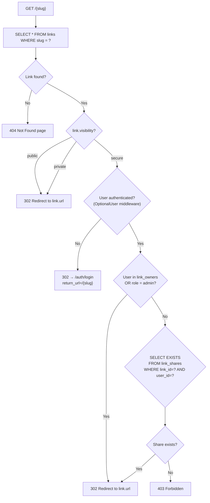
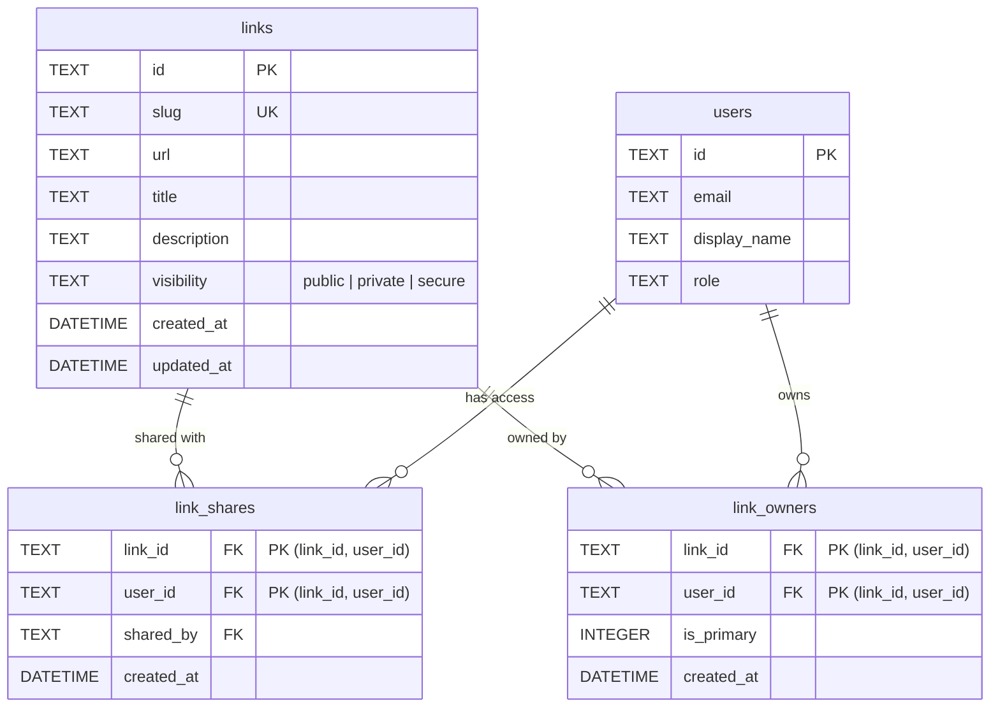
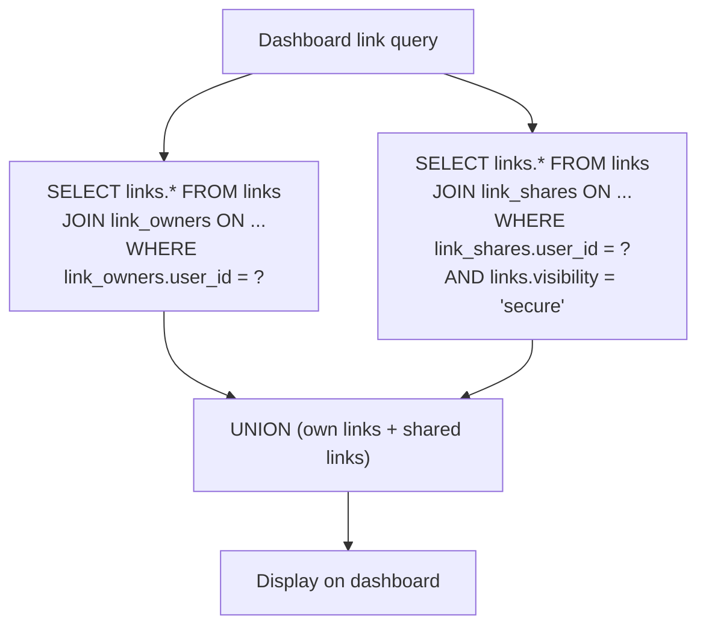
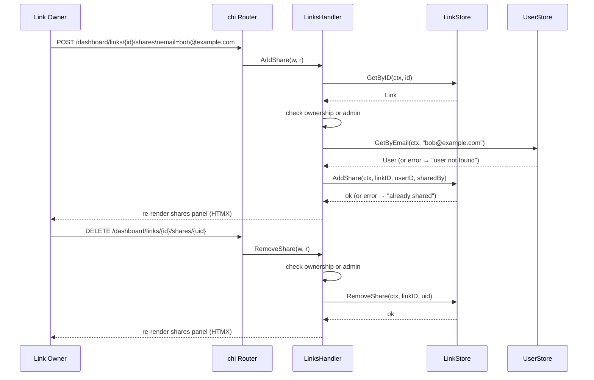

# Design: Link Visibility Modes (SPEC-0010)

## Context

joe-links treats all links as globally public — any user who navigates to `/{slug}` is redirected, and all links appear in dashboard searches, tag listings, and admin views. This is appropriate for team-wide go-links but insufficient for links to sensitive internal resources (e.g., HR tools, incident response pages, financial dashboards). Teams need the ability to control both discoverability and access on a per-link basis.

ADR-0014 established the three-tier visibility model: public (default, unchanged behavior), private (unlisted but accessible by anyone who knows the slug), and secure (access-controlled with explicit user grants). This design document details how the visibility model integrates with the existing architecture.

Related: ADR-0014 (Link Visibility Modes), ADR-0005 (Data Model), ADR-0003 (OIDC Auth), ADR-0007 (Views and Routing), ADR-0008 (REST API Layer), SPEC-0002 (Link Data Model), SPEC-0004 (Application Views and Routing), SPEC-0005 (REST API Layer).

## Goals / Non-Goals

### Goals
- Add a `visibility` column to `links` that defaults to `'public'` (zero-friction migration for existing data)
- Create a `link_shares` join table for user-level access grants on secure links
- Modify the slug resolver to enforce visibility at the redirect point
- Filter browsing views (dashboard, search, tags, public browser, profiles) based on visibility
- Expose visibility in the REST API for programmatic management
- Provide UI for setting visibility and managing shares

### Non-Goals
- Time-limited shares (expiring access grants) — deferred
- Group-based sharing (share with all users in an org) — deferred
- Visibility per-tag or per-collection — visibility is per-link only
- Password-protected links (share via a secret URL rather than user identity) — different pattern
- Audit log for share events — deferred to a future spec

## Decisions

### TEXT Column for Cross-Database Portability

**Choice**: The `visibility` column is `TEXT NOT NULL DEFAULT 'public'` with application-level validation for the three valid values.

**Rationale**: SQLite does not enforce CHECK constraints on TEXT columns in all configurations, MySQL ENUM types are non-standard, and PostgreSQL's custom types add migration complexity. Using TEXT with application-level validation is consistent with the existing approach (e.g., `role TEXT` on the `users` table) and works identically across all three databases.

**Alternatives considered**:
- CHECK constraint: SQLite support varies by compile flags; not portable
- Database-native ENUM: MySQL-specific syntax, does not work on SQLite
- Integer column with constants: less readable in queries and debugging

### Resolver Hot Path Optimization

**Choice**: For `public` and `private` links, the resolver performs zero additional queries beyond the existing slug lookup. The `visibility` column is loaded as part of the existing `SELECT * FROM links WHERE slug = ?` query. The access check for `secure` links is an additional `SELECT EXISTS(...)` query against `link_shares` only when the link is `secure` and the user is not an owner.

**Rationale**: The slug resolver is the hottest path in the application — every go-link click hits it. Adding a JOIN or subquery for every redirect would degrade performance. By branching on the `visibility` value (which is already in the loaded link row), we add zero overhead for the 90%+ of links that are public or private.

**Alternatives considered**:
- Preload shares into context middleware: wasteful for non-secure links
- Cache share memberships: adds complexity and staleness risk

### Shares as a Flat Join Table (Not ACL)

**Choice**: The `link_shares` table is a simple `(link_id, user_id)` join table with a `shared_by` audit field, following the same pattern as `link_owners`.

**Rationale**: The only permission being modeled is "can this user access this link?" — a binary yes/no. A full ACL system with permission types (`view`, `edit`, `admin`) would duplicate the existing `link_owners` authorization and add unnecessary complexity. The `shared_by` column provides minimal auditability without a full audit log table.

### Dashboard "Shared with Me" as a Filter

**Choice**: Secure links shared with the user appear in the dashboard under a "Shared with me" filter/tab, not as a separate page.

**Rationale**: Users already manage all their links on the dashboard. Adding shared links as a filterable category keeps the UI cohesive. A separate `/dashboard/shared` page would fragment link management across two locations. The filter approach is consistent with the existing tag filter pattern.

## Architecture

### Resolver Flow with Visibility



### Data Model



### Dashboard Query Logic



### Share Management Flow



### Package Structure

```
Migrations:
  internal/db/migrations/00009_add_link_visibility.sql
    — ALTER TABLE links ADD COLUMN visibility TEXT NOT NULL DEFAULT 'public'
  internal/db/migrations/00010_create_link_shares.sql
    — CREATE TABLE link_shares (...)

Store changes:
  internal/store/link_store.go
    — AddShare(), RemoveShare(), ListShares(), HasShare()
    — ListPublic() adds WHERE visibility = 'public'
    — ListByOwner() returns all own links + shared secure links
    — GetBySlug() already returns visibility (column added to struct)

Handler changes:
  internal/handler/resolve.go
    — visibility check after slug lookup
  internal/handler/links.go
    — AddShare(), RemoveShare() handlers
    — Create/Edit forms include visibility selector
  internal/handler/dashboard.go
    — "Shared with me" filter support

API changes:
  internal/api/links.go
    — visibility field in request/response JSON
  internal/api/shares.go
    — SharesAPIHandler (list, add, remove)

Template changes:
  web/templates/pages/dashboard/links_new.html   — visibility selector
  web/templates/pages/dashboard/links_edit.html   — visibility selector
  web/templates/pages/dashboard/links_detail.html — shares panel
```

## Risks / Trade-offs

- **Secure link resolver overhead** — secure links add one DB query (share check) to the redirect hot path. Mitigated by: the composite primary key `(link_id, user_id)` on `link_shares` serves as an efficient lookup index; the query only runs for secure links, which are expected to be a small fraction of total links.
- **Share management complexity** — adding and removing shares introduces new UI and API surface. Mitigated by: the UI follows existing patterns (email lookup + HTMX list management, same as co-owner management).
- **Orphaned shares** — if a link's visibility is changed from `secure` to `public`, existing `link_shares` rows become inert but remain in the database. This is intentional: re-enabling `secure` mode restores the previous share grants. Cleanup can be added later if storage becomes a concern.
- **No CHECK constraint** — the visibility column uses application-level validation only. Mitigated by: the same approach is used for `role` on the `users` table; all writes go through the store layer which enforces validation.
- **Migration ordering** — if SPEC-0012 (user profiles) also adds a migration, the migration numbers must not conflict. The visibility migrations use `00009` and `00010`; SPEC-0012's `display_name_slug` migration should use a number after these.

## Migration Plan

1. Add goose migration `00009_add_link_visibility.sql`:
   - `ALTER TABLE links ADD COLUMN visibility TEXT NOT NULL DEFAULT 'public'`
2. Add goose migration `00010_create_link_shares.sql`:
   - Create `link_shares` table with composite PK and CASCADE foreign keys
   - Create index on `(link_id, user_id)`
3. Add `HasShare()`, `AddShare()`, `RemoveShare()`, `ListShares()` to `LinkStore`
4. Modify `GetBySlug()` to return the `visibility` field (already a column on the struct after migration)
5. Modify the resolver in `internal/handler/resolve.go` to enforce visibility
6. Add visibility selector to link create/edit templates
7. Add shares panel to link detail template
8. Add share management handlers to `internal/handler/links.go`
9. Add share API endpoints to `internal/api/shares.go`
10. Add visibility field to API request/response types

Rollback: run down migrations (drop `link_shares`, remove `visibility` column). All links revert to implicitly public behavior.

## Open Questions

- Should the visibility selector show a warning when changing from public to secure ("Existing users who access this link via bookmark will lose access")? Likely yes, but the exact UX is deferred to implementation.
- Should there be a bulk share feature (share a link with all members of a role or group)? Deferred — joe-links does not currently have group/team concepts.
- Should the API support filtering links by visibility (`GET /api/v1/links?visibility=secure`)? Useful for CLI tools managing secure links; deferred to a follow-up.
