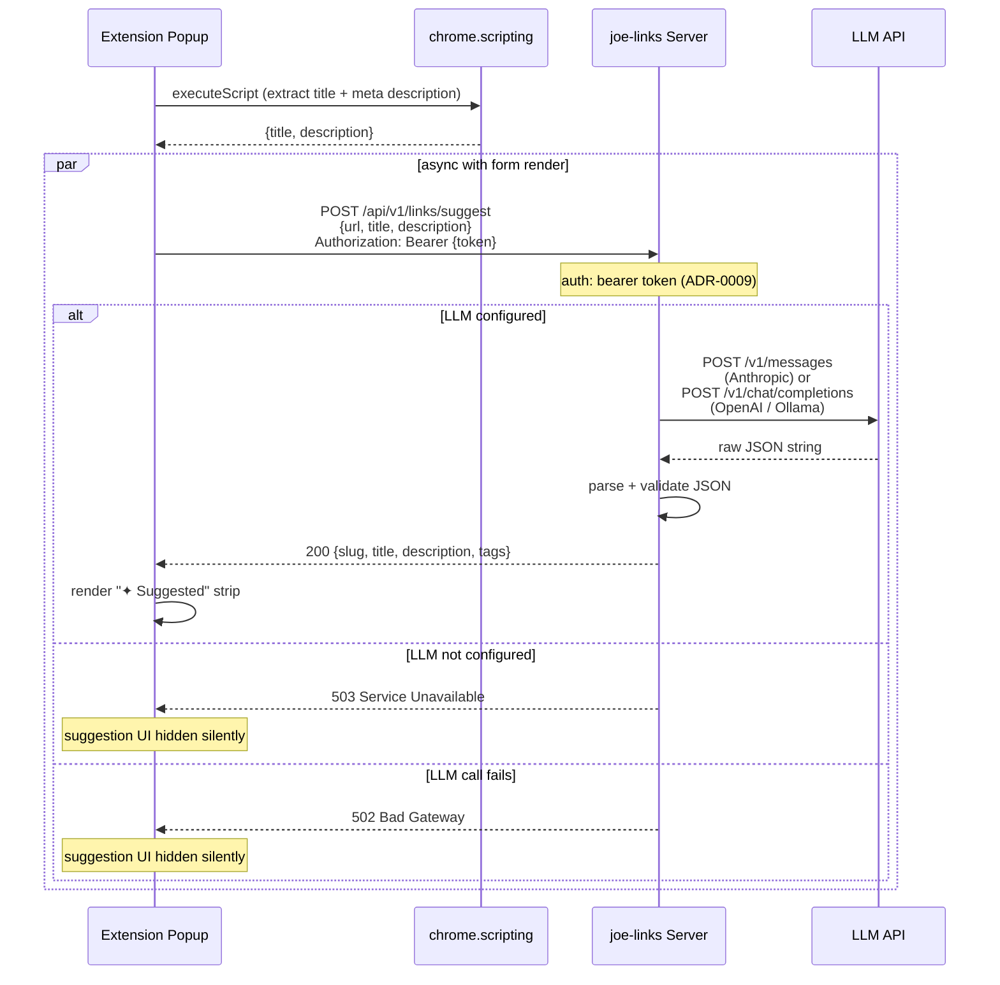
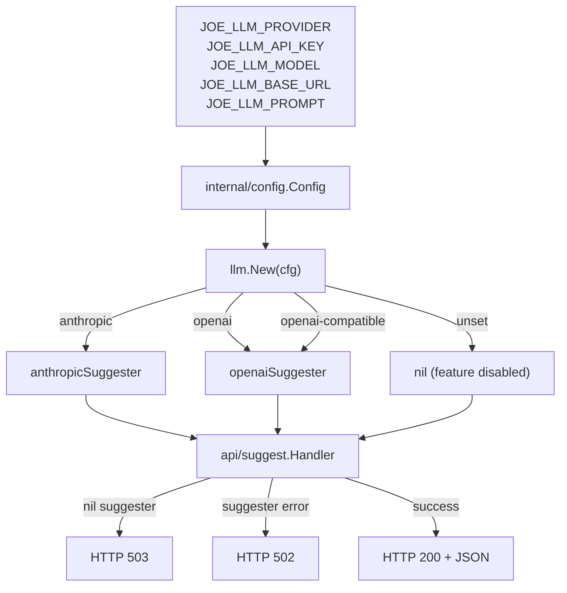

# Design: LLM-Powered Metadata Suggestions

## Context

When creating a go-link, users must manually fill in slug, title, description, and tags. For most URLs these values are predictable from the page content, but the friction of four fields slows creation — especially in the browser extension popup where screen space is tight. See ADR-0017 for the architectural decision that chose a server-side suggestion endpoint (Option A) over extension-side LLM calls (Option B) or server-side page crawling (Option C).

The existing extension popup already makes two async calls on load (existing links lookup + keyword templates). Adding a suggestion call fits naturally into the same initialization pattern.

## Goals / Non-Goals

### Goals

- Reduce form-filling friction in the extension popup via one-click field suggestions
- Centralise LLM API key management on the server (no user-facing key config)
- Support Anthropic, OpenAI, and any OpenAI-compatible endpoint (including local Ollama)
- Keep zero-config deployments completely unaffected (no LLM config → feature does not exist)
- Stay within the existing REST + bearer token conventions (ADR-0008, ADR-0009)
- Use only `net/http` — no provider SDK dependencies

### Non-Goals

- Reading authenticated/session-gated page content (server cannot replicate the user's session)
- Per-user LLM provider or model selection
- Streaming / partial suggestions
- Caching or storing LLM responses
- Modifying the link creation API itself — suggestions are advisory only

## Decisions

### Server-side endpoint, not extension-side

**Choice**: The extension sends `{url, title, description}` to `POST /api/v1/links/suggest`; the server calls the LLM and returns `{slug, title, description, tags}`.

**Rationale**: API key stays on the server. Operator controls model selection and prompt. Extension change is minimal (one additional fetch). Works identically across Chrome, Firefox, and Safari extensions.

**Alternatives considered**:
- Extension-side LLM call: Every user needs their own API key in extension storage. CSP and CORS complications. Key is in a lower-trust environment.
- Server-side page crawl: Unreliable (JS rendering, auth walls). Adds SSRF attack surface. Server can't see content the user's session can access.

### `internal/llm` package with a `Suggester` interface

**Choice**: A single Go interface in `internal/llm` isolates all LLM communication. Two concrete implementations: `anthropicSuggester` (Anthropic Messages API) and `openaiSuggester` (OpenAI Chat Completions, also handles `openai-compatible`).

**Rationale**: Provider-specific wire format (headers, request/response shape) is encapsulated. Callers work with `SuggestRequest` / `SuggestResponse` only. New providers can be added without touching handler code. No SDK imports — both implementations use `net/http` directly.

### Feature-flag via `JOE_LLM_PROVIDER`

**Choice**: When `JOE_LLM_PROVIDER` is unset the `Suggester` is `nil`, the endpoint returns 503, and zero LLM code paths run.

**Rationale**: Operators who don't want LLM get identical behaviour to today. No partial initialisation risk. The 503 response is the extension's signal to silently hide the suggestion UI.

### Embedded default prompt as Go `text/template`

**Choice**: The default prompt is embedded in the binary via `go:embed`. `JOE_LLM_PROMPT` overrides it at startup. The template uses `{{.URL}}`, `{{.Title}}`, `{{.Description}}` variables and instructs the LLM to respond with JSON only.

**Rationale**: Operators can tune the prompt without recompiling. The default covers the common case. Embedding avoids runtime file I/O and keeps the single-binary promise.

### Silent degradation in the extension

**Choice**: If the suggest endpoint returns any non-200 response (including 503, 502, network errors, or timeout), the extension does not render the suggestion strip and shows no error to the user.

**Rationale**: LLM availability is best-effort. The form is fully usable without suggestions. Surfacing errors for an optional feature creates noise and confusion. Operators who care about LLM uptime can check server logs.

## Architecture



### Package structure

```
internal/
  llm/
    llm.go              # Suggester interface, SuggestRequest, SuggestResponse
    anthropic.go        # anthropicSuggester (Messages API)
    openai.go           # openaiSuggester (Chat Completions; also openai-compatible)
    prompt.go           # default prompt template (go:embed)
    prompt.tmpl         # embedded default prompt

internal/
  api/
    suggest.go          # POST /api/v1/links/suggest handler

internal/
  config/
    config.go           # LLMProvider, LLMAPIKey, LLMModel, LLMBaseURL, LLMPrompt fields

integrations/
  extension/
    popup.js            # meta extraction + suggest call + suggestion strip render
    manifest.json       # adds "scripting" permission
```

### Config wiring



### Extension suggestion strip

The strip is injected above the form fields after suggestions arrive. Each field row has a "Use" button that writes the value into the form input. The strip has a dismiss (×) button. If suggestions are partial (e.g. tags empty), only rows with non-empty values are shown.

```
┌─────────────────────────────────────────┐
│ ✦ Suggested                         ×   │
│  slug:  my-cool-link          [Use]     │
│  title: My Cool Link          [Use]     │
│  desc:  A link to the PR…     [Use]     │
│  tags:  go  tools             [Use]     │
└─────────────────────────────────────────┘
```

## Risks / Trade-offs

- **LLM latency** → Mitigated by firing the request asynchronously after the popup is interactive. The form is usable immediately; suggestions layer on top when ready.
- **Malformed LLM JSON** → Server logs raw response and returns 502. Extension hides suggestion UI silently.
- **Prompt injection via page title/description** → The prompt is a system message instructing JSON-only output; injected content lands in a user-turn, not the system prompt. Risk is low in a single-user deployment.
- **`scripting` permission in manifest** → Requires re-approval when sideloading the extension. Documented in extension README. Safari WKWebExtension supports the `scripting` API as of Safari 15.4.
- **Privileged pages (chrome://, about:)** → `executeScript` throws; extension falls back to `tabs.query` title only and still fires the suggestion request.

## Migration Plan

This is a greenfield feature. No existing data or behaviour changes.

1. Add `JOE_LLM_*` fields to `internal/config/config.go` and viper bindings
2. Create `internal/llm/` package with interface and two implementations
3. Wire `llm.New(cfg)` into the server `Deps` struct
4. Add `POST /api/v1/links/suggest` handler in `internal/api/suggest.go`, register on the chi sub-router
5. Add swag annotations and regenerate Swagger docs
6. Add `"scripting"` to `manifest.json` permissions
7. Implement meta extraction + suggestion strip in `popup.js`
8. Bump extension version

## Open Questions

- Should the suggest endpoint accept an optional `html` field (raw page HTML) for richer context in future? Not in scope for SPEC-0017 but worth reserving the field name.
- Default model per provider: `claude-haiku-4-5-20251001` for Anthropic, `gpt-4o-mini` for OpenAI — are these the right cost/quality defaults?
