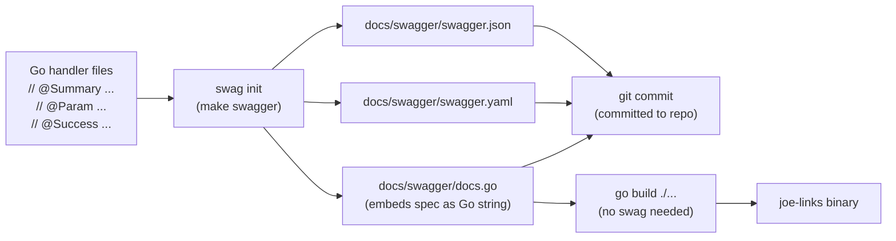
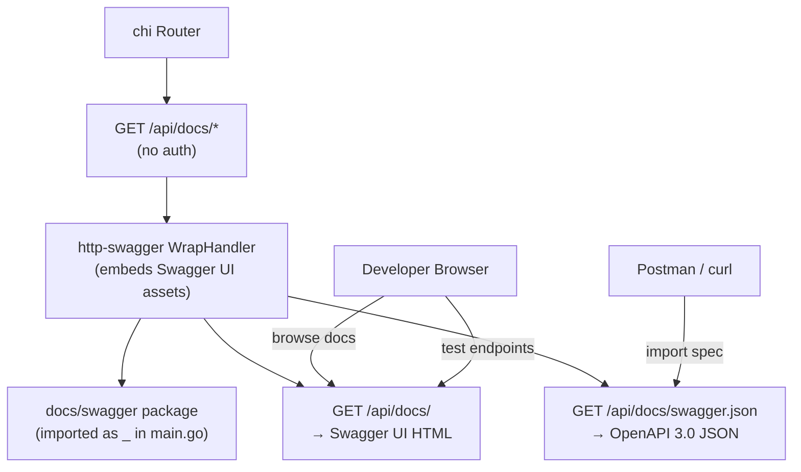
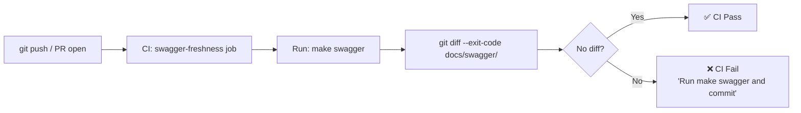

# Design: OpenAPI 3.0 Documentation and Swagger UI (SPEC-0007)

## Context

The REST API (SPEC-0005) needs interactive documentation that stays in sync with the code and fits the single-binary deployment model. Developers need to discover endpoints, understand request/response schemas, and test API calls from the browser without setting up a separate documentation site.

The key constraints are: (1) the OpenAPI spec must be derived from the code, not maintained separately; (2) the Swagger UI must be served by the same `joe-links` binary with no external dependencies; (3) the generated spec must be committed to the repo so `go build` works without any generation tooling installed.

Related: ADR-0010 (OpenAPI & Swagger UI), ADR-0008 (REST API), ADR-0009 (API Auth), SPEC-0005 (REST API), SPEC-0006 (API Tokens).

## Goals / Non-Goals

### Goals
- Generate a valid OpenAPI 3.0 spec from Go handler annotations using `swaggo/swag`
- Serve Swagger UI at `/api/docs/` with zero external hosting dependencies
- Keep the committed `docs/swagger/swagger.json` as the source of truth for API consumers (Postman, curl, etc.)
- Document all `/api/v1` endpoints including PAT authentication
- Provide a `make swagger` target and a CI check to prevent spec drift

### Non-Goals
- Spec-first development (oapi-codegen) — joe-links is code-first; the API emerges from handler implementations
- SDK code generation — the spec is for human discovery and client library generation by consumers
- Documentation for the HTMX web UI endpoints (they return HTML, not JSON)
- API versioning in the spec (a future `/api/v2` would get its own spec or use OpenAPI's `servers` array)

## Decisions

### swaggo/swag (Code-First, Annotation-Driven)

**Choice**: Use `github.com/swaggo/swag` to parse Go comment annotations and generate `docs/swagger/swagger.json`, `docs/swagger/swagger.yaml`, and `docs/swagger/docs.go`.

**Rationale**: The team is building code first, not spec first. Annotations live in the same file as the handler, making them naturally in sync. The generated `docs.go` file is imported as a blank import (`_ "github.com/joestump/joe-links/docs/swagger"`) in `main.go` — no runtime generation step. The `swag` binary is a dev-time tool, not a runtime dependency.

**Alternatives considered**:
- oapi-codegen: spec-first is the right model for API-first products; for a web app with an API layer, it inverts the workflow and makes iteration slower
- go-swagger: generates OpenAPI 2.0 (Swagger 2.0), not 3.0; lacks `requestBody`, `oneOf`, and other modern features; reduced maintenance activity
- Hand-written YAML: guaranteed to drift from implementation

### Committed `swagger.json` for Reproducible Builds

**Choice**: `docs/swagger/swagger.json`, `docs/swagger/swagger.yaml`, and `docs/swagger/docs.go` are committed to the repository.

**Rationale**: Committing the generated files ensures `go build` always works on a fresh clone — no need to install `swag` in every build environment (CI, production servers, contributor machines). The `make swagger` target is a developer workflow step, not a build step.

**Alternatives considered**:
- Generate at build time (`go generate`): requires `swag` in every build environment; complicates reproducible builds
- Generate at server startup: adds startup latency and requires the full annotation parsing logic at runtime

### `http-swagger` for Zero-Asset UI Serving

**Choice**: Use `github.com/swaggo/http-swagger/v2` to serve the Swagger UI. Register `GET /api/docs/*` on the main chi router.

**Rationale**: `http-swagger` bundles the Swagger UI assets (CSS, JS, HTML) and serves them directly from its embedded filesystem. No separate static asset embedding or CDN dependency is needed. The handler is registered outside the `BearerTokenMiddleware` so the docs are browsable without a token.

**Alternatives considered**:
- Embed Swagger UI assets manually with `go:embed`: equivalent but requires manual asset maintenance
- Link to swagger.io CDN: external dependency; breaks in air-gapped environments

### Swagger UI Unauthenticated (Authorize Dialog for Testing)

**Choice**: `/api/docs/` is accessible without authentication. The Swagger UI's built-in "Authorize" dialog accepts a PAT for testing protected endpoints.

**Rationale**: Documentation should be discoverable without credentials — a developer evaluating joe-links should be able to browse the API surface before creating a token. The "Authorize" dialog (populated by the `BearerToken` security scheme) allows per-session token entry for testing.

## Architecture

### Spec Generation Workflow



### Runtime Serving Architecture



### Annotation Structure

Each handler file in `internal/api/` follows this annotation pattern:

```
internal/api/
  main_annotations.go   // @title, @version, @basePath, @securityDefinitions
  links.go              // @Router /links [get], @Router /links [post], etc.
  tags.go               // @Router /tags [get], etc.
  users.go              // @Router /users/me [get]
  admin.go              // @Router /admin/users [get], etc.
  tokens.go             // @Router /tokens [get], /tokens [post], /tokens/{id} [delete]
  types.go              // Request/response structs referenced in @Param/@Success
```

The main annotation block in `internal/api/main_annotations.go`:

```go
// @title           joe-links API
// @version         1.0
// @description     Self-hosted go-links service. Authenticate with a Personal Access Token.
// @BasePath        /api/v1
// @securityDefinitions.apikey BearerToken
// @in              header
// @name            Authorization
// @description     Type "Bearer" followed by a space and your API token. Example: "Bearer jl_xxx"
package api
```

### CI Freshness Check



## Risks / Trade-offs

- **Annotation drift** — swaggo annotations in comments can diverge from actual handler behavior if not kept in sync. Mitigated by the CI freshness check (the spec is regenerated and diffed against committed files; if annotations change the spec without a `make swagger` run, CI catches it).
- **Verbose annotations** — swaggo annotations are repetitive, especially for error responses. Mitigated by using `types.go` for reusable response structs and defining error codes as package-level constants.
- **Swagger UI CDN dependency** — `http-swagger` v2 may include CDN links for Swagger UI assets in some configurations. For air-gapped deployments, verify the library serves assets from its embedded filesystem (not CDN). If CDN is used, override the URL to a local embed.
- **OpenAPI 3.0 vs 2.0** — swaggo historically generated 2.0; verify the swaggo version used supports OpenAPI 3.0 output (`--oas3` flag or default in newer versions).

## Migration Plan

Greenfield. Steps:
1. Add `swaggo/swag`, `swaggo/http-swagger` to `go.mod`
2. Create `internal/api/main_annotations.go` with the global annotation block
3. Add `@Summary`, `@Tags`, `@Param`, `@Success`, `@Failure`, `@Security`, `@Router` annotations to every handler in `internal/api/`
4. Run `make swagger` to generate `docs/swagger/`
5. Add blank import `_ "github.com/joestump/joe-links/docs/swagger"` to `cmd/joe-links/main.go`
6. Register `GET /api/docs/*` on the chi router
7. Add swagger freshness check to CI

Rollback: remove the `/api/docs/*` handler registration and the blank import. The `docs/swagger/` directory can be left or removed — it has no runtime impact if not imported.

## Open Questions

- Should Swagger UI be protected behind authentication in production (to avoid leaking API shape to unauthenticated users)? Currently no — the API shape is not sensitive and discoverability benefits outweigh the risk for a self-hosted team tool.
- Should the spec be versioned alongside the codebase (e.g., `docs/swagger/v1/`) for future multi-version API support? Deferred — a single spec per binary version is sufficient for now.
