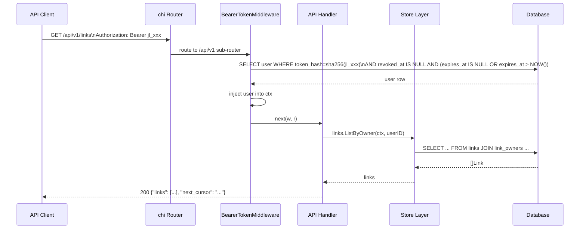

# Design: REST API Layer (SPEC-0005)

## Context

joe-links is primarily a server-rendered HTMX web application (ADR-0007). The web UI satisfies browser-based interactions but leaves programmatic clients entirely unserved — HTMX endpoints return HTML fragments, not machine-readable data. Browser extensions need to register go-links from the current tab, CLI tools need bulk import/export, and CI/CD pipelines need to create deployment links. A JSON REST API fills this gap without disrupting the existing web UI.

The API is designed as a second consumer of the existing store layer, not a replacement for the HTMX interface. Both surfaces share the same `LinkStore`, `UserStore`, and `TagStore` interfaces and the same authorization logic.

Related: ADR-0008 (REST API Layer), ADR-0001 (tech stack), ADR-0003 (auth), ADR-0005 (data model), SPEC-0006 (API token auth), SPEC-0007 (OpenAPI/Swagger).

## Goals / Non-Goals

### Goals
- Expose all link management, tag, and admin operations via a JSON REST API at `/api/v1`
- Maintain full feature parity between the web UI and the API for all CRUD operations
- Add the API without any modification to existing HTMX handlers or routes
- Apply versioning via URL prefix to enable future `/api/v2` without breaking clients
- Share authorization logic between web and API handlers via the request context
- Serve cursor-based pagination on all list endpoints

### Non-Goals
- GraphQL, gRPC, or RPC-style APIs — REST over HTTP is sufficient
- Real-time subscriptions or WebSocket endpoints
- A public API for unauthenticated slug resolution (the existing `GET /{slug}` redirect serves this)
- SDK generation — the OpenAPI spec is sufficient for clients to generate their own

## Decisions

### chi Sub-Router for Isolation

**Choice**: Mount a dedicated chi sub-router at `/api/v1` with its own middleware chain.

**Rationale**: The API and HTMX layers need independent middleware — the API needs `BearerTokenMiddleware` and JSON content-type enforcement; the web layer needs SCS session loading and HTMX-specific headers. A chi sub-router provides clean separation without middleware leakage. The existing `NewRouter` function grows a `NewAPIRouter` sibling, both wired in `serve.go`.

**Alternatives considered**:
- Single router with per-route middleware: messy — every route would need explicit middleware decoration
- Separate HTTP server on a different port: over-engineered and breaks single-binary model

### New `internal/api/` Package for API Handlers

**Choice**: API handlers live in `internal/api/`, separate from the HTMX handlers in `internal/handler/`.

**Rationale**: HTMX handlers and API handlers have fundamentally different response patterns (HTML fragments vs JSON), different error handling (redirect vs `{"error": "..."}` body), and different middleware assumptions. Keeping them in the same package would require proliferation of `isAPIRequest()` checks and messy dual-path logic.

**Alternatives considered**:
- One handler package with shared code: forces coupling between HTML and JSON response paths
- Code generation from OpenAPI spec: inverts the workflow; the codebase is code-first

### Shared Store Layer, No New Persistence Logic

**Choice**: API handlers call the same `*store.LinkStore`, `*store.UserStore`, `*store.TagStore` methods that HTMX handlers use. No new query methods are needed for the initial API surface.

**Rationale**: The store interfaces already model the complete data operations. Adding a JSON serialization layer on top reuses all existing query logic, validation, and database portability.

### Cursor-Based Pagination (Keyset)

**Choice**: `?cursor=<opaque>` + `?limit=N` (default 50, max 200) with `"next_cursor"` in responses.

**Rationale**: Keyset/cursor pagination is stable under concurrent writes — offset pagination drifts when rows are inserted or deleted between pages. For a list of links that a team is actively editing, offset pagination would produce duplicate or skipped results. The cursor is an opaque base64-encoded representation of the last row's sort key (e.g., `created_at DESC, id ASC`).

**Alternatives considered**:
- Offset/limit (`?page=N&per_page=N`): simple but produces inconsistent results under concurrent writes
- No pagination: unacceptable for large link collections (admin view of all links)

### Consistent Error Shape

**Choice**: All errors return `{"error": "<human message>", "code": "<SCREAMING_SNAKE>"}`.

**Rationale**: Machine-readable error codes allow clients to handle specific errors programmatically (e.g., show a "slug taken" message vs a generic alert) without string matching. The human message provides context for logs and developer debugging.

## Architecture

```mermaid
C4Container
    title REST API Layer — Container Diagram

    Person(devUser, "Developer / CLI User", "Uses the API programmatically")
    Person(webUser, "Browser User", "Uses the web UI via HTMX")

    Container_Boundary(binary, "joe-links binary") {
        Container(chiRouter, "chi Router", "Go / chi", "Routes all HTTP traffic")

        Container_Boundary(web, "HTMX Layer") {
            Component(webHandlers, "HTMX Handlers", "internal/handler", "Renders HTML fragments")
            Component(sessionMW, "Session Middleware", "SCS", "Loads OIDC session")
        }

        Container_Boundary(api, "API Layer") {
            Component(apiHandlers, "API Handlers", "internal/api", "Returns JSON responses")
            Component(bearerMW, "Bearer Token Middleware", "internal/auth", "Validates PAT, injects user")
            Component(swaggerUI, "Swagger UI", "swaggo/http-swagger", "Serves /api/docs/*")
        }

        Component(stores, "Store Layer", "internal/store", "LinkStore, UserStore, TagStore, TokenStore")
    }

    ContainerDb(db, "Database", "SQLite / MySQL / PG", "Persists all data")

    devUser -->|"HTTP + Bearer token"| chiRouter
    webUser -->|"HTTP + session cookie"| chiRouter

    chiRouter --> sessionMW
    sessionMW --> webHandlers
    chiRouter --> bearerMW
    bearerMW --> apiHandlers
    chiRouter --> swaggerUI

    webHandlers --> stores
    apiHandlers --> stores
    stores --> db
```

### Request Flow: API Request



### Package Structure

```
internal/
  api/
    router.go          # NewAPIRouter(deps) — mounts sub-router
    links.go           # LinksAPIHandler — CRUD + owners
    tags.go            # TagsAPIHandler — list + filter
    users.go           # UsersAPIHandler — /me
    admin.go           # AdminAPIHandler — users + links
    tokens.go          # TokensAPIHandler — PAT management
    types.go           # Request/response structs (used by swaggo)
    errors.go          # writeError(w, code, msg, status) helper
    paginate.go        # cursor encode/decode helpers
```

## Risks / Trade-offs

- **Handler duplication** — some validation logic is repeated between `internal/handler` (HTMX) and `internal/api` (JSON). Mitigated by extracting shared validation into `internal/store` or a `internal/validation` package.
- **API version drift** — future schema changes must be reflected in both the store layer and the API response types. Mitigated by the OpenAPI CI freshness check (SPEC-0007).
- **Admin endpoint exposure** — `/api/v1/admin/*` routes expose bulk operations. Mitigated by the same role-based middleware as the HTMX admin routes; API tokens carry the user's role from their user record.

## Migration Plan

This is a greenfield addition — no existing data or routes are modified. Deployment steps:
1. Add `internal/api/` package and `NewAPIRouter`
2. Wire `NewAPIRouter` in `internal/handler/router.go` at `/api/v1`
3. Add `docs/swagger/` generated files
4. Register `/api/docs/*` handler on the main router

Rollback: remove the `/api/v1` mount and `/api/docs/*` handler — no schema changes involved.

## Open Questions

- Should the API support `GET /{slug}` resolution (just return the target URL as JSON rather than redirecting)? Currently scoped out — the existing redirect serves unauthenticated resolution.
- Should list endpoints support server-side filtering (`?tag=engineering`, `?q=jira`)? Deferred to a follow-up spec; the initial API returns full lists with client-side filtering.
