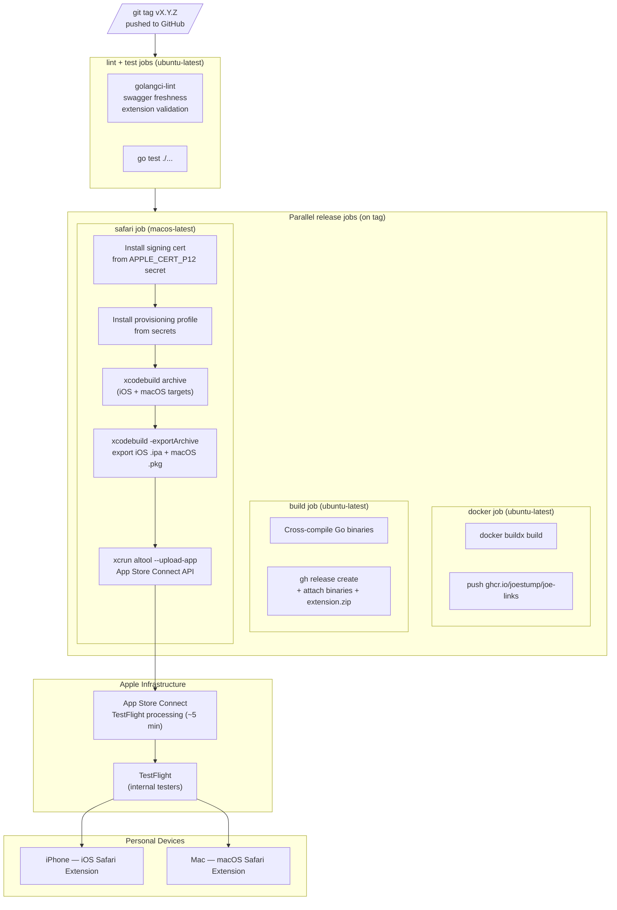

# Design: Safari Web Extension — Apple Distribution and CI Pipeline

## Context

The joe-links browser extension (SPEC-0008) targets Chrome and Firefox via the Manifest V3 Web Extension standard. Safari on both iOS and macOS requires an additional native app wrapper built with Xcode and signed by an Apple identity. ADR-0015 chose Apple Developer Program + TestFlight as the distribution strategy: it eliminates the 7-day free-signing expiry, supports both iOS and macOS from a single Xcode project, and integrates naturally into the existing GitHub Actions release pipeline.

The existing `integrations/extension/` directory already contains a valid MV3 extension with `manifest.json`, `background.js`, `popup.html/js`, `options.html/js`, and `icons/`. `xcrun safari-web-extension-converter` can produce an Xcode project from this directory as a one-time conversion; the generated project is committed to the repository and maintained alongside the extension source.

Related: ADR-0015 (distribution decision), ADR-0012 (MV3 extension architecture), SPEC-0008 (extension source).

---

## Goals / Non-Goals

### Goals

- Produce a Safari Web Extension installable on iOS 15+ and macOS 12+ without user bypass of Gatekeeper or the 7-day re-signing problem
- Automate TestFlight uploads in the existing CI pipeline so every tagged release reaches devices without manual intervention
- Store all signing secrets exclusively in GitHub Actions secrets — nothing sensitive committed to the repository
- Ensure iOS-incompatible APIs degrade gracefully so the extension does not crash on startup

### Non-Goals

- App Store public listing — this is an internal TestFlight distribution only
- Automated TestFlight install on device — the tester taps install in the TestFlight app manually
- Supporting iOS versions before 15.0 or macOS versions before 12.0 (Monterey)
- Modifying the existing Chrome/Firefox extension behaviour — the Safari wrapper consumes the extension source unchanged

---

## Decisions

### Xcode Project Location and Structure

**Choice**: Committed to `integrations/apple/`, generated once via `xcrun safari-web-extension-converter integrations/extension/ --app-name "joe-links" --bundle-identifier net.joestump.joe-links --swift --macos-only false`.

**Rationale**: Committing the generated Xcode project lets CI build it without a conversion step on every run. The converter applies automatic patches (e.g., manifest compatibility shims) that would otherwise need to be re-applied on each run. The `integrations/apple/` path keeps it alongside the MV3 extension source under a shared `integrations/` umbrella.

**Alternatives considered**:
- Generate on every CI run: rejected because converter output can change across Xcode versions, making builds non-reproducible
- Monorepo root Xcode project: rejected as cluttering; a subdirectory is cleaner

### Signing Strategy: Manual Certificate Import (not fastlane match)

**Choice**: Install the distribution certificate from a base64-encoded `.p12` GitHub Actions secret at CI run time using `security import`. Provisioning profiles similarly injected as secrets.

**Rationale**: `fastlane match` requires a separate private git repository or S3 bucket for certificate storage, adding infrastructure for a single-developer project. Manual import via `security` is simpler, well-documented, and sufficient for one signing identity.

**Alternatives considered**:
- `fastlane match`: rejected due to extra infrastructure requirements; worth revisiting if more contributors join
- `xcode-actions/import-codesign-assets`: a third-party action wrapping the same approach — deferred in favour of explicit shell steps for transparency

### TestFlight Upload Tool: `xcrun altool` / `notarytool`

**Choice**: Use `xcrun altool --upload-app` (or `xcrun notarytool` for macOS notarization) with the App Store Connect API key (`.p8` file + Key ID + Issuer ID) stored as GitHub Actions secrets.

**Rationale**: `altool` is the standard CLI tool bundled with Xcode Command Line Tools on GitHub-hosted macOS runners. No third-party dependencies. Fastlane `deliver` is an alternative but adds Ruby/Bundler overhead for a single upload step.

**Alternatives considered**:
- `fastlane deliver`: more feature-rich but unnecessary; adds Gemfile/Bundler dependency
- Transporter GUI app: not automatable in CI

### Build Number Strategy

**Choice**: Derive the build number from the git tag: strip the leading `v`, remove dots, and zero-pad if needed. For example, `v0.2.21` → `221`. The marketing version (`CFBundleShortVersionString`) uses the semantic version string from the tag.

**Rationale**: Monotonically increasing build numbers are required by App Store Connect; tag-derived numbers are reproducible and predictable without a counter database. The `vMAJOR.MINOR.PATCH` format keeps numbers small (three digits) well into the foreseeable future.

**Alternatives considered**:
- Unix timestamp: monotonically increasing but opaque and not tied to the release
- CI run number: non-reproducible if jobs are re-run; breaks App Store Connect's requirement for strictly increasing numbers

### CI Job Placement

**Choice**: New `safari` job in `.github/workflows/ci.yml` that `needs: [lint, test]`, runs only on tag pushes, and runs in parallel with the existing `docker` job. Failure of `safari` does NOT block `docker` or `build` jobs.

**Rationale**: Mirrors the `docker` job pattern exactly. Parallel execution minimises total release pipeline time. Failure isolation means a signing issue does not prevent the server binary and Docker image from being released.

---

## Architecture

### Repository Layout

```
joe-links/
├── integrations/
│   ├── extension/          # MV3 source (Chrome/Firefox + converter input)
│   │   ├── manifest.json
│   │   ├── background.js
│   │   ├── popup.html / popup.js
│   │   ├── options.html / options.js
│   │   └── icons/
│   └── apple/              # Safari Xcode project (generated once, committed)
│       ├── joe-links.xcodeproj
│       ├── iOS (App)/
│       ├── iOS (Extension)/
│       ├── macOS (App)/
│       ├── macOS (Extension)/
│       ├── Shared (App)/
│       └── Shared (Extension)/
└── .github/workflows/
    └── ci.yml              # safari job added here
```

### CI Pipeline



### iOS Compatibility Layer

`background.js` already wraps `setActionIcon()` in a `try/catch` to handle `OffscreenCanvas` absence. The `updateRedirectRules()` call targets `declarativeNetRequest`, which is available on iOS 16+ and must be silently skipped on iOS 15. No changes to extension source are required; the existing defensive coding satisfies the spec requirements.

### Secrets Required (GitHub Actions)

| Secret | Description |
|--------|-------------|
| `APPLE_CERT_P12` | Base64-encoded `.p12` distribution certificate |
| `APPLE_CERT_PASSWORD` | Passphrase for the `.p12` |
| `APPLE_PROVISIONING_PROFILE_IOS` | Base64-encoded iOS distribution provisioning profile |
| `APPLE_PROVISIONING_PROFILE_MACOS` | Base64-encoded macOS distribution provisioning profile |
| `APP_STORE_CONNECT_API_KEY_ID` | App Store Connect API Key ID |
| `APP_STORE_CONNECT_API_ISSUER_ID` | App Store Connect API Issuer ID |
| `APP_STORE_CONNECT_API_KEY_P8` | Contents of the `.p8` private key file |

### Build Expiry Monitoring

A separate scheduled workflow (weekly cron) will call the App Store Connect API to check the age of the most recent TestFlight build. If the build is 76+ days old (within 14 days of the 90-day expiry), the workflow emits a warning annotation in GitHub Actions and optionally opens a GitHub issue titled "TestFlight build expiring soon".

---

## Risks / Trade-offs

- **$99/year recurring cost** → Accepted per ADR-0015; the Apple Developer Program is necessary for notarization and TestFlight
- **90-day build expiry** → Mitigated by the scheduled expiry-check workflow and the expectation that active development produces tags more frequently than every 90 days
- **macOS runner cost** → GitHub-hosted `macos-latest` runners cost ~10× more than Linux runners per minute; the `safari` job is gated to tag pushes only to minimise cost
- **Xcode version drift** → The committed Xcode project is tied to the Xcode version that ran the converter; CI uses `macos-latest` which updates periodically. If the project format becomes incompatible, it must be re-generated or migrated. Mitigation: pin the Xcode version in CI using `xcode-select` if needed
- **Signing certificate expiry** → Apple distribution certificates expire after one year. A calendar reminder or CI check for certificate validity should be added alongside the build-expiry monitor
- **`xcrun altool` deprecation** → Apple is transitioning from `altool` to `notarytool` for notarization and `xcrun devicectl` for some flows. The CI job should be written to use `notarytool` for macOS notarization and `altool` for TestFlight upload (the current stable path)

---

## Migration Plan

1. Enroll in the Apple Developer Program (one-time, $99/year)
2. Create the App Store Connect app record for `joe-links` (iOS + macOS app, bundle ID `net.joestump.joe-links`)
3. Generate an App Store Connect API key and add all secrets listed above to the GitHub repository
4. Run `xcrun safari-web-extension-converter integrations/extension/ --app-name "joe-links" --bundle-identifier net.joestump.joe-links --swift --macos-only false` locally
5. Open the generated Xcode project, configure automatic signing with the Developer Program team, and verify both targets build
6. Commit the `integrations/apple/` directory
7. Add the `safari` CI job to `.github/workflows/ci.yml`
8. Push a test tag and verify the pipeline uploads to TestFlight
9. Accept the internal tester invitation and install the build on an iPhone and Mac
10. Add the scheduled expiry-check workflow

---

## Open Questions

- Should the `integrations/apple/` Xcode project include a custom app icon and splash screen, or use the defaults generated by the converter?
- What is the target minimum macOS version for the macOS app wrapper — 12.0 (Monterey) as stated in SPEC-0015, or a newer baseline?
- Should the expiry-check workflow open a GitHub issue automatically, or only log a warning? (The spec says SHOULD for both; the implementation decision is deferred.)
- If `fastlane match` is adopted later (when more contributors join), the `APPLE_CERT_P12` and provisioning profile secrets can be replaced by a single match repository reference.
