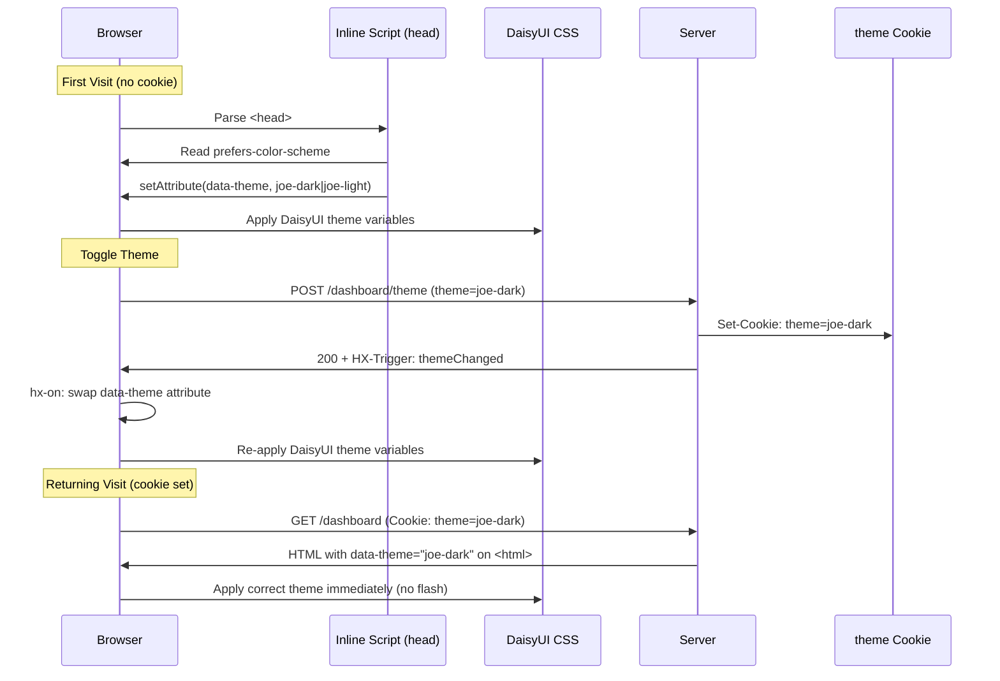

# Design: UI Design System — Pastel Themes, Dark/Light/System Modes

## Context

joe-links is a utility tool that should feel personal and fun rather than enterprise-utilitarian. The design system uses a warm pastel palette to differentiate the app visually and create a pleasant daily-use experience. The system must handle dark/light/system mode gracefully — particularly the "flash of wrong theme" problem common in SSR apps — while keeping JavaScript minimal (consistent with ADR-0001's HTMX-first approach).

See ADR-0006 for the full decision record.

## Goals / Non-Goals

### Goals
- Define a cohesive pastel color palette for both light and dark modes
- Prevent flash of wrong theme on first visit and on page navigations
- Persist theme preference without requiring a database record or user account
- Keep the theming mechanism transparent to all other components (DaisyUI handles propagation)
- Comply with WCAG AA contrast ratios in both themes

### Non-Goals
- Per-user theme stored in the database (cookie is sufficient)
- More than two themes (light/dark is enough; a "system" mode is handled by the inline script logic)
- Custom per-component color overrides beyond the DaisyUI theme variables
- Animation or transition effects on theme switch (may be added later)

## Decisions

### DaisyUI Custom Themes Over Built-Ins

**Choice**: Two fully custom themes (`joe-light`, `joe-dark`) rather than built-in DaisyUI themes like `cupcake` or `dark`.

**Rationale**: Built-in themes are overused and don't match the desired pastel aesthetic. Defining custom themes in `tailwind.config.js` provides full color control with zero runtime overhead — DaisyUI compiles theme variables into CSS custom properties at build time.

### Cookie Over localStorage for Theme Persistence

**Choice**: `theme` cookie (non-HttpOnly) rather than `localStorage`.

**Rationale**: Cookies are sent with every HTTP request, so the server can set `data-theme` in the rendered HTML before the browser parses any JavaScript. This eliminates the SSR/hydration flash entirely for returning users. `localStorage` is only available after the page loads JavaScript, making the flash unavoidable without an inline script that also reads from `localStorage` — at which point the approaches are equivalent but cookies are also server-readable.

### Inline Anti-Flash Script

**Choice**: A tiny inline `<script>` in `<head>` (before stylesheets) that reads the `theme` cookie and sets `data-theme` synchronously.

**Rationale**: The only way to avoid a theme flash without SSR cookie support is to execute synchronous JS before the browser renders. The script is intentionally minimal (< 200 bytes) to minimize render-blocking impact. It is the one allowed exception to the "no inline JS" principle in ADR-0001.

**Script logic** (pseudocode):
```js
(function(){
  var t = document.cookie.match(/theme=([^;]+)/);
  var theme = t ? t[1] : (window.matchMedia('(prefers-color-scheme: dark)').matches ? 'joe-dark' : 'joe-light');
  if (theme === 'joe-light' || theme === 'joe-dark') {
    document.documentElement.setAttribute('data-theme', theme);
  }
})();
```

### HX-Trigger for Client-Side Theme Swap

**Choice**: `POST /dashboard/theme` returns `HX-Trigger: {"themeChanged": {"theme": "joe-dark"}}` instead of a redirect or full page swap.

**Rationale**: The toggle button is in the navbar (outside any HTMX target). A `HX-Trigger` event allows a small inline `hx-on` listener on the `<html>` element to swap `data-theme` without reloading or swapping any DOM fragment. Combined with the `Set-Cookie` header, both client-side and server-side state are updated atomically.

## Architecture

### Theme Application Flow



### Color Palette Reference

| Token          | joe-light               | joe-dark                | Contrast (on base) |
|----------------|-------------------------|-------------------------|--------------------|
| `primary`      | `#c084fc` lilac         | `#a855f7` purple        | ✓ AA on base-100   |
| `primary-content` | `#fafafa`            | `#fafafa`               | ✓ AA on primary    |
| `secondary`    | `#fb923c` peach         | `#f97316` orange        | ✓ AA on base-100   |
| `accent`       | `#34d399` mint          | `#10b981` emerald       | ✓ AA on base-100   |
| `base-100`     | `#fdf4ff` lavender-white| `#1e1b2e` deep purple   | —                  |
| `base-200`     | `#f3e8ff`               | `#2d2840`               | —                  |
| `base-300`     | `#e9d5ff`               | `#3d3756`               | —                  |
| `base-content` | `#1f1335` near-black    | `#e9d5ff` lavender      | ✓ AA on base-100   |
| `info`         | `#67e8f9` sky           | `#22d3ee` cyan          | ✓ AA on base-100   |
| `success`      | `#86efac` sage          | `#4ade80` green         | ✓ AA on base-100   |
| `warning`      | `#fde68a` butter        | `#fbbf24` amber         | ✓ AA on base-100   |
| `error`        | `#fca5a5` rose          | `#f87171` red-400       | ✓ AA on base-100   |

### Tailwind Config Structure

```js
// tailwind.config.js
module.exports = {
  plugins: [require("daisyui")],
  daisyui: {
    themes: [
      {
        "joe-light": {
          "primary": "#c084fc",
          "primary-content": "#fafafa",
          "secondary": "#fb923c",
          "accent": "#34d399",
          "neutral": "#6b7280",
          "base-100": "#fdf4ff",
          "base-200": "#f3e8ff",
          "base-300": "#e9d5ff",
          "base-content": "#1f1335",
          "info": "#67e8f9",
          "success": "#86efac",
          "warning": "#fde68a",
          "error": "#fca5a5",
        },
        "joe-dark": {
          "primary": "#a855f7",
          "primary-content": "#fafafa",
          "secondary": "#f97316",
          "accent": "#10b981",
          "neutral": "#9ca3af",
          "base-100": "#1e1b2e",
          "base-200": "#2d2840",
          "base-300": "#3d3756",
          "base-content": "#e9d5ff",
          "info": "#22d3ee",
          "success": "#4ade80",
          "warning": "#fbbf24",
          "error": "#f87171",
        },
      },
    ],
  },
}
```

## Risks / Trade-offs

- **Cookie non-HttpOnly** → The `theme` cookie is readable by JavaScript (required for the anti-flash script). This is intentional and acceptable since the cookie contains no sensitive data (`joe-light` or `joe-dark` only).
- **Contrast ratios on pastel colors** → Light pastels on white backgrounds can fail WCAG AA. The `joe-light` palette uses `base-100: #fdf4ff` (near-white) with `base-content: #1f1335` (near-black) to maintain high contrast. Primary buttons use white content text on the lilac primary — this pair MUST be verified with a contrast checker during implementation.
- **DaisyUI version coupling** → Custom theme format may change between DaisyUI major versions. Pin the DaisyUI version in `package.json` and review color token names on upgrades.

## Open Questions

- Should the theme cookie be set server-side as HttpOnly (no flash script needed) by using a proper SSR cookie-reading middleware? This would be more secure but requires reading the cookie before template execution — confirm the SCS session middleware ordering.
- Is a third "system" theme option in the UI useful (let the browser decide), or is the system-default-on-first-visit behavior sufficient?
