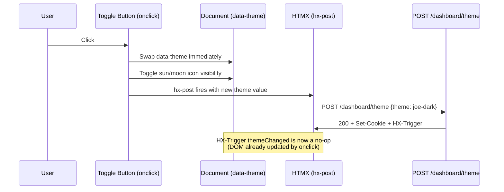
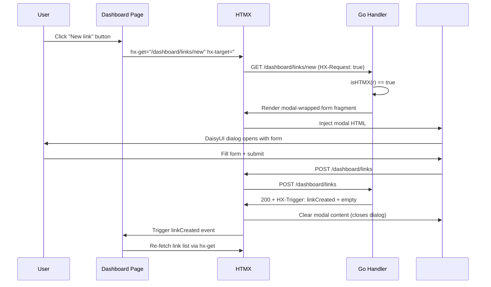
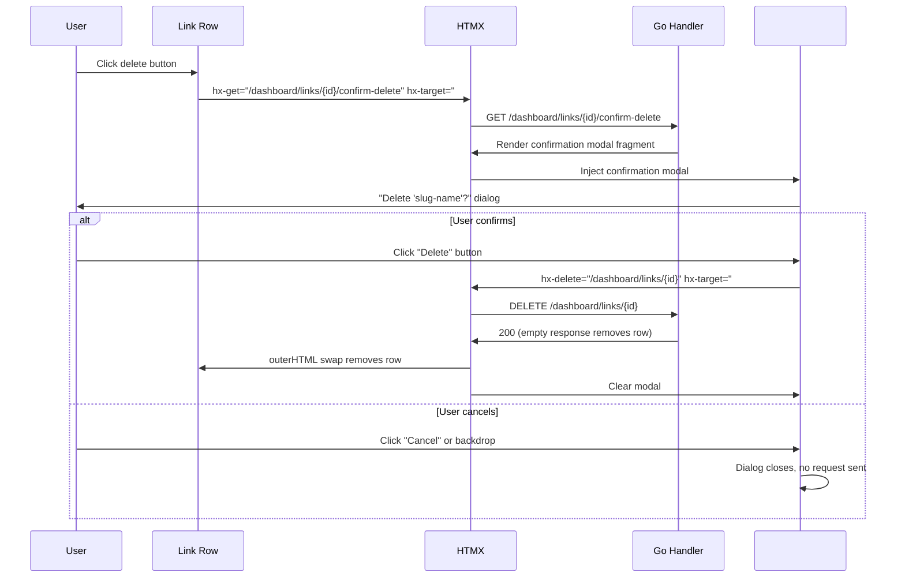
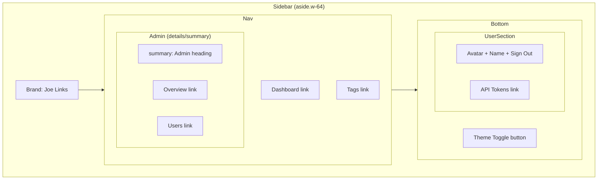

# Design: UI/UX Improvements

## Context

The joe-links UI is functional but has several polish issues: the theme toggle requires two clicks to visually respond, the admin sidebar section takes up space on non-admin pages, link creation/editing navigates away from the dashboard, delete confirmations use the browser's native `confirm()` which looks out of place with the DaisyUI design system, and the API Tokens link is positioned awkwardly between the theme toggle and user info. These improvements address usability and visual consistency without changing the underlying Go + HTMX + DaisyUI stack.

See SPEC-0003 (UI Theming), SPEC-0004 (Application Views and Routing), ADR-0001 (Technology Stack).

## Goals / Non-Goals

### Goals
- Fix the theme toggle so icon swap is immediate on first click
- Collapse admin sidebar section when not on admin pages to reduce visual noise
- Open link create/edit forms in modals to keep users on the dashboard
- Replace native `confirm()` dialogs with DaisyUI modals for visual consistency
- Group per-user settings (API Tokens) with the user section in the sidebar

### Non-Goals
- Redesigning the overall sidebar layout or navigation hierarchy
- Adding new pages or routes beyond what exists
- Changing the theme persistence mechanism (cookie approach from SPEC-0003 stays)
- Mobile responsive sidebar behavior (separate concern)
- Animating the admin section expand/collapse (native `<details>` behavior is sufficient)

## Decisions

### Theme Toggle: Client-Side Icon Swap Before HTMX Request

**Choice**: Add an `onclick` handler to the theme toggle button that immediately swaps the `data-theme` attribute and icon visibility, then let the HTMX `hx-post` fire normally to persist the cookie.

**Rationale**: The current bug is a sequencing issue. The `hx-vals='js:{...}'` reads `data-theme` correctly, and the server responds with `HX-Trigger: themeChanged` which triggers the icon swap — but the icon swap only happens *after* the HTTP round-trip. By performing the visual swap eagerly in an `onclick` handler, the user sees immediate feedback. The HTMX request still fires to persist the preference via cookie. If the request fails, the worst case is the cookie is stale until the next toggle — acceptable for a theme preference.

**Alternative considered**: Using `htmx:beforeRequest` event — rejected because it would require attaching a custom event listener and the `onclick` approach is simpler and more explicit.

### Admin Sidebar: `<details>/<summary>` Over DaisyUI Collapse

**Choice**: Use native HTML `<details>` and `<summary>` elements with the `open` attribute conditionally set based on the current route.

**Rationale**: The DaisyUI collapse component requires a hidden checkbox or focus state management, which adds complexity. Native `<details>` provides expand/collapse for free, works without JavaScript, and can be styled with Tailwind utilities. The `open` attribute is set server-side in the Go template based on whether the current path starts with `/admin`. This avoids any client-side state management.

### Link Forms: HTMX Modal with `isHTMX` Handler Branch

**Choice**: Reuse the existing form templates by wrapping them in a DaisyUI `<dialog>` wrapper when served as an HTMX fragment. The handler checks `isHTMX(r)` — if true, render only the modal-wrapped form fragment; if false, render the full page with base layout.

**Rationale**: This follows the established HTMX partial pattern already used throughout the codebase (`renderFragment` vs `render`). The same Go handler serves both cases, keeping the form logic DRY. The modal wrapper is a thin template that includes the existing form content inside a `<dialog class="modal">` container.

**Modal close on success**: On successful create/edit, the handler returns an `HX-Trigger` event (e.g., `linkCreated` or `linkUpdated`) plus an `HX-Reswap: innerHTML` targeting `#modal` with empty content. The dashboard listens for the trigger event to refresh the link list.

### Delete Confirmation: Server-Rendered Modal Fragment

**Choice**: The delete button triggers an `hx-get` to a confirmation endpoint (e.g., `GET /dashboard/links/{id}/confirm-delete`) that returns a DaisyUI modal fragment injected into `#modal`. The modal's "Delete" button then sends the actual `DELETE` request.

**Rationale**: This is more consistent with the HTMX-first approach than building the modal in client-side JavaScript. The server generates the modal HTML with the correct item name and delete URL baked in. This approach also allows future enhancements (e.g., showing dependent items that will be affected by deletion).

**Alternative considered**: Using `hx-confirm` with a custom event to intercept and show a DaisyUI modal — rejected because it requires non-trivial JavaScript to intercept the HTMX confirm flow and creates a split between HTMX-managed and JS-managed modals.

### API Tokens: Relocate Into User Info Block

**Choice**: Move the `<a href="/dashboard/settings/tokens">` link from its standalone position between the theme toggle and user info into the user info `<div>`, positioned as a small link below the user's display name.

**Rationale**: API Tokens is a per-user setting, logically grouped with user identity. The current position — sandwiched between theme toggle and user avatar — is visually awkward and creates three separate sections in the sidebar footer. Grouping it with user info reduces the footer to two clear sections: theme control and user account.

## Architecture

### Theme Toggle Interaction Flow



### Modal Form Loading Flow



### Delete Confirmation Flow



### Sidebar Layout Structure



## Template Changes

### Theme Toggle Button (base.html)

The button gains an `onclick` handler that performs the visual swap eagerly:

```html
<button class="..."
        onclick="(function(btn){
            var cur = document.documentElement.getAttribute('data-theme');
            var next = cur === 'joe-dark' ? 'joe-light' : 'joe-dark';
            document.documentElement.setAttribute('data-theme', next);
            document.getElementById('theme-icon-sun').style.display = next === 'joe-dark' ? 'block' : 'none';
            document.getElementById('theme-icon-moon').style.display = next === 'joe-dark' ? 'none' : 'block';
        })(this)"
        hx-post="/dashboard/theme"
        hx-vals='js:{theme: document.documentElement.getAttribute("data-theme")}'
        hx-swap="none">
```

Note: `hx-vals` now reads `data-theme` *after* the `onclick` has already swapped it, so the POST sends the correct new theme value to the server.

### Admin Section (base.html)

```html
{{if eq .User.Role "admin"}}
<details class="pt-3"{{if .IsAdminPage}} open{{end}}>
    <summary class="px-3 mb-1 text-xs font-semibold uppercase tracking-wider text-base-content/50 cursor-pointer list-none">
        Admin
    </summary>
    <a href="/admin" ...>Overview</a>
    <a href="/admin/users" ...>Users</a>
</details>
{{end}}
```

The `IsAdminPage` boolean is set in the `BasePage` struct by the handler based on `strings.HasPrefix(r.URL.Path, "/admin")`.

### Modal Form Wrapper (new partial)

A new partial template `web/templates/partials/modal_form.html`:

```html
{{define "modal_form"}}
<dialog id="form-modal" class="modal modal-open">
    <div class="modal-box">
        {{block "modal_content" .}}{{end}}
    </div>
    <form method="dialog" class="modal-backdrop">
        <button>close</button>
    </form>
</dialog>
{{end}}
```

### Delete Confirmation Modal (new partial)

A new partial template `web/templates/partials/confirm_delete.html`:

```html
{{define "confirm_delete"}}
<dialog id="confirm-modal" class="modal modal-open">
    <div class="modal-box">
        <h3 class="font-bold text-lg">Delete '{{.Name}}'?</h3>
        <p class="py-4">This action cannot be undone.</p>
        <div class="modal-action">
            <button class="btn btn-ghost"
                    onclick="document.getElementById('modal').innerHTML=''">
                Cancel
            </button>
            <button class="btn btn-error"
                    hx-delete="{{.DeleteURL}}"
                    hx-target="{{.Target}}"
                    hx-swap="outerHTML"
                    onclick="document.getElementById('modal').innerHTML=''">
                Delete
            </button>
        </div>
    </div>
    <form method="dialog" class="modal-backdrop">
        <button onclick="document.getElementById('modal').innerHTML=''">close</button>
    </form>
</dialog>
{{end}}
```

## Risks / Trade-offs

- **onclick + HTMX race condition**: The `onclick` handler swaps the DOM before `hx-vals` reads the value. Since JavaScript is single-threaded and `hx-vals` is evaluated synchronously during HTMX's request preparation (which happens after `onclick` completes), the read-after-write is safe. However, if the HTMX POST fails (network error), the visual state and cookie will be out of sync until the next page load, when the anti-flash script re-reads the cookie and corrects it. This is an acceptable trade-off for a theme preference.

- **Two modal patterns**: The codebase will have two distinct modal use cases (form modals and confirmation modals). Both inject into `#modal` and use DaisyUI's `modal-open` class, so they share the same visual pattern. Care must be taken that only one modal is open at a time (e.g., you cannot open a delete confirmation while an edit form modal is open).

- **`<details>` styling limitations**: Native `<details>` elements have limited styling options compared to a JavaScript-powered accordion. The default disclosure triangle can be hidden via `list-none` on `<summary>`, but animation of the expand/collapse is not possible without JavaScript. This is acceptable given the non-goal of animation.

- **Server-rendered confirmation modals add routes**: Each deletable entity type needs a `GET .../confirm-delete` route that returns the modal fragment. This adds route surface but keeps the pattern consistent with the HTMX-first approach and avoids building modals in client-side JavaScript.

## Open Questions

- Should the confirmation modal be a generic reusable component (accepting item name, delete URL, and target via query params), or should each entity type have its own confirmation handler? A generic endpoint would reduce route proliferation but is less flexible for custom messaging.
- Should the modal form submission use `hx-post` inside the modal targeting `#modal` (for re-rendering validation errors in place), or should it target `body` for a full swap on success? The former is more HTMX-idiomatic; the latter is simpler.
