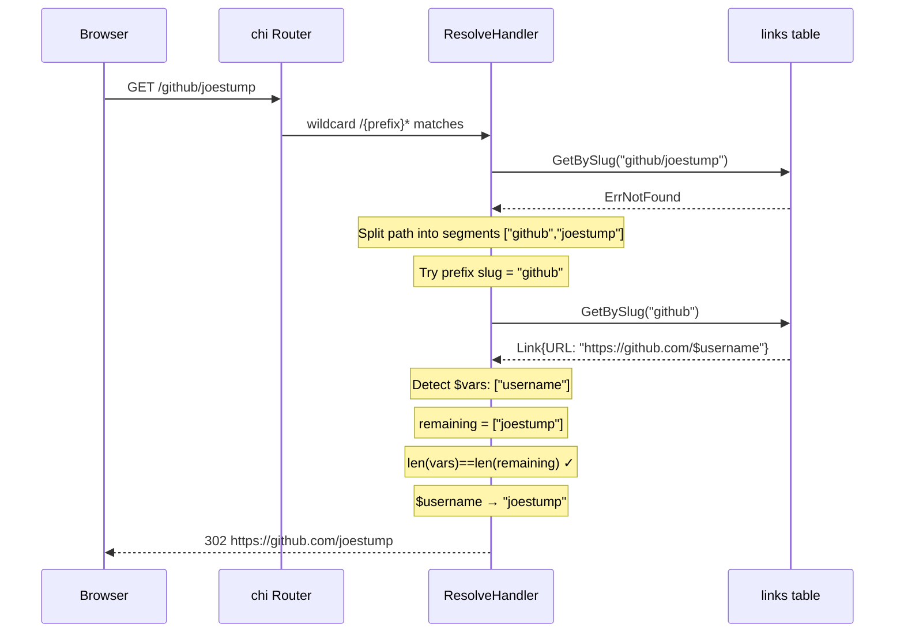
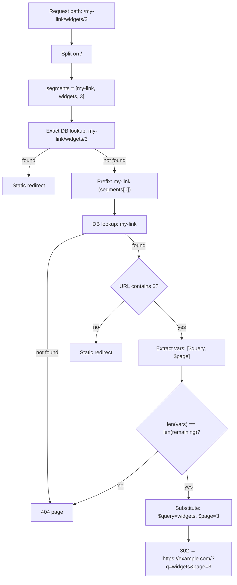

# Design: URL Variable Substitution in Short Links

## Context

Joe-links currently maps a single slug to a single static URL. The resolver handles
`GET /{slug}` via chi, looking up the slug in the `links` table and issuing a 302 redirect.
Chi's `{slug}` wildcard captures only one path segment; multi-segment paths like
`/github/joestump` are not routed to the resolver today.

Users want to create reusable go-links that accept runtime arguments — e.g. `go/github/$username`
so that `go/github/joestump` and `go/github/anthropic` both work from a single link record.
This is explicitly a user-space feature; no admin configuration or keyword host setup (ADR-0011)
is required.

The decision to embed `$varname` syntax in the URL field and use prefix-slug matching is
documented in ADR-0013.

## Goals / Non-Goals

### Goals
- Allow `$varname` placeholders in link URLs, resolved positionally from path segments
- Support multiple variables in a single link
- Keep the `links` table schema unchanged (no migration)
- Extend the resolver to handle multi-segment paths without breaking existing single-segment links
- Surface a UI hint in the link form when variables are detected

### Non-Goals
- Named/keyword variable matching (variables are purely positional)
- Server-side validation that variable count matches path at link-save time (this is a run-time check)
- URL-encoding or transformation of substituted values beyond plain string replacement
- Backwards-variable-resolution (inferring slug from a full URL — out of scope)
- Collision detection between variable slugs and existing single-segment slugs (ADR-0013 notes
  that exact-match wins; ambiguity is the user's responsibility)

## Decisions

### Variable Placeholder Syntax

**Choice**: `$varname` — dollar sign followed by a lowercase identifier (`[a-z][a-z0-9_]*`)

**Rationale**: Dollar-sign is the conventional variable sigil across shells and many templating
systems. It is visually distinct from the rest of a URL and is not a valid URL character outside
query-string values, making it unambiguous as a placeholder. Using named variables (instead of
positional `{1}`) makes templates self-documenting: `https://github.com/$username` is
immediately legible.

**Alternatives considered**:
- `{varname}` — conflicts with chi's route parameter syntax and ADR-0011's `{slug}` keyword
  placeholder; risks confusion
- `{1}`, `{2}` positional indices — not self-documenting (rejected per ADR-0013 Option C)
- Separate `variables` column — requires schema migration (rejected per ADR-0013 Option B)

### Resolver Route Change

**Choice**: Change the catch-all from `/{slug}` (single-segment) to `/{prefix}*` (wildcard
suffix that passes the full path to the handler)

**Rationale**: chi's `{slug}` does not match slashes. The simplest way to route multi-segment
paths to the existing resolver without interfering with any named route above it is to use chi's
wildcard route. All existing named routes (`/auth/*`, `/dashboard/*`, `/admin/*`, `/api/v1/*`,
`/static/*`) are registered before the catch-all and continue to take priority.

**Alternatives considered**:
- Custom `http.Handler` on `/` via `r.Mount` — more invasive change to router structure
- A second dedicated route `/{slug}/*` — requires knowing at startup which slugs have variables

### Prefix-Slug Matching Algorithm

**Choice**: Split request path on `/`, try exact slug first, then try the first N-1 segments as
a slug (where N is the total segment count), continuing until a matching slug is found or no
prefixes remain.

**Rationale**: Exact match must win so that a slug `github/joestump` (if it exists) takes
priority over the variable link `github`. Beyond that, the simplest algorithm that is also
correct is greedy longest prefix: try `a/b/c`, then `a/b`, then `a`. Each attempt is a single
indexed DB lookup. For realistic path depths (2–4 segments) this is at most 3–4 queries.

**Alternatives considered**:
- Load all variable slugs into memory at startup — avoids per-request DB overhead but adds
  complexity and stale-data risk

### UI Hint Implementation

**Choice**: Client-side JavaScript watches the URL input for `$` characters and renders a
hint below the field showing detected variable names and an example path. No server round-trip
required.

**Rationale**: The hint is purely cosmetic and can be computed entirely from the URL field
value with a simple regex. Adding a server endpoint for this would be unnecessary complexity.

## Architecture

### Resolver flow with variable substitution

### Variable detection and substitution

## Risks / Trade-offs

- **Multiple DB lookups on 404 paths** → Mitigated: the common case (exact slug match) is still
  one lookup. Variable path lookup only fires when the exact match fails and the path has >1
  segment. Real-world paths are shallow (2–3 segments).
- **Ambiguous overlap between exact slugs and variable slugs** → Mitigated: exact match always
  wins. Users who create `github/joestump` and `github` can coexist; the specific slug takes
  priority. Documented as a user responsibility in ADR-0013.
- **No save-time variable-count validation** → Users won't see errors until navigation with
  wrong arity. Mitigated by the UI hint which shows expected variable names, and a clear 404 at
  runtime.
- **Variable values are URL-path segments** → Values may need URL-encoding before substitution
  if they contain special characters. The implementation SHOULD apply
  `url.PathEscape` to each substituted value unless the URL template already encodes it.

## Migration Plan

No database migration is required. The feature is purely additive:
1. Deploy the updated binary with the new resolver logic and extended route
2. Existing static links continue to work unchanged
3. Users can immediately start creating variable links via the existing form

Rollback: revert the binary. Variable links would stop working but no data is corrupted; link
records with `$` in the URL are valid rows in the existing schema.

## Open Questions

- Should `url.PathEscape` be applied to substituted values, or should we apply
  `url.QueryEscape` when the `$var` appears in a query-string position? A simple heuristic is
  to apply `url.PathEscape` always and let users URL-encode if needed.
- Should there be a UI affordance (e.g. a "Test this link" field) so users can preview the
  resolved URL before saving? Deferred to a follow-up.
