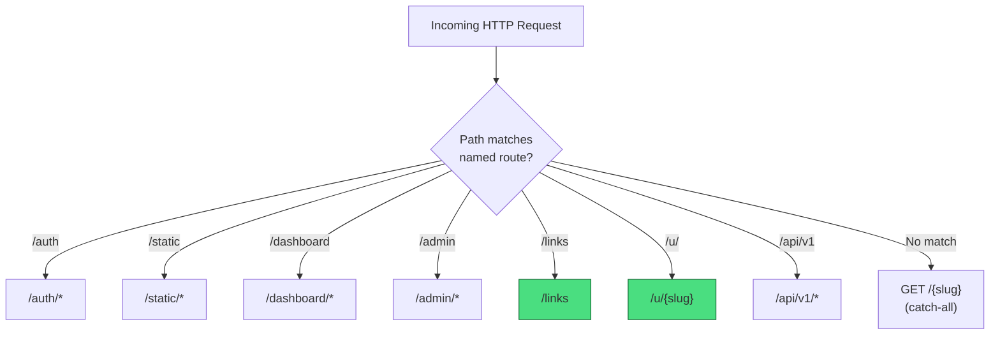
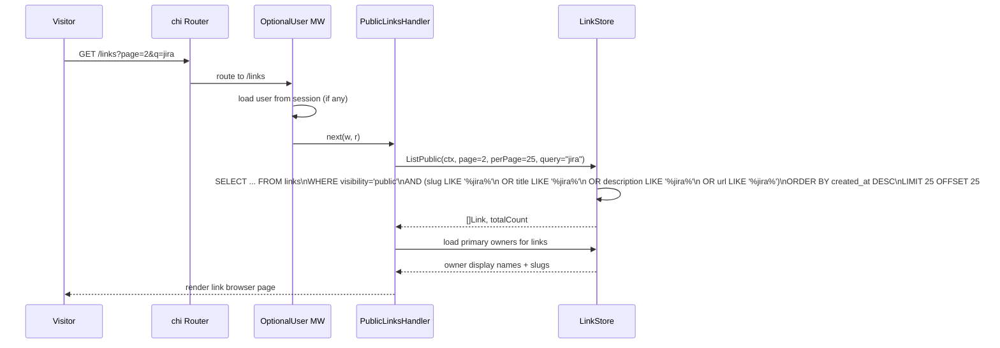
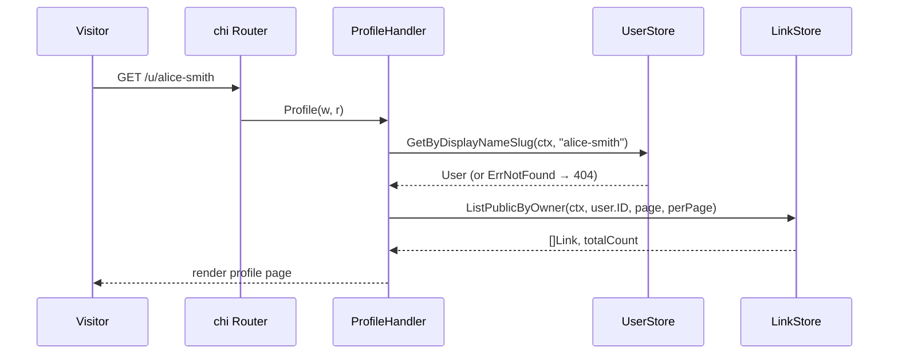
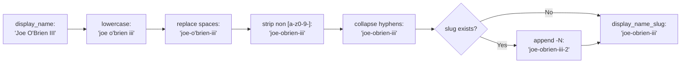

# Design: User Profiles and Public Link Browsing (SPEC-0012)

## Context

joe-links currently operates as a fully authenticated application — every view except the slug resolver requires an OIDC session. There is no way for unauthenticated users to browse available links or discover what go-links exist. This limits the service's value for onboarding new team members who want to see available links before creating their own.

Additionally, there is no concept of a user profile — links are tied to users via `link_owners` but there is no public page where a user's contributions are visible. Profile pages enable team-level discoverability: "What links has Alice set up?"

This spec introduces two public-facing views: a link browser and per-user profiles. Both are read-only, unauthenticated, and respect link visibility modes (SPEC-0010).

Related: SPEC-0004 (Application Views and Routing), SPEC-0002 (Link Data Model), SPEC-0010 (Link Visibility Modes), ADR-0007 (Views and Routing).

## Goals / Non-Goals

### Goals
- Public link browser at `/links` with search and pagination, accessible without authentication
- Per-user profile pages at `/u/{display_name_slug}` showing a user's public links
- Consistent with existing HTMX patterns and DaisyUI styling
- Respect link visibility modes — only `public` links appear in public views
- Add `display_name_slug` to the `users` table for efficient profile URL routing

### Non-Goals
- User profile editing (bio, avatar upload) — profiles are read-only, derived from OIDC claims
- Follow/subscribe to users — out of scope for a go-links tool
- RSS feeds for public links — deferred
- Full-text search (Elasticsearch/Bleve) — substring LIKE queries are sufficient for the expected data volume
- Social features (comments, likes, bookmarks) — not applicable

## Decisions

### `/links` as a Reserved Route

**Choice**: Register `GET /links` as a named route before the catch-all slug resolver. Add `links` to the reserved slugs list alongside `auth`, `static`, `dashboard`, `admin`.

**Rationale**: The public link browser is a core navigation destination. Using `/links` is natural and memorable. Reserving it prevents users from accidentally claiming it as a go-link slug.

### `/u/{display_name_slug}` for User Profiles

**Choice**: User profiles live under the `/u/` prefix with a URL-safe slug derived from the user's display name.

**Rationale**: The `/u/` prefix is a well-established convention (GitHub uses it). Using a slug derived from the display name produces human-readable URLs (`/u/alice-smith`) rather than opaque UUIDs (`/u/550e8400...`). The prefix `u` is added to the reserved slugs list.

**Alternatives considered**:
- `/users/{id}`: exposes UUIDs in URLs; not human-friendly
- `/~{username}`: Unix-style; the tilde is awkward in URLs and requires percent-encoding in some contexts
- `/profile/{slug}`: longer prefix with no benefit

### `display_name_slug` Column on `users` Table

**Choice**: Add a `display_name_slug TEXT NOT NULL DEFAULT '' UNIQUE` column to the `users` table and maintain it on user creation and display name changes.

**Rationale**: Deriving the slug on every request (scan all users, slugify each display name, find a match) is O(n) and cannot use an index. Storing the pre-computed slug enables a direct `WHERE display_name_slug = ?` indexed lookup. The slug is updated whenever the display name changes (which only happens during OIDC login when claims are refreshed).

**Alternatives considered**:
- Compute on the fly: O(n) lookup, no index possible
- Use email prefix as slug: email structure varies; some users have numeric or random email prefixes
- Store as a separate profile table: over-engineered; a single column on `users` is sufficient

### Offset Pagination for Public Views

**Choice**: Public views use offset-based pagination (`?page=1&per_page=25`) rather than the cursor-based pagination used by the API (SPEC-0005).

**Rationale**: Public views are read-only browsing pages where users expect page numbers ("Page 3 of 12") and the ability to jump to a specific page. Cursor-based pagination is designed for API consumers processing sequential pages; it does not support page numbers or random access. The public link volume is expected to be modest (hundreds to low thousands), where offset pagination performs well.

**Alternatives considered**:
- Cursor pagination: no page numbers, poor UX for browsing
- Infinite scroll: harder to implement, breaks back-button behavior
- No pagination (load all): unacceptable for large link collections

### OptionalUser Middleware for Public Routes

**Choice**: Public routes (`/links`, `/u/{slug}`) use `OptionalUser` middleware so authenticated users see the navbar while unauthenticated users see the page without it.

**Rationale**: The `OptionalUser` middleware is already used for the landing page (`GET /`) and the 404 page. It loads the user from the session if present but does not redirect to login if absent. This provides a consistent experience where logged-in users always see their navbar.

## Architecture

### Route Registration



### Public Link Browser Data Flow



### User Profile Data Flow



### Display Name Slug Derivation



### Package Structure

```
Routes (registered before catch-all):
  GET /links                    → publicLinks.Index     (OptionalUser)
  GET /links (HTMX search)     → publicLinks.Search    (OptionalUser, fragment)
  GET /u/{display_name_slug}   → profile.Show          (OptionalUser)

Handler files:
  internal/handler/public_links.go   — PublicLinksHandler
  internal/handler/profile.go        — ProfileHandler

Store additions:
  internal/store/link_store.go       — ListPublic(), ListPublicByOwner()
  internal/store/user_store.go       — GetByDisplayNameSlug()

Templates:
  web/templates/pages/links.html          — public link browser
  web/templates/pages/profile.html        — user profile page

Migration:
  internal/db/migrations/00009_add_display_name_slug.sql
```

## Risks / Trade-offs

- **LIKE-based search performance** — `LIKE '%query%'` cannot use standard B-tree indexes. For the expected data volume (hundreds to low thousands of links), this is acceptable. If performance becomes an issue, a full-text search index (FTS5 for SQLite, GIN for Postgres) can be added later.
- **Display name slug uniqueness** — if many users share similar display names (e.g., "John Smith"), the suffix counter could grow. This is acceptable for a team tool where user counts are in the tens to hundreds.
- **Slug derivation from OIDC display name** — display names come from the OIDC provider and may change. The slug is recalculated on each login, which could break bookmarked profile URLs. Mitigated by: profile pages are a discovery tool, not a permalink system; the display name rarely changes.
- **Visibility dependency** — this spec references `visibility = 'public'` from SPEC-0010. Until SPEC-0010 is implemented, the query should treat all links as public (omit the visibility filter). The handler should be designed to add the filter cleanly when visibility is available.

## Migration Plan

1. Add goose migration `00009_add_display_name_slug.sql`:
   - `ALTER TABLE users ADD COLUMN display_name_slug TEXT NOT NULL DEFAULT ''`
   - Populate from existing `display_name` values
   - `CREATE UNIQUE INDEX idx_users_display_name_slug ON users(display_name_slug)`
2. Add `ListPublic()` and `ListPublicByOwner()` to `LinkStore`
3. Add `GetByDisplayNameSlug()` to `UserStore`
4. Add `PublicLinksHandler` and `ProfileHandler`
5. Register routes before catch-all in `router.go`
6. Add `links` and `u` to reserved slugs list
7. Add templates

Rollback: drop the `display_name_slug` column (down migration), remove routes and handlers. Existing functionality is unaffected.

## Open Questions

- Should profile pages show a user's tag cloud (tags they use most frequently)? Deferred — adds query complexity for a minor discoverability benefit.
- Should the public link browser support tag filtering (click a tag chip to filter)? Likely yes, but deferred to avoid scope creep — search covers the primary use case.
- Should `/u/{slug}` support a canonical redirect if the slug changes (HTTP 301)? Deferred — would require storing previous slugs, which adds complexity.
